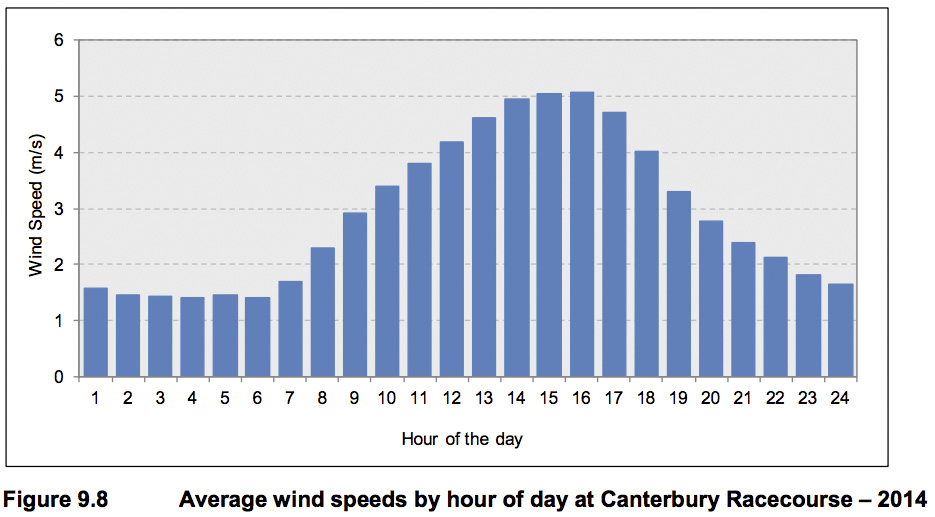
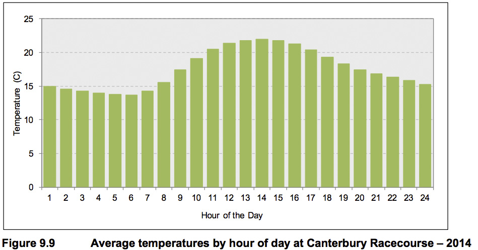
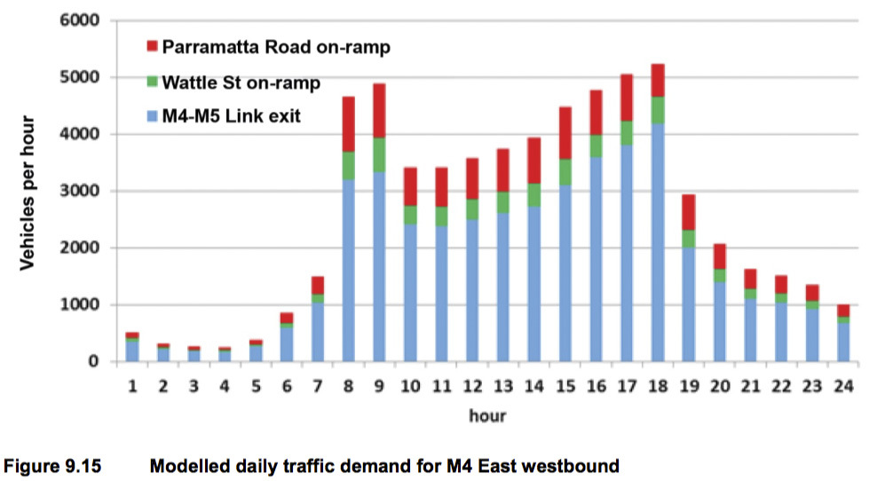
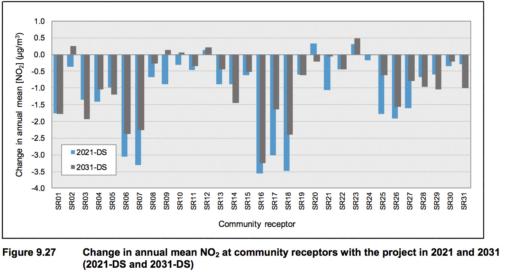
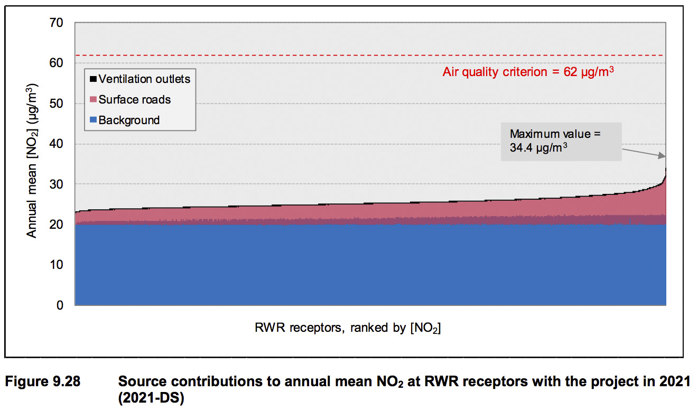
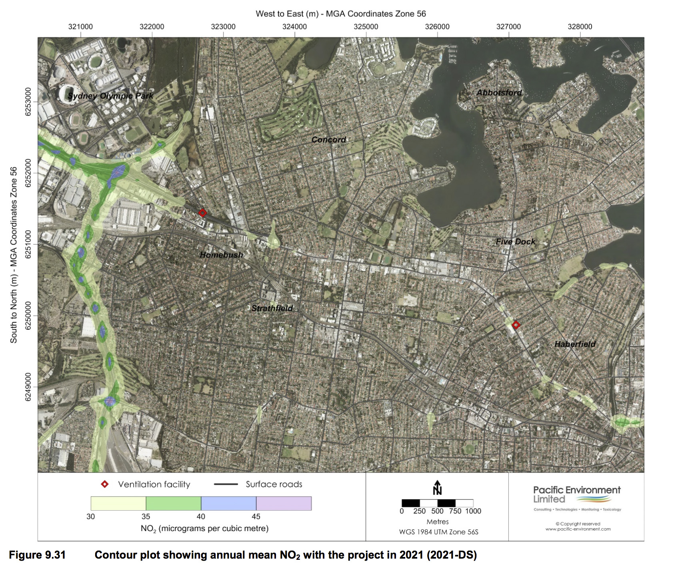
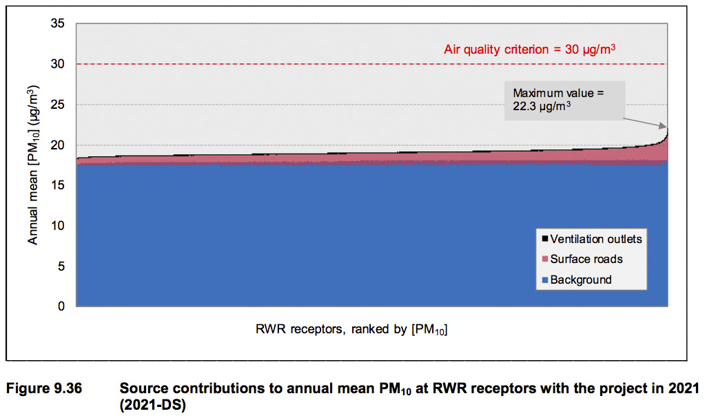
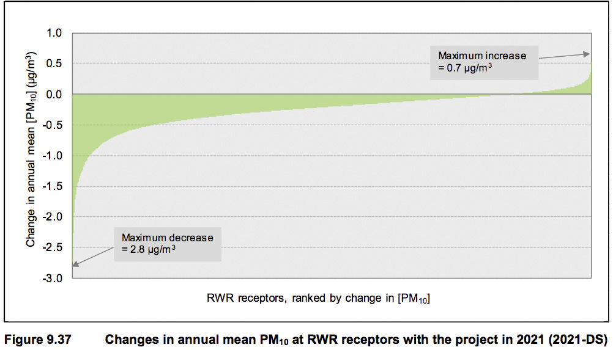

# WestConnex M4 East Environmental Impact Statement
September 2015

Prepared for WestConnex Delivery Authority
Prepared by AECOM Australia Pty Ltd, GHD Pty Ltd

## 9. Air Quality

### 9.1 Introduction

This chapter describes the methodology used to assess the impacts of the M4 East project (the project) on regional, local and in-tunnel air quality, and the results of that assessment in summary. Appendix H provides greater detail of the monitoring and modelling methodologies and results.

The Secretary of the NSW Department of Planning and Environment (DP&E) has issued a set of environmental assessment requirements for the project; these are referred to as Secretary’s Environmental Assessment Requirements (SEARs). Table 9.1 sets out these requirements, and identifies where they have been addressed in this environmental impact statement (EIS).

<table id="table-9-1">
  <caption>Table 9.1 Secretary’s Environmental Assessment Requirements – air quality</caption>
  <thead>
    <tr>
      <th></th>
      <th></th>
    </tr>
  </thead>
  <tbody>
    <tr>
      <th></th>
      <td></td>
    </tr>
  </tbody>
</table>

### 9.2 Assessment approach

#### 9.2.1 Overview

This assessment considers the impacts of the project on regional and local air quality, and the cumulative impacts of this project and the M4-M5 link. The assessment also includes detailed analysis of the predicted quality of air inside the tunnel.

A number of recent air quality assessments for surface roads and tunnels in Australia and New Zealand were reviewed to identify methodologies, tools and findings that could inform the project assessment. These previous assessments are summarised in Appendix D of the air quality assessment report in Appendix H.  The summary includes details of the pollutants considered, the sources of emissions, the dispersion models used, and the approaches used to assess impacts on air quality during construction and operation.

#### 9.2.2 Terminology

The concentration of a pollutant at a given location comprises contributions from various sources. Several terms have been used to describe these contributions.

The following terms have been used in this chapter to describe the concentration of a pollutant at a specific location (receptor) over a specific averaging period:

* **Background concentration** describes all contributing sources of a pollutant concentration other than road traffic. It includes, for example, contributions from natural sources, industry and domestic activity
* **Surface road concentration** describes the contribution of pollutants from the surface road network. It includes not only the contribution of the nearest road at the receptor, but also the net contribution of the modelled road network at the receptor
* **Ventilation outlet concentration** describes the contribution of pollutants from tunnel ventilation outlets
* **Total concentration** is the sum of the sources defined above: background, surface road and ventilation outlet concentrations. It may relate to conditions with or without the project under assessment
* **The change in concentration due to the project** is the difference between the total concentration with the project and the total concentration without the project, and may be either an increase or a decrease, depending on factors including the redistribution of traffic on the network as a result of the project.

#### 9.2.3 Air quality criteria

Air quality was assessed in relation to the criteria listed in Table 9.2.

<table id="table-9-2">
  <caption>Table 9.2 Air quality criteria applicable to the project assessment</caption>
  <thead>
    <tr>
      <th></th>
      <th></th>
    </tr>
  </thead>
  <tbody>
    <tr>
      <th></th>
      <td></td>
    </tr>
  </tbody>
</table>

##### In-tunnel air quality

###### Carbon monoxide

Carbon monoxide (CO) has historically been an indicator of the level of motor vehicle emissions in tunnels, and has therefore been used as the basis of in-tunnel air quality criteria. Advances in vehicle technology have been effective in reducing the levels of CO emissions, so that other emissions are now more relevant indicators of in-tunnel air quality. Chief among these is nitrogen dioxide.

###### Nitrogen dioxide

Nitrogen dioxide (NO2) is a respiratory irritant with identified health effects at levels that may be encountered in road tunnels (section 10.4.1). DP&E considers that NO2 is the key pollutant of concern for in-tunnel air quality, and applied new criteria to the NorthConnex tunnel in its approval conditions (NSW Department of Planning and Environment 2015). The new criterion for NO2 is a tunnel average of 0.5 parts per million (ppm), measured as a rolling average throughout the tunnel, with a limit at any point in the tunnel of 1.0 ppm. This criterion is equivalent to the most stringent international workplace health and safety criteria and compares favourably to international design guidelines for in-tunnel NO2 levels, which range between 0.4 ppm and 1.0 ppm. Detailed design of the project tunnel would address this criterion under all operating conditions, in addition to the CO and visibility (particulate) limits noted in Table 9.3 and Table 9.4. These are the same operational criteria applied to the recently approved NorthConnex tunnel.

<table id="table-9-3">
  <caption>Table 9.3 In-tunnel operational criteria for CO and NO2</caption>
  <thead>
    <tr>
      <th></th>
      <th></th>
    </tr>
  </thead>
  <tbody>
    <tr>
      <th></th>
      <td></td>
    </tr>
  </tbody>
</table>

###### Visibility and particulate matter

Visibility is an important consideration in the design of the tunnel ventilation system; the visibility is required to be greater than the minimum vehicle stopping distance at the design speed (Permanent International Association of Road Congresses (PIARC) 2012). Visibility is reduced by the scattering and absorption of light by particles suspended in the air. The measurement of visibility in a tunnel (using an opacity meter) is based on the concept that a light beam ‘decays’ (reduces in intensity) as it passes through air. The level of decay can thus be used to determine the opacity of the air. For tunnel ventilation, visibility is expressed by the extinction coefficient K.

The amount of light scattering or absorption is dependent upon the composition, diameter and density of the particles in the air. Particles that affect visibility are generally in a size range of 0.4 to 1.0 micrometres.

<table id="table-9-4">
  <caption>Table 9.4 In-tunnel operational criteria for visibility</caption>
  <thead>
    <tr>
      <th></th>
      <th></th>
    </tr>
  </thead>
  <tbody>
    <tr>
      <th></th>
      <td></td>
    </tr>
  </tbody>
</table>

The operational extinction coefficient limit of 0.005 m-1 may result in tunnel emissions being visible under congested conditions, but not at sufficient levels to produce hazy conditions (PIARC 2012).

##### Air quality at tunnel ventilation outlets

The tunnel would be designed and operated to avoid emissions from the tunnel portals as far as practicable. Elevated ventilation outlets, one at each end of the tunnel, would be designed and constructed as described in Chapter 5 (Project description) and Chapter 6 (Construction works). Tall tunnel ventilation outlets are effective in dispersing emissions from tunnels using the momentum and buoyancy of the plume. A combination of the design height of the outlet and the amount of fresh air mixed with the contaminated air from a tunnel can be used to ensure appropriate dilution and compliance with local air quality standards. The project ventilation outlet heights and locations are shown in Table 9.19.

##### Ambient air quality standards and goals

An ambient air quality standard defines a metric relating to the concentration of an air pollutant in the ambient air. The term ‘standard’ is used here to refer to the numerical value of the concentration for a given pollutant in legislation. The Approved Methods for the Modelling and Assessment of Air Pollutants in NSW (NSW DEC 2005b) (Approved Methods) refer to ‘impact assessment criteria’, and this terminology is also used here.

An air quality standard is typically expressed as a concentration limit for a given averaging period (eg annual mean or 24-hour mean), which may either be stated as a ‘not-to-be-exceeded’ value or permit some exceedances. Several averaging periods may be used for the same pollutant to address long- term and short-term exposure.

In 1998 Australia adopted a National Environment Protection (Ambient Air Quality) Measure (AAQ NEPM), with the goal of ensuring compliance with air quality standards within 10 years of commencement, in order to attain ’ambient air quality that allows for the adequate protection of human health and wellbeing’. The AAQ NEPM established national standards for six pollutants:

* Carbon monoxide (CO)
* Nitrogen dioxide (NO2)
* Sulfur dioxide (SO2)
* Lead (Pb)
* Photochemical oxidants as ozone (O3)
* Particulate matter with an aerodynamic diameter of less than 10 μm (PM10).

The AAQ NEPM was extended in 2003 to include advisory reporting standards for PM with an aerodynamic diameter of less than 2.5 μm (PM2.5). The impact assessment criteria for these pollutants are shown in Table 9.5.

<table id="table-9-5">
  <caption>Table 9.5 Advisory reporting standards for PM2.5 in AAQ NEPM</caption>
  <thead>
    <tr>
      <th></th>
      <th></th>
    </tr>
  </thead>
  <tbody>
    <tr>
      <th></th>
      <td></td>
    </tr>
  </tbody>
</table>

###### Air toxics

Air toxics are gaseous or particulate organic pollutants that are present in the air in low concentrations, but are defined on the basis that they are, for example, highly toxic, carcinogenic or highly persistent in the environment, so as to be a hazard to humans, plants or animal life. Sources of air toxics include motor vehicles, solid fuel combustion, industry, and materials such as paints and adhesives in new buildings.

In recognition of the potential health effects of exposure to air toxics, the National Environment Protection (Air Toxics) Measure (Air Toxics NEPM) identifies ‘investigation levels’ for five priority pollutants: benzene, formaldehyde, toluene, xylenes and benzo(a)pyrene (as a marker for polycyclic aromatic hydrocarbons). These are not compliance standards, but are used to assess the significance of monitored levels of air toxics with respect to protection of human health.

#### 9.2.4 NSW assessment criteria

The Australian states and territories manage emissions and air quality. In NSW the statutory methods used for assessing air pollution from stationary sources are listed in the NSW Approved Methods (NSW DEC 2005b).

The metrics, criteria and goals set out for criteria pollutants in the NSW Approved Methods are listed in Table 9.6. The PM2.5 advisory standards are designed for the evaluation of overall population exposure rather than the impacts of a specific facility, and there is no requirement to evaluate PM2.5 in the NSW Approved Methods. However, they are often considered to be applicable.

<table id="table-9-6">
  <caption>Table 9.6 Impact assessment criteria for ‘criteria pollutants’ in NSW Approved Methods (NSW DEC, 2005)</caption>
  <thead>
    <tr>
      <th></th>
      <th></th>
    </tr>
  </thead>
  <tbody>
    <tr>
      <th></th>
      <td></td>
    </tr>
  </tbody>
</table>

The Approved Methods document specifies air quality criteria for many other substances (mostly hydrocarbons), including air toxics. The SEARs for the project require an evaluation of BTEX compounds: benzene, toluene, ethylbenzene, and xylenes. The impact assessment criteria in the Approved Methods priority air toxics and BTEX compounds are given in Table 9.7. From a health perspective the annual average is the most relevant metric for air toxics, as the main effects are chronic in nature.

<table id="table-9-7">
  <caption>Table 9.7 Impact assessment criteria for air toxics</caption>
  <thead>
    <tr>
      <th></th>
      <th></th>
    </tr>
  </thead>
  <tbody>
    <tr>
      <th></th>
      <td></td>
    </tr>
  </tbody>
</table>

##### Pollutants and metrics excluded from the project assessment

The following pollutants and metrics were not considered to be relevant to the ambient air quality assessment of the project (nor to road transport projects in general):

* Sulfur dioxide (SO2). Although SO2 is emitted from road vehicles, SO2 emissions are directly proportional to the sulfur content of the fuel, and given that petrol and diesel in NSW now contain less than 50 ppm and 10 ppm of sulfur respectively, the emissions of SO2 are very low. Sulfur dioxide is therefore not a major concern in terms of transport related air quality
* Lead. The removal of lead from petrol means that it is no longer considered to be an air quality problem other than in relation to specific industrial activities, such as smelting
* Total suspended particulate (TSP). For road transport, TSP can be broadly assumed to be equivalent to PM10, and therefore within the controlling standard.  While this is certainly the case for exhaust particles, it is possible that some non-exhaust particles are greater than 10 μm in diameter
* Ozone (O3). Because of its secondary and regional nature, ozone cannot practicably be considered in a local air quality assessment. In addition, the changes in emissions associated with the project were well below the thresholds that trigger an ozone assessment (see section 9.7.2)
* Hydrogen fluoride (HF). The standards for HF relate to sensitive vegetation rather than human health, and HF is not a pollutant that is relevant to road vehicle operation.

There are currently no standards for assessment of ‘ultrafine’ particles. These are particles with a diameter of less than 0.1 μm. While there is some evidence that particles in this size range are associated with adverse health effects, it is not currently practical to incorporate them into an environmental impact assessment. There are several reasons for this, including the rapid transformation of such particles in the atmosphere, the need to treat ultrafine’ particles in terms of number rather than mass, the lack of robust emission factors, the lack of robust concentration response functions, the lack of ambient background measurements, and the absence of air quality standards

In relation to concentration response functions, the WHO Regional Office for Europe (2013) has stated the following:

> the richest set of studies provides quantitative information for PM2.5. For ultrafine particle numbers, no general risk functions have been published yet, and there are far fewer studies available. Therefore, at this time, a health impact assessment for ultrafine particles is not recommended.’

For the purpose of the project assessment it has therefore been assumed that the effects of ultrafine’ particles on health are adequately represented by those of PM2.5.

#### 9.2.5 Modelling scenarios

##### Overview

Two types of scenario were considered for ambient air quality:

* Expected traffic scenarios
* Regulatory worst case scenarios.

For the expected traffic scenarios the following were determined:

* The total concentration for comparison against NSW impact assessment criteria and international air quality standards
* The contributions of the different sources (background, surface roads and ventilation outlets)
* The change in the total concentration associated with the project. The results are presented as:
* Pollutant concentrations at discrete receptors (in charts and tables)
* Pollutant concentrations across the modelling domain (as contour plots).

##### Expected traffic scenarios

The expected traffic scenarios included in the operational ambient air quality assessment are summarised in Table 9.8. The scenarios took into account changes over time in the composition and performance of the vehicle fleet, as well as predicted traffic volumes and the distribution of traffic on the road network.  The results from the modelling of these scenarios were also used in the health risk assessment for the project (described in Chapter 11).

Future year land use projections and infrastructure were included in the traffic modelling to understand the level of traffic demand and associated travel patterns, including induced demand. The air quality scenarios modelled used the expected traffic conditions in the corresponding years in terms of volume, composition and speed, as represented in the WestConnex Road Traffic Model (WRTM).

The traffic demand scenarios used for the assessment of the project are shown in Table 9.8.

<table id="table-9-8">
  <caption>Table 9.8 Expected traffic scenarios for the operational assessment</caption>
  <thead>
    <tr>
      <th></th>
      <th></th>
    </tr>
  </thead>
  <tbody>
    <tr>
      <th></th>
      <td></td>
    </tr>
  </tbody>
</table>

###### 2014 base year

For the purpose of the air quality assessment, a 2014 base year was used. This was used to establish existing conditions. The inclusion of a base year enables the dispersion modelling methodology to be verified against real-world air pollution monitoring data. The base year also provided a current baseline that helped to define underlying trends in projected emissions and air quality, and provided a sense of scale and context for the project impacts.

###### 2021 ‘do minimum’

2021 was adopted as the primary year for forecasting impacts of the project. The primary ‘do minimum’ case assumes that the King Georges Road Interchange Upgrade and M4 Widening projects are complete, but that the remainder of the WestConnex projects are not built. It is called ‘do minimum’ rather than ‘do nothing’ as it assumes that infrastructure schemes currently incomplete but scheduled for opening prior to the assessment year are operational.

###### 2021 ‘do something’

As per the primary 'do minimum' scenario, this represents conditions with the project complete and open to traffic, but without any other subsequent WestConnex projects. .It is considered that traffic patterns would be more stable by 2021 than immediately after opening in 2019.

###### 2031 ‘do minimum’

2031 was adopted as the case for 10 years after the primary year, and was considered to allow for full ramp-up of traffic demand as travellers respond to the provision of the fully completed WestConnex and the associated tolls The ‘do minimum’ scenario assumes a future network, including the King Georges Road Interchange Upgrade and M4 Widening projects, and some upgrades to the broader transport network over time to improve capacity and cater for traffic growth, but does not include the other subsequent WestConnex projects.

###### 2031 ‘do something’

This scenario assumes all WestConnex projects are complete, and also includes the Sydney Gateway and the Southern Extension.

###### 2031 ‘do something (cumulative)’

This is an additional 'do something' scenario with the M4 East, New M5 and M4–M5 Link projects in place. This excludes contributions from the New M5 ventilation outlets (including the shared outlet with the M4–M5 Link), because of their geographical distance from the project. In other words, it was assumed that there would be no ‘overlap’ in the areas affected by the emissions from the M4 East and New M5 ventilation outlets (approximately six to eight kilometres away).

##### Regulatory worst case scenarios

The objective of these scenarios was to demonstrate that compliance with the emission limits for the tunnel ventilation outlets would guarantee acceptable ambient air quality.

The scenarios were:

* RWC-A. This scenario applied to the project only. The same ventilation outlets and assumptions were applicable in 2021 and 2031
* RWC-B. This scenario applied to the project and the M4-M5 Link, taking into account the additional ventilation outlets.

These scenarios assessed constant ventilation outlet concentrations (at maximum allowable limits) over a 24-hour period, to provide a representation of the theoretical maximum changes in air quality across all potential operational modes, including unconstrained and worst case traffic conditions (from an emissions perspective) as well as vehicle breakdown situations. The concentration limits for the ventilation outlets are shown in Table 9.9 and were taken from the NorthConnex Instrument of Approval. These limits were converted to mass emission rates (in kilograms per hour, or kg/h) based on assumed ventilation settings. A ‘medium’ level air flow of 400 cubic metres per second (m3/s) was assumed for each outlet, with the corresponding number of fans in operation, effective outlet diameters and exit velocities. Sensitivity tests were also conducted using alternative ‘high’ (800 m3/s) and ‘low’ (200 m3/s) air flows with corresponding outlet conditions and emission rates, but these gave results that were very similar to those for the medium air flow case and have therefore not been reported here.

<table id="table-9-9">
  <caption>Table 9.9 Concentration limits for ventilation outlets</caption>
  <thead>
    <tr>
      <th></th>
      <th></th>
    </tr>
  </thead>
  <tbody>
    <tr>
      <th></th>
      <td></td>
    </tr>
  </tbody>
</table>

The ventilation outlet assumptions for the regulatory worst case scenarios are shown in Appendix H (Table 8.19) and the results are presented in section 9.7.3.

The analysis was undertaken to assist regulatory authorities in assessing and determining potential ventilation outlet concentration limits that could be applied through conditions of approval. Assuming that concentration limits are applied to the ventilation outlets, the results of the analysis will demonstrate the air quality performance of the project if it operates continuously at the limits. In reality, ventilation outlet concentrations would vary over a daily cycle due to changing traffic volumes and tunnel fan operation.

The assumptions underpinning the worst case scenarios were very conservative, and resulted in contributions from project ventilation outlets that were much higher than could realistically occur under any operational conditions in the tunnel.

#### 9.2.6 Accuracy and conservatism

There is generally a desire for a small amount of conservatism in air quality assessments. The reasons for this include the following:

* Allowing for uncertainty. An assessment on the scale undertaken for this project is a complex, multi-step process that involves a range of assumptions, inputs, models and post-processing procedures. There is an inherent uncertainty in each of the methods used to estimate emissions and concentrations, and there are clearly limits to how accurately any impacts in future years can be predicted. Conservatism is built into predictions to ensure that a margin of safety is applied (ie to minimise the risk that any potential impacts are underestimated)
* Providing flexibility. It is not desirable to define the potential environmental impacts of a project too narrowly in the early stages of the development process. A conservative approach provides flexibility, allowing for ongoing design refinements within an approved environmental envelope (AECOM 2014).

Conversely, excessive conservatism in an assessment risks overstating potential air quality impacts and associated human health risks. This, in turn, may lead to some undesirable outcomes that need to be mitigated and managed. An overly conservative approach may create, or contribute to, concerns within the local community and among other stakeholders about the impacts of the project. It may lead to additional, or more stringent, conditions of approval than necessary, including requirements for the mitigation, monitoring and management of air quality. Overstatement of vehicle contributions to local air quality may also lead to overstating the benefit where vehicle emissions are reduced by the project (AECOM 2014).

Air quality assessments therefore need to strike a balance between these potentially conflicting requirements.

The operational air quality assessment for the project has been conducted, as far as possible, with the intention of providing ‘accurate’ or ‘realistic’ estimates of pollutant emissions and concentrations. The general approach has been to use inputs, models and procedures that are as accurate as possible, except where the context dictates that a degree of conservatism is sensible. An example of this is the estimation of the maximum one-hour NO2 concentration during a given year. Any method that provides a ‘typical’ or ‘average’ one-hour NO2 concentration will tend to result in an underestimate of the likely maximum concentration, and therefore a more conservative approach is required.

However, the scale of the conservatism can be difficult to define, and this can sometimes result in assumptions being overly conservative. Skill and experience is required to estimate impacts that err on the side of caution but are not unreasonably exaggerated or otherwise skewed. By demonstrating that a deliberate overestimate of impacts is acceptable, it can be confidently predicted that the actual impacts that are likely to be experienced in reality would also lie within acceptable limits (AECOM 2014b).

#### 9.2.7 Model selection and validation

Both the emissions and dispersion models were validated for use in the assessment of this project. The Graz Lagangrian (GRAL) dispersion model (version 14.11) was selected for this study, and was validated by comparing predicted and measured concentrations in the 2014 base year.

GRAL was chosen because it is:

* Suitable for regulatory applications and can utilise a full year of meteorological data
* Able to predict low wind speed conditions (less than one metre per second) better than most other models
* Specifically designed for the simultaneous modelling of road transport networks, including line sources (surface roads), point sources (tunnel ventilation outlets) and other sources
* Able to take into account vehicle wake effects
* Able to characterise pollution dispersion in complex local terrain and topography, including the presence of buildings in urban areas
* Validated in a wide range of studies featuring complex and flat terrain and with varying meteorological conditions (high/low wind speeds, stable/unstable atmospheric conditions etc.

While the GRAL system has not been used extensively in Australia, it was used in the assessment of the Waterview Connection tunnels near Auckland, New Zealand.  The model set up for this project has been tailored to suit the needs of both the study at hand and the regulatory requirements in NSW in relation to air quality.

The GRAL model is described in more detail in Appendix H. The method and results of the evaluation are given in Appendix I of the air quality assessment report provided in Appendix H, and are summarised below.

GRAL was configured to provide concentration predictions for each main pollutant (CO, NOX, NO2 and PM10) at each of nine air quality monitoring sites (seven background and two roadside) in the WestConnex GRAL domain and for the full 2014 base year. The WestConnex and M4 East model domains are described in section 9.4.2. PM2.5 was not included as no independent testing of the model performance for PM2.5 was possible.

The GRAL predictions were for the combined surface road network and the existing M5 East tunnel ventilation outlet. For each monitoring site the GRAL predictions were extracted for an hourly time series of concentrations for 2014. These were combined with an estimated background contribution for each monitoring site.

The performance of GRAL was also investigated for the project-specific air quality monitoring stations. Given that only partial monitoring data for 2014 were available at each site, the comparisons between the model and the measurements were made for the monitoring period covered at each site.

The vehicle emission models used in the in-tunnel and ambient air quality assessments were validated by comparison with the EPA measured emissions from the Lane Cove Tunnel (see Appendix E of the air quality assessment in Appendix H).

#### 9.2.8 Sensitivity tests

A number of sensitivity tests were conducted to investigate the effects of varying the key assumptions in the ambient air quality assessment (Appendix H). These included:

* The influence of ventilation outlet temperature
* The influence of ventilation outlet height
* The inclusion of buildings near tunnel ventilation outlets.

These tests were based on a sub-area of the M4 East GRAL domain of approximately two kilometres by two kilometres around the project’s eastern ventilation outlet. Only the ventilation outlet contribution, and only annual mean PM2.5 and maximum 24-hour PM2.5, were included in the tests. A sub-set of 14 sensitive receptors was evaluated. The predicted concentrations were indicative, as the aim of the sensitivity tests was to assess the proportional sensitivity of the model to specific input parameters.

### 9.3 Construction air quality assessment methodology

Activities on construction ancillary facilities can be categorised into four types (as noted in Figure 9.1) to reflect their potential impacts. The potential for dust emissions is then assessed for each likely activity in each category:

* Demolition is any activity that involves the removal of existing structures
* Earthworks covers the processes of soil stripping, ground levelling, excavation and landscaping.  Earthworks primarily involves excavating material, haulage, tipping and stockpiling
* Construction is any activity that involves the provision of new structures, or modification or refurbishment of existing structures. ‘Structures’ include buildings, ventilation outlets and roads
* Track-out involves the transport of dust and dirt from the construction/demolition site onto the public road network on construction vehicles. These materials may then be deposited and re-suspended by vehicles using the network.

It is very difficult to _quantify_ dust emissions from construction activities, since it is not possible to predict the weather conditions that will prevail during specific construction activities. In any case, the effects of construction on airborne particle concentrations would generally be temporary and relatively short-lived, and mitigation should be straightforward, since dust suppression measures are routinely employed as ‘good practice’ on most construction ancillary facilities. It is therefore more usual to provide a _qualitative_ assessment of potential construction dust impacts. This approach follows the guidance published by the UK Institute of Air Quality Management (IAQM) (2014), the aim of which is to identify risks and recommend appropriate mitigation measures.

Construction activities would occur at several sites within the project area, as described in Chapter 6 (Construction work). Many of these activities would be transitory. The majority of the construction footprint would be underground; however, surface works would be required to support tunnelling activities and to construct surface infrastructure such as interchanges, tunnel portals, ventilation facilities, ancillary operations buildings and facilities, and the eastbound cycleway near the Homebush Bay Drive interchange.

The guidance published by the IAQM (2014) was used for the assessment of air quality during construction (see Appendix H). The IAQM guidance has been adapted for use in NSW, taking into account factors such as the assessment criteria for ambient PM10 concentrations. The potential construction air quality impacts have been assessed based on the proposed works, plant and equipment, and the potential emission sources and levels.

The IAQM procedure for assessing construction dust impacts is shown in Figure 9.1.

<figure id="figure-9-1">
  
  <figcaption>
    Figure 9.1 Steps in an assessment of construction dust (IAQM 2014)
  </figcaption>
</figure>

The main air pollution and amenity issues at construction ancillary facilities are:

* Dust deposition (soiling of surfaces) and visible dust plumes
* Elevated PM10 concentrations due to dust-generating activities
* Exhaust emissions from diesel-powered construction equipment.

The assessment methodology considers three dust impacts:

* Annoyance due to dust deposition (soiling of surfaces)
* The risk of health effects from increased exposure to PM10
* Harm to ecological receptors.

The risk of dust impacts from a demolition/construction ancillary facility causing loss of amenity and/or health or ecological impacts is related to the following (IAQM 2014):

* The nature of the activities being undertaken
* The duration of the activities
* The size of the site
* The meteorological conditions (wind speed, direction and rainfall). Adverse impacts are more likely to occur downwind of the site and during drier periods
* The proximity of receptors to the activities
* The sensitivity of the receptors to dust
* The adequacy of the mitigation measures applied to reduce or eliminate dust.

### 9.4 Operational assessment methodology

Details of the various components of the operational assessment methodology are provided in Appendix H and a summary of the in-tunnel and external air quality assessment is provided below.

#### 9.4.1 In-tunnel assessment methodology

The in-tunnel traffic, airflow, pollution level and temperature have been modelled using the EQUA AB software IDA Tunnel, which models air flows and pollutant concentrations. A traffic model within the simulation applies traffic continuity and realistic rules on traffic flow versus speed, to predict the traffic density and speed throughout the tunnel. The resulting airflows, in combination with the vehicle emissions, determine the pollutant levels in the tunnel.

This software was used to model tunnel ventilation and pollution concentrations under varying traffic flows, from free-flowing to congested conditions, for the years 2021 and 2031, over a 24-hour period on a summer and a winter day.

##### Congested traffic (maximum traffic flow) scenario

Multi-lane tunnels have an advantage in mitigating congestion, in that slow vehicles can occupy the left lane, allowing the remaining lanes to accommodate faster moving traffic. The notion of uniformly slow moving traffic throughout a tunnel in the absence of an accident or other incident is unrealistic. Since ventilation simulation software and other calculation methods do not consider this speed difference between lanes, they underestimate the aerodynamic effect of vehicles and produce lower estimates of tunnel air flow and higher estimates of in-tunnel pollution, especially for congested cases where the speed difference between lanes is significant.

When congestion does occur in the model simulations, it is associated with high traffic demand at entry portals and occurs locally where traffic merges, or at steep exit ramps where congestion may extend back into the mainline tunnel.  Since traffic flow is compressible, especially in a long tunnel, some sections can flow freely while others are congested.

Two real life congestion scenarios have been simulated:

* A single lane closure in the three-lane mainline tunnel
* Congestion at the exit portals.

Traffic simulation within the IDA Tunnel model shows that these events do not produce severe drops in traffic speed throughout the mainline tunnel. In order to generate severe congestion along the mainline, it was necessary to apply a traffic speed limit; this is a somewhat artificial method of producing the severe congestion scenarios required for ventilation design.

Emissions from the total vehicle ‘fleet’ in Sydney were calculated based on:

* Australia-specific emission factors (PIARC 2012 and the air quality assessment contained in Appendix H
* Traffic volumes taken from the WRTM, as discussed in Chapter 8 (Traffic and Transport)
* Traffic mix (existing M4 traffic data, weigh-in-motion studies), as discussed in Chapter 8
* Tunnel alignment and geometry.

In-tunnel vehicle emissions were modelled following PIARC (2012) methods, with the Australian fleet specifications extrapolated to 2020 and used for both the 20121 and 2031 scenarios (Appendix L of the air quality assessment in Appendix H).

#### 9.4.2 External air quality assessment methodology

The operational ambient air quality assessment was based on the GRAMM/GRAL modelling system. This system consists of two main modules: a prognostic wind field model (the Graz Mesoscale Model, or GRAMM) and a dispersion model (GRAL).  The elements of the system are shown in Figure 9.2 and summarised below. Full details of the methodology are presented in the air quality assessment report in Appendix H.

<figure id="figure-9-2">
  
  <figcaption>
    Figure 9.2 Overview of the GRAMM/GRAL modelling system
  </figcaption>
</figure>

The GRAL dispersion model is a three-dimensional model used to predict pollutant concentrations. It is suitable for regulatory applications and can use a full year of meteorological data. It predicts pollutant concentrations under low wind speed conditions less than one metre per second) more accurately than Gaussian models (eg CALINE). It is specifically designed for the simultaneous modelling of surface roads, point sources (tunnel ventilation outlets) and tunnel portals, and takes into account vehicle wake effects.

GRAL characterises pollution dispersion in complex local terrain and topography, including the presence of buildings in urban areas. It has been validated in a wide range of studies featuring complex and flat terrain, and with different meteorological conditions such as high and low wind velocities, and stable or unstable atmospheric conditions (Appendix I of the Air Quality Assessment Report in Appendix H) and is not inherently conservative (see discussion of conservatism in section 9.2.6).

##### Definition of modelling domains

The modelling domains for the project are shown in Figure 9.3. The following terms are used in this report to describe the different geographical areas of the assessment:

* The GRAMM domain (also referred to as the ‘study area’) is shown by the red boundary in Figure 9.3. This was used for the modelling of meteorology, and was the largest area included in the assessment. The GRAMM domain covers a substantial part of Sydney, extending 25 kilometres in the east-west (x) alignment and 20 kilometres in the north-south (y) alignment.
* The WestConnex GRAL domain for dispersion modelling is shown by the black boundary in Figure 9.3. This extended 15 kilometres in the east-west alignment and 14 kilometres in the north-south alignment. Every dispersion model was run undertaken for the WestConnex GRAL domain, which includes all WestConnex projects (a section of the M4 Widening, M4 East, King Georges Road Interchange Upgrade, New M5 and M4􏰁M5 Link). The large size of the WestConnex GRAL domain was defined for a number of reasons:
    * It facilitated a ‘whole of project’ modelling approach, whereby the specific information for each WestConnex project could be extracted and presented in more detail for the separate EISs (in this case, for the M4 East project). This improved both the efficiency and consistency of the air quality assessments for the various WestConnex projects
    * It provided the cumulative impacts of all relevant projects, such as the combined ventilation outlet for the M4 East and M4-M5 Link
    * It maximised the flexibility of the assessment process, and is capable of accommodating any future changes in the requirements of any project
    * It maximised the number of meteorological and air quality monitoring stations that could be included for model evaluation purposes.
* The M4 East GRAL domain is shown by the blue boundary in Figure 9.3. This extended 8.5 kilometres in the east-west alignment and 6.2 kilometres in the north-south alignment. No separate modelling was undertaken for this domain; rather, the model results for this area were extracted from the model results for the WestConnex GRAL domain.

<figure id="figure-9-3">
  
  <figcaption>
    Modelling domains for GRAMM and GRAL
  </figcaption>
</figure>

##### Determination of components of assessment

The various pollutant concentrations were determined as follows:

* Background concentrations were based on measurements from air quality monitoring stations at urban background locations in the study area, but well away from roads (as defined in Australian Standard AS/NZS 3580.1.1:2007). The approaches used to determine long-term and short-term background concentrations are explained in Appendix F of the air quality assessment in Appendix H.  Background concentrations were assumed to remain unchanged in future years
* Surface road concentrations and ventilation outlet concentrations were estimated (separately) using the GRAL dispersion model
* For all pollutants except NO2, as the background concentration was the same with and without the project, the project increment was equal to the difference between the road concentration (surface roads and ventilation outlets) with and without the project. A different method was required for NO2to account for the atmospheric chemistry in the roadside environment (see Appendix G of the air quality assessment in Appendix H).

##### Receptors

Appendix H presents contour maps showing concentrations, and changes in concentration, across the entire M4 East GRAL domain. The concentrations are based on a Cartesian grid of points with an equal spacing of 10 metres in the x and y directions. This results in 527,000 grid locations across the M4 East GRAL domain.

This report also presents distributions of changes in concentration at over 10,000 discrete receptor locations along the project corridor where people are likely to be present for some period of the day. Two types of discrete receptor locations were defined for use in the assessment:

* ‘Community receptors’. These were taken to be representative of particularly sensitive locations within a zone (600 metres either side) along the project corridor, such as schools, child care centres and hospitals. For these receptors a detailed approach was used to calculate the total concentration of each pollutant. This involved the combination of the contemporaneous road/outlet time series of concentrations from GRAL and the background time series of concentrations, stated as a one-hour mean for each hour of the year in each case. The number of such receptors that could be treated in this was dictated by the limit on the number of time series that could be extracted from GRAL. In total, 31 community receptors were included in the assessment
* ‘Residential, workplace and recreational (RWR) receptors’. These were all discrete receptor locations along the project corridor, and mainly covered residential and commercial land uses. The 31 community receptors were also included. For these receptors a simpler statistical approach was used to combine a concentration statistic for the modelled roads and outlets (eg maximum 24-hour mean PM10, annual mean NOX) with an appropriate background statistic. Around 10,000 RWR receptors were included in the assessment.

The RWR receptors are discrete points in space, classified according to the land use identified at that location. The RWR receptors do not identify the number of residential (or other) properties at the location. The residential land use at an RWR receptor location may range from a single-storey dwelling to a multi-storey, multi-dwelling building. The RWR receptors are therefore not designed for the assessment of changes in total population exposure. The human health risk assessment (Appendix J) combines the air quality information with the highest available resolution population data from the Australian Bureau of Statistics to calculate key health indicators that reflect population- weighted change in concentrations across the study area.

Although not all particularly sensitive receptors along the project corridor were included in the first type, they were included in the second type. This included, for example, aged care facilities and some additional schools. This approach was considered to be appropriate, in that it allowed all relevant receptors to be included in the assessment whilst recognising model limitations Community receptors are listed in Table 9.10. RWR receptor types are listed in Table 9.11. The locations of both types of receptor are shown in Figure 9.4.

<table id="table-9-10">
  <caption>Table 9.10 Community receptors</caption>
  <thead>
    <tr>
      <th></th>
      <th></th>
    </tr>
  </thead>
  <tbody>
    <tr>
      <th></th>
      <td></td>
    </tr>
  </tbody>
</table>

<table id="table-9-11">
  <caption>Table 9.11 RWR receptor types and numbers</caption>
  <thead>
    <tr>
      <th></th>
      <th></th>
    </tr>
  </thead>
  <tbody>
    <tr>
      <th></th>
      <td></td>
    </tr>
  </tbody>
</table>

<figure id="figure-9-4">
  
  <figcaption>
    Figure 9.4 Community and residential, workplace and recreational receptors for air quality modelling
  </figcaption>
</figure>

### 9.5 Existing environment

This section describes the existing environment and conditions in the study area, including:

* A description of the terrain and land use in the study area
* The meteorology (weather patterns) in the study area
* Consideration of historical trends in road traffic emissions
* The historical and current air quality environment in the study area
* The meteorological inputs for the operational air quality assessment
* The background concentrations for the operational air quality assessment.

#### 9.5.1 Terrain and land use

The topography of the land in an area plays an important role in the dispersion of air pollutants. It steers winds, generates turbulence and large scale eddies, and generates drainage flows at night (when air cools and flows downslope) and upslope flows during the day (as a result of surface heating).

Terrain data for Sydney were obtained from the Advanced Spaceborne Thermal Emission and Reflection Radiometer (ASTER) website. The terrain within the WestConnex study area is predominantly flat, but increases in elevation to the north of the Five Dock Bay area towards the Hills District and to the south towards the Sutherland Shire and adjoining parkland.

The terrain along the project corridor rises from an elevation of around 15 metres Australian Height Datum (AHD) at the western end to an elevation of around 22 metres AHD at the eastern end. Land use within the M4 East GRAL domain consists primarily of urban areas, with pockets of small recreational reserves and waterbodies around Five Dock Bay and towards the east coast. The uniformity of the terrain, and the lack of major obstacles to wind flow, should support good dispersion and air flow throughout the study area.

#### 9.5.2 Climate

Table 9.12 and Table 9.13 present the 20-year temperature and rainfall data for the two closest Bureau of Meteorology (BoM) sites, located at Sydney Olympic Park (Archery Centre) (site number 066195) and the Canterbury Racecourse (site number 066194). Monthly averages of maximum and minimum temperatures are presented, as well as rainfall data consisting of mean monthly rainfall and the average number of rain days per month.

<table id="table-9-12">
  <caption>Table 9.12 Climate averages for Sydney Olympic Park</caption>
  <thead>
    <tr>
      <th></th>
      <th></th>
    </tr>
  </thead>
  <tbody>
    <tr>
      <th></th>
      <td></td>
    </tr>
  </tbody>
</table>

<table id="table-9-13">
  <caption>Table 9.13 Climate averages for Canterbury Racecourse</caption>
  <thead>
    <tr>
      <th></th>
      <th></th>
    </tr>
  </thead>
  <tbody>
    <tr>
      <th></th>
      <td></td>
    </tr>
  </tbody>
</table>

The annual average maximum and minimum temperatures recorded at the Sydney Olympic Park station are 23.6°C and 13.9°C, respectively. At Canterbury Racecourse these are 23.2°C and 12.3°C, respectively. On average, January is the hottest month, with average maximum temperatures of 28.4°C and 27.6°C at Olympic Park and Canterbury, respectively. July is the coldest month at both stations, with average minimum temperatures of 7.8°C and 5.8°C, respectively.

Rainfall data collected at the Sydney Olympic Park station shows that February is the wettest month, with an average rainfall of 110 millimetres over an average of eight rain days. The average annual rainfall is 884 millimetres over an average of 82 rain days per year. Rainfall data from the Canterbury site shows the wettest month on average occurring in April, with 113 millimetres falling over eight rain days. The average annual rainfall is slightly higher, at 928 millimetres over an average of 85 rain days per year.

#### 9.5.3 Meteorology

Several meteorological stations in the study area were considered, and their locations are shown in Figure 9.5. Data relevant to the dispersion modelling such as wind speed, wind direction, temperature and cloud cover was obtained for the following locations (shown in Figure 9.5):

* NSW Office of Environment and Heritage (OEH) meteorological stations:
    * Chullora
    * Earlwood
    * Rozelle
* BoM meteorological stations:
    * Canterbury Racecourse Automatic Weather Station (AWS) (site number 066194)
    * Fort Denison (site number 066022)
    * Sydney Airport Allied Meteorological Office (AMO) (site number 066037)
    * Sydney Olympic Park AWS (site number 066195)
    * Sydney Olympic Park AWS (Archery Centre) (site number 066212).

An analysis of the data required as input for GRAMM was conducted to examine the availability and validity of the data from these meteorological stations. Data recovery, wind speed, wind direction, temperature and relative humidity information for years 2009 to 2014 was analysed, where available, for each of the sites. A minimum of five years of data was chosen for analysis, in line with the requirements of determining site-representative data outlined in the Approved Methods.

It is noted that the OEH Randwick site is also located within the model domain.  However, as it would be less than 500 metres away from the western edge of the domain, it was not considered for inclusion in the model due to potential model boundary effects, which could skew the wind fields at this location.

Appendix H (Meteorological Data and Evaluation) of the air quality assessment report in Appendix H of this EIS provides a summary of the annual data recovery, average wind speed and percentage of calms (wind speeds less than 0.5 metres per second) for each of the selected meteorological stations from 2009 to 2014. The table shows a generally high percentage of data recovery at each site over the last six years consistent with the data requirements in the Approved Methods.  There was a high level of consistency in the annual average wind speed and annual percentage of calms across the years within each meteorological station database. Wind speed conditions, including episodes of calm conditions, have remained relatively consistent over the period.

Annual and seasonal wind roses for all six years and for all sites were used to analyse the general wind patterns across the modelling domain. These are presented in Appendix H. The wind roses showed very similar wind patterns for all six years at each individual site. The dominant wind patterns are predominantly from the northwest and southeast directions. The seasonal patterns are also very similar between each site.

Based on the analysis of the available meteorological data within the GRAMM modelling domain (Figure 9.5) presented in Appendix H, data from the BoM Canterbury Racecourse AWS meteorological station were chosen as the input to GRAMM for modelling. The site was considered to be representative of the meteorology in the domain.

Analysis of the Canterbury Racecourse data showed that the wind speed and direction patterns for the past six years (2009 to 2014) were consistent from year to year Appendix H (Meteorological Data and Evaluation) of the Air Quality Assessment Report in Appendix H of this EIS. Other sites also showed consistencies, but the Canterbury Racecourse AWS site was the most centrally located with respect to WestConnex. The analysis of six years of data also showed that 2014, the most recent year available, was representative of longer term weather conditions. The selection of the 2014 meteorological data was consistent with the use of 2014 measured ambient air quality data to define background concentrations for the assessment.

Figure 9.6 to Figure 9.9 show annual and diurnal plots of wind speed and temperature from the Canterbury Racecourse site for 2014. The annual plots show a typical distribution of wind speed and temperature over the course of a year.  The diurnal plots also show typical patterns, with higher wind speeds and temperatures during the day, decreasing at night and in the early morning.

Having determined that 2014 was a representative year, these data were then used to run the meteorological model (GRAMM) to determine three-dimensional wind fields across the modelling domain. This process is described further in Appendix H. Wind speed and direction values were extracted at each of the meteorological stations shown in Figure 9.5 and some statistical analysis was carried out to compare these extracted (predicted) data with the observations at each of those sites. This process is discussed further in section Appendix H.

<figure id="figure-9-5">
  
  <figcaption>
    Figure 9.5 Meteorological stations in the GRAMM model domain
  </figcaption>
</figure>

<figure id="figure-9-6">
  
  <figcaption>
    Figure 9.6 Hourly average wind speeds at Canterbury Racecourse - 2014
  </figcaption>
</figure>

<figure id="figure-9-7">
  
  <figcaption>
    Figure 9.7 Hourly average temperatures at Canterbury Racecourse - 2014
  </figcaption>
</figure>

<figure id="figure-9-8">
  
  <figcaption>
    Figure 9.8 Average wind speeds by hour of day at Canterbury Racecourse - 2014
  </figcaption>
</figure>

<figure id="figure-9-9">
  
  <figcaption>
    Figure 9.9 Average temperatures by hour of day at Canterbury Racecourse - 2014
  </figcaption>
</figure>

#### 9.5.4 Emissions

Calculations have established that exhaust emissions of some pollutants from road transport have decreased as vehicle emissions legislation has tightened, and they are predicted to decrease further in the future (Bureau of Infrastructure, Transport and Regional Economics (BITRE) 2010).

However, over the longer term, it is anticipated that emission levels will start to rise again, as increases in annual vehicle activity (associated with the projected population growth in Sydney) begin to offset the reductions achieved by the current emission standards and vehicle technologies (Department of Infrastructure and Transport (DIT) 2012).

The most detailed and comprehensive source of information on current and future emissions in the Sydney area is the emissions inventory compiled by EPA. An emissions inventory defines the amount, in tonnes per year, of each pollutant that is emitted from each source in a given area. The base year of the latest published EPA inventory is 2008 (NSW EPA 2012), and projections are available for 2011, 2016, 2021, 2026, 2031 and 2036. The importance of road transport as a source of pollution in Sydney can be illustrated by reference to sectoral emissions. The data for anthropogenic (caused by humans) and biogenic (caused by plants and animals) emissions in Sydney, and also for road transport in Sydney, have been extracted from the latest EPA inventory and are presented here.  Emissions were considered for the most recent historical year (2011) and for the future years.

##### Sectoral emissions

Figure 9.10 shows that in 2011 road transport in Sydney was the single largest sectoral contributor to emissions of CO (44 per cent) and NOX (57 per cent). It was also responsible for a significant proportion of emissions of volatile organic compounds (VOCs) (17 per cent), PM10 (10 per cent) and PM2.5 (12 per cent). The main contributors to VOCs were domestic and commercial activity and biogenic sources such as volatile oils from vegetation. The most important sources of PM10 and PM2.5 emissions were the domestic and commercial sector, and industry. The contribution to PM from the domestic sector in Sydney was due largely to wood burning for heating in winter. Emissions from natural sources, such as bushfires, dust storms and marine aerosol, also contributed significantly to PM concentrations. Road transport contributed only two per cent of total SO2 emissions in Sydney, reflecting the reduction in sulphur in road transport fuels in recent years. SO2 emissions in Sydney were dominated by the off-road mobile sector and industry.

<figure id="figure-9-10">
  
  <figcaption>
    Figure 9.10 Sectoral emissions in Sydney, 2011 (values in tonnes per year and percentage of total)
  </figcaption>
</figure>

##### Road transport sector emissions

The breakdown of emissions in 2011 from the road transport sector by process and vehicle type is presented in Figure 9.11. Petrol passenger vehicles (mainly cars) accounted for a large proportion of the vehicle kilometres travelled (VKT) in Sydney. Diesel passenger vehicles have represented only a very small proportion of the total passenger vehicle fleet. However, the improved performance of light- duty diesel vehicles over the last 10 years, together with superior fuel economy, has boosted sales and the market share is increasing (NSW EPA 2012). Exhaust emissions from these vehicles were responsible for 62 per cent of CO from road transport in Sydney in 2011, 45 per cent of NOx and 76 per cent of SO2. They were a minor source of PM10 (4 per cent) and PM2.5 (9 per cent). Non-exhaust processes were the largest source of road transport PM10 (60 per cent) and PM2.5 (46 per cent). This is a larger proportion than in most European countries, as there are relatively few diesel cars in Australia.  Heavy-duty diesel vehicles are disproportionate contributors of NOx and PM emissions due to their inherent combustion characteristics, high operating mass (and hence high fuel usage) and level of emission control technology (NSW EPA 2012).

Projected emissions for sectoral and road transport emissions in Sydney from 2011 to 2036 are shown in Figure 9.12 and Figure 9.13.

The projections of sectoral emissions in Figure 9.12 show that the road transport contribution to CO, VOCs and NOX emissions will decrease substantially between 2011 and 2036, due to improvements in emission control technology. For PM10, PM2.5 and SO2 the road transport contributions will also decrease, but their smaller contributions mean that these reductions will have only a minor impact on total emissions.

The projections of road transport emissions are broken down by process and vehicle group in Figure 9.13. Substantial reductions in emissions of CO, VOCs, and NOX are projected between 2011 and 2036. There will be smaller changes in emissions of PM10 and PM2.5. SO2 emissions are proportional to fuel sulfur content, and this is assumed to remain constant in the inventory.  The inventory also records emissions of specific organic compounds, based on speciation profiles of petrol and diesel fuels.

#### 9.5.5 General characteristics of Sydney air quality

Air quality in the Sydney region has improved over the last few decades. The improvements have been attributed to initiatives to reduce emissions from industry, motor vehicles, businesses and residences.

Historically, elevated levels of CO were generally only encountered near busy roads, but concentrations have fallen as a result of improvements in motor vehicle technology. Since the introduction of unleaded petrol and catalytic converters in 1985, peak CO concentrations in central Sydney have plummeted, and the last exceedance of the air quality standard for CO in NSW was recorded in 1998 (NSW Department of Environment, Climate Change and Water (DECCW) 2009 and 2010).

While levels of NO2, SO2 and CO continue to be below national standards, levels of ozone and particles (PM10 and PM2.5) sometimes exceed the standards.  Ozone and PM levels are affected by:

* The annual variability in the weather
* Natural events such as bushfires and dust storms, as well as hazard-reduction burns
* The location and intensity of local emission sources, such as wood heaters, transport and industry (OEH 2015).

<figure id="figure-9-11">
  
  <figcaption>
    Figure 9.11 Breakdown of road transport emissions – Sydney, 2011 (values in tonnes per year and percentage of total)
  </figcaption>
</figure>

<figure id="figure-9-12">
  
  <figcaption>
    Figure 9.12 Projections of sectoral emissions – Sydney, 2011-2036
  </figcaption>
</figure>

<figure id="figure-9-13">
  
  <figcaption>
    Figure 9.13 Projections of road transport emissions – Sydney, 2011-2036
  </figcaption>
</figure>

#### 9.5.6 Data from existing monitoring sites in the study area

A detailed analysis of historical trends (2004-14) and the current state of Sydney’s air quality is provided in Appendix F of the Air Quality Assessment Report in Appendix H. The analysis was based upon data from multiple long-term monitoring stations operated by OEH and NSW Roads and Maritime Services (Roads and Maritime), as well as from monitoring stations established more recently and specifically for the project. The data from the monitoring sites were also used to define appropriate background concentrations of pollutants for the project assessment.

The data for specific air quality metrics during the period 2004-14 can be summarised as follows:

* Maximum one-hour and rolling eight-hour mean CO concentrations
    * All maximum values were well below the air quality criteria of 30 mg/m3 (one-hour) and 10 mg/m3 (eight-hour)
    * There was a general downward trend in concentration, but it was not statistically significant at any site
* Annual mean NO2 concentrations
    * Concentrations at all sites were well below the NSW air quality criterion of 62 µg/m3. Values at the OEH sites exhibited a systematic, and generally significant, downward trend.  However, in recent years the concentrations at some sites appear to have stabilised. At the Roads and Maritime background sites there was no significant downward trend
    * The average NO2 concentrations at the roadside sites were 34-37 µg/m3, and therefore around 10-15 µg/m3 higher than those at the background sites. Even so, the NO2 concentrations at roadside were also well below the assessment criterion
* Maximum one-hour NO2 concentrations
    * Although variable, maximum NO2 concentrations have remained largely stable over time, and the values at all sites continue to be below the NSW air quality criterion of 246 µg/m3
    * The maximum one-hour mean NO2 concentrations at the Roads and Maritime roadside sites in 2014 were 115 and 122 µg/m3 respectively. These values are on a par with the higher maximum values for the background sites.
* Annual mean PM10 concentrations
    * Concentrations at the OEH sites showed a downward trend between 2004 and 2014, but this was only statistically significant at two sites. In recent years the annual mean concentration at the OEH sites has been between 17 μg/m3 and 20 μg/m3, except at Lindfield, where the concentration is substantially lower (around 14 μg/m3). The concentration at the Roads and Maritime background sites appears to have stabilised at around 15 μg/m3. These values can be compared with air quality criterion of 30 μg/m3
* Maximum 24-hour PM10 concentrations
    * Maximum 24-hour PM10 concentrations exhibited a slight downward trend, but there was a large amount of variation from year to year. In 2014 the concentrations at the various sites were clustered around 40 µg/m3, but the historical patters suggest that this would be unlikely to continue into the future
* Annual mean PM2.5 concentrations
    * PM2.5 is only measured at three OEH sites in the study area. Concentrations at the two OEH sites closest to the project – Chullora and Earlwood - showed a broadly similar pattern, with a systematic reduction between 2004 and 2012 being followed by a substantial increase between 2012 and 2014. The main reason for the increase was a change in the measurement method, which indicated that background PM2.5 concentrations in the study area during 2014 were already very close to, or above, the advisory reporting standard in the AAQ NEPM of eight µg/m3
* Maximum 24-hour PM2.5 concentrations
    * There has been no systematic trend in the maximum 24-hour PM2.5 concentration.  As with the annual mean PM2.5 concentration, the maximum one-hour concentrations are very close to, or above, the advisory reporting standard in the PMAAQ NEPM of 25 µg/m3.

#### 9.5.7 Project-specific monitoring

The WestConnex Delivery Authority (WDA) has established five monitoring stations in the M4 East GRAL domain to support the development and assessment of the project. The WDA monitoring stations were designed to supplement the existing OEH and Roads and Maritime stations, to establish the representativeness of the data from these sites, and to provide long-term air quality data in the vicinity of the project. The locations of the monitoring stations were determined with consideration being given to a number of criteria; one station is located at an urban background site and four stations are located near busy roads to characterise population exposure in these areas.

All monitoring stations are listed in Table 9.14; further details are provided in Appendix F of the air quality assessment in Appendix H.

<table id="table-9-14">
  <caption>Table 9.14 Air quality monitoring stations</caption>
  <thead>
    <tr>
      <th></th>
      <th></th>
    </tr>
  </thead>
  <tbody>
    <tr>
      <th></th>
      <td></td>
    </tr>
  </tbody>
</table>

### 9.6 Assessment of air quality impacts during construction

An assessment of construction impacts on air quality was undertaken in accordance with the procedure described in Figure 9.1. A detailed assessment is provided in the air quality assessment report in Appendix H. The following sections discuss the potential impacts on air quality during construction that were identified through this assessment.

### 9.6.1 Significance of risks

For almost all construction activity, the aim should be to prevent significant effects on receptors through the use of effective mitigation. Experience shows that this is normally possible. Hence the residual impacts will normally be ‘not significant’ (IAQM 2014).

However, even with a rigorous Construction Air Quality Management Plan in place, it is not possible to guarantee that the dust mitigation measures will be effective all the time. There is the risk that nearby residences, commercial buildings, hotel, cafés and schools in the immediate vicinity of the construction zone, might experience some occasional dust soiling impacts. This does not imply that impacts are likely, or that if they did occur, that they would be frequent or persistent. Overall construction dust is unlikely to represent a serious ongoing problem. Any effects would be temporary and relatively short-lived, and would only arise during dry weather with the wind blowing towards a receptor, at a time when dust is being generated and mitigation measures are not being fully effective. The likely scale of this would not normally be considered sufficient to change the conclusion that with mitigation the effects will be ‘not significant’.

In the western and central areas of the project, the nearest sensitive receptors are located along Parramatta Road north and south of the designated construction area. At the eastern end of the project as Parramatta Road turns towards the southeast, receptors are towards the east and west of Parramatta Road and along Wattle Street to the northeast.

A review of the annual and seasonal wind roses (Appendix H) indicates the winds that could be capable of transporting emissions towards receptors. Given the transitional nature of the prevailing winds with respect to the receptors, this could occur at any time of year.

There are unlikely to be any construction projects of this magnitude occurring concurrently with this project in the immediate vicinity, except the M4 Widening project to the west of the M4 East. This may affect a limited area. As such, cumulative impacts due to dust from construction are unlikely.

### 9.7 Assessment of air quality impacts during operation

#### 9.7.1 In-tunnel air quality

Air quality is monitored continuously in all Sydney’s major road tunnels, with monitors installed along the length of each tunnel. These typically measure CO and visibility, and are specially designed for use in road tunnels where access for routine essential maintenance is restricted by the need to minimise traffic disruption. While these instruments typically only have a coarse resolution, more precise instrumentation has been installed in the ventilation outlets of some tunnels, with measurements including PM10, PM2.5, NOX and NO2. Some of the data from these instruments are available on the web sites of the tunnel operators of the Lane Cove and Cross City Tunnels. Measurements from those tunnels have been used to inform the air quality assessment for this project.

In-tunnel traffic, airflow, pollution levels and temperature for the project and for the future M4–M5 Link were modelled using the IDA Tunnel software (http://www.equa.se/en/tunnel/ida-tunnel/road-tunnels). The data used in the tunnel ventilation simulation, and the results of the simulation, are provided in full in Appendix L of the air quality assessment in Appendix H.

The three pollutants assessed for in-tunnel air quality were NO2, CO and PM2.5 (exhaust only, as visibility). For the operating years of the project, NO2 will be the pollutant that determines the required airflow and drives the design of ventilation for in-tunnel pollution.

##### Design traffic scenarios

The tunnel ventilation system would operate in, and be responsive to, a range of traffic modes which are described in Chapter 5 (Project description) and Appendix L of the air quality assessment in Appendix H. As an example, Figure 9.16 illustrates the modelled air flows at the eastern ventilation outlet that would be required to maintain the in-tunnel air quality below the criteria with varying expected traffic volumes for each hour of the day.

The daily traffic volumes by hour for the project in 2031 are shown in Figure 9.14 and Figure 9.15.

<figure id="figure-9-14">
  
  <figcaption>
    Figure 9.14 Modelled daily traffic demand for M4 East eastbound
  </figcaption>
</figure>

<figure id="figure-9-15">
  
  <figcaption>
    Figure 9.15 Modelled daily traffic demand for M4 East westbound
  </figcaption>
</figure>

The hourly traffic demand in the tunnel was used as input to the modelling of air flow requirements and the resulting pollutant levels in the tunnel, shown in Figure 9.16.

<figure id="figure-9-16">
  
  <figcaption>
    Figure 9.16 Relationship between air flow and traffic volumes in 2021
  </figcaption>
</figure>

###### Free flowing or normal traffic

‘Normal’ traffic conditions refer to the conditions that occur the majority of the time, when the predicted weekday traffic volumes are high and traffic is flowing freely. Normal traffic conditions are assessed but are not considered to represent the worst case or maximum pollutant generation scenario.

Under normal traffic conditions the tunnel ventilation system would use vehicle aerodynamic drag (commonly referred to as the ‘piston effect’) to draw air in through the entrance portals, and to move the air along the tunnel in sufficient volumes to satisfy the fresh air demand of the traffic.

In-tunnel air containing vehicle emissions would be extracted from the tunnels before it reaches the exit portals. Air would be exhausted through a ventilation off-take inside the tunnels and transferred to the ventilation facility via a shaft. The air would then be discharged from the ventilation outlet to the atmosphere to achieve effective dispersion.

For the tunnel off-ramps, air would be drawn back down the ramp for extraction via the ventilation facility. This would require jet fans to maintain the air flow against the direction of traffic flow. A similar approach would be applied to sections of the mainline tunnels close to the exit portals.

Under low traffic, the vehicle generated piston effect would be lessened. In these situations the airflow would need to be assisted by the jet fans located throughout the tunnels. Under low traffic conditions, emission levels would also be low, consistent with the number of vehicles in the tunnel. Additional fresh air supply is unlikely to be required.

##### Predicted criteria pollutant levels for the normal traffic scenario

This model simulation uses the traffic demand shown in Figure 9.14 and Figure 9.15.

The results for 2021-DS, 2031-DS and 2031-DSC are presented in Figure 9.17, Figure 9.20 and Figure 9.19. These plots, which show the diurnal change in the peak in-tunnel value, confirm that the tunnel ventilation system would be designed to maintain in-tunnel air quality well within operational limits.

<figure id="figure-9-17">
  
  <figcaption>
    Figure 9.17 Peak in-tunnel NO2, CO and extinction coefficient – 2021-DS
  </figcaption>
</figure>

<figure id="figure-9-18">
  
  <figcaption>
    Figure 9.18 Peak in-tunnel NO2, CO and extinction coefficient – 2031-DS
  </figcaption>
</figure>

<figure id="figure-9-19">
  
  <figcaption>
    Figure 9.19 Peak in-tunnel NO2, CO and extinction coefficient – 2031-DSC
  </figcaption>
</figure>

###### Congested traffic (maximum traffic flow – variable speeds)

Multi-lane tunnels have an advantage in mitigating congestion in that slow vehicles can occupy the left lane, allowing the remaining lanes to accommodate faster moving traffic Ventilation simulation results for 2031 congested traffic are tabulated in Appendix L of the air quality assessment in Appendix H. The traffic flow cases are for steady state traffic demand, with the mainline traffic speeds at nominal limits of 20 kilometres per hour, 40 kilometres per hour, 60 kilometres per hour and 80 kilometres per hour.

Congested cases have been generated by applying speed limits in the model near the end of critical sections. The traffic then backs up behind that forced speed limit as determined by the throughput and the modelled traffic behaviour.  Traffic flows from 1,000 vehicles per hour to 5000 vehicles per hour were modelled, ensuring that traffic saturation (maximum traffic) was reached. With the ramp inflows and outflows held in the same proportions as the normal peak hour traffic, some parts of the tunnel network would become saturated before others.

This approach of applying artificial constraints has been necessary because of the difficulty in generating realistic congested scenarios. The M4 East and M4􏰁M5 Link eastbound tunnels would have several exit ramps from the Concord Road interchange to Rozelle. Tunnel operators would not allow traffic to bank back into the tunnel at speeds below 20 kilometres per hour, but even if external network congestion reduced the speed on all seven exit lanes to 20 kilometres per hour, the exit capacity would remain relatively high, and the three lanes of the mainline from Concord Road would continue to run relatively freely.  Congestion on the external road network is therefore unlikely to cause congestion within the tunnel. In particular, it would not create sufficiently heavy congestion eastbound to generate a cumulative scenario reflecting M4 East and M4􏰁M5 Link.

The most realistic cause of traffic congestion in the mainline tunnels would be the use of the variable speed limit signs to slow traffic near the end of the mainline tunnels, for instance in response to an incident such as oil on the roadway or other hazard. However, such incidents would not occur with the same frequency as external network congestion, and they would be short-lived because of the implementation of incident traffic management procedures.

Predicted criteria pollutant levels for the breakdown traffic scenario In the case of a vehicle breakdown in the tunnel, the tunnel operator may close one lane upstream of the disabled vehicle to clear a path for the incident management vehicle. With one lane closed, the number of vehicles in the tunnel would decrease and the average speed in the other lanes would be reduced. If the breakdown occurred near the tunnel exit, and the operators were to take no action, the traffic would bank up and over time might resemble the congested scenario. However, when the tunnel is appropriately controlled, the foreseeable breakdown scenario is less onerous than the congested case. The congested case results may therefore be applied to the breakdown scenario, with some conservatism. Given the low frequency of these occurrences, the added conservatism in breakdown cases is not significant.

Major incident conditions, including major accident and fire scenarios, require significant traffic control measures to be put in place including tunnel closure. The ventilation system would be operated to provide a safe environment for tunnel occupants, eg smoke may be ventilated from the tunnel portals in the case of a fire (Appendix H).

##### The predicted pollutant levels from the congested traffic scenarios need to be considered in this context.

Predicted criteria pollutant levels for the congested traffic scenario These congested case results are compared with the 80 kilometres per hour (free flowing) case. The important conclusion from these results, as shown in Figure 9.20 and Figure 9.21 is that in-tunnel pollution levels can be maintained at levels below the criteria under all traffic conditions.

<figure id="figure-9-20">
  
  <figcaption>
    Figure 9.20 Profiles of NO2 levels in 2031 for maximum traffic flows at various speeds between 20 and 80 kilometres per hour from the western entry of M4 East to M4-M5 Link at Rozelle
  </figcaption>
  <footer>
    
Notes:

    <ul>
      <li>(a) 'Concord on' is the Concord Road on-ramp</li>
      <li>(b) 'Parra Wattle off' means the Parramatta Road and Wattle Street off-ramps</li>
      <li>(c) 'Wattle on' is the Wattle Street on-ramp</li>
      <li>(d) 'CWL off' is the City West Link off-ramp</li>
      <li>(e) 'Rozelle vent' is a possible future ventilation outlet</li>
    </ul>
  </footer>
</figure>

<figure id="figure-9-21">
  
  <figcaption>
    Figure 9.21 Profiles of CO levels in 2031 for maximum traffic flows at various speeds between 20 and 80 kilometres per hour from Rozelle to the western portal of the M4 East
  </figcaption>
  <footer>
    
Notes:

    <ul>
      <li>(a) 'Concord on' is the Concord Road on-ramp</li>
      <li>(b) 'Parra Wattle off' means the Parramatta Road and Wattle Street off-ramps</li>
      <li>(c) 'Wattle on' is the Wattle Street on-ramp</li>
      <li>(d) 'CWL off' is the City West Link off-ramp</li>
      <li>(e) 'Rozelle vent' is a possible future ventilation outlet</li>
    </ul>
  </footer>
</figure>

The tunnel average values for NO2 for the varying traffic speeds are shown in Table 9.15.

<table id="table-9-15">
  <caption>Table 9.15 Relationship between travel speed and average NO2 concentrations</caption>
  <thead>
    <tr>
      <th></th>
      <th></th>
    </tr>
  </thead>
  <tbody>
    <tr>
      <th></th>
      <td></td>
    </tr>
  </tbody>
</table>

The maximum peak concentrations of pollutants in the tunnel for all traffic scenarios are shown in Table 9.16. The maximum in-tunnel concentrations of CO and NO2, as well as the peak extinction coefficient, were calculated using the methods described in Appendix L of the air quality assessment report (Appendix H). The maximum concentrations for all traffic scenarios, including worst-case conditions, were within the concentrations associated with the regulatory worst case.

<table id="table-9-16">
  <caption>Table 9.16 Capacity traffic Maximum in-tunnel concentrations for all scenarios</caption>
  <thead>
    <tr>
      <th></th>
      <th></th>
    </tr>
  </thead>
  <tbody>
    <tr>
      <th></th>
      <td></td>
    </tr>
  </tbody>
</table>

#### 9.7.2 Assessment of ambient air quality impacts

##### Surface roads

The changes in the total emissions resulting from the project can be viewed as a air quality impacts. Total emissions were calculated for all surface roads included

WestConnex GRAL domain. The emissions, in tonnes per year, are shown in changes in emissions are shown in Table 9.18. For the pollutants NOX and PM, the net effects of the project on total emissions in 2021 and 2031 were very small (less than 0.2 per cent). In the cumulative case for 2031 there would be an increase in emissions of NOX and PM of around 1.5 to two per cent. The effects of the project on emissions were much smaller than the projected reductions in emissions over time. For example, between 2014 and 2031, NOX emissions (without the project) are projected to decrease by 55 per cent.

The increase in NOx emissions for the assessed road network in 2021 is estimated to be eight tonnes per year. This value equates to a tiny proportion of anthropogenic NOx emissions in the Sydney airshed in 2016 (around 53,700 tonnes). It was therefore concluded that the regional impacts of the project would be negligible, and undetectable in ambient air quality measurements at background locations.

<table id="table-9-17">
  <caption>Table 9.17 Total emissions in the WestConnex model domain</caption>
  <thead>
    <tr>
      <th></th>
      <th></th>
    </tr>
  </thead>
  <tbody>
    <tr>
      <th></th>
      <td></td>
    </tr>
  </tbody>
</table>

<table id="table-9-18">
  <caption>Table 9.18 Changes in total emissions in the WestConnex model domain</caption>
  <thead>
    <tr>
      <th></th>
      <th></th>
    </tr>
  </thead>
  <tbody>
    <tr>
      <th></th>
      <td></td>
    </tr>
  </tbody>
</table>

##### Tunnel ventilation outlets

The M4 East ventilation outlet heights and locations are shown in Table 9.19 and in Chapter 5 (Project description).The western ventilation outlet for the M4􏰃M5 Link would be adjacent to the M4 East eastern ventilation outlet.

<table id="table-9-19">
  <caption>Table 9.19 Ventilation outlet locations and heights</caption>
  <thead>
    <tr>
      <th></th>
      <th></th>
    </tr>
  </thead>
  <tbody>
    <tr>
      <th></th>
      <td></td>
    </tr>
  </tbody>
</table>

###### Regulatory worst case scenario

A summary of the results for the regulatory worst case scenario for the 10,154 RWR receptors is presented in Table 9.20.

<table id="table-9-20">
  <caption>Table 9.20 Results of regulatory worst case assessment (RWR receptors)</caption>
  <thead>
    <tr>
      <th></th>
      <th></th>
    </tr>
  </thead>
  <tbody>
    <tr>
      <th></th>
      <td></td>
    </tr>
  </tbody>
</table>

The regulatory worst case scenario is a theoretical analysis and the actual impacts of the tunnel operation for all traffic scenarios are expected to be much lower. However, Roads and Maritime would monitor ambient air quality after project opening to demonstrate that the ventilation outlets have no detectable impact on local air quality.

###### Expected traffic scenarios

The ventilation outlet airflows, exit velocities and emission rates for NO2, PM2.5 (vehicle exhaust only) and CO under the expected traffic scenarios are provided in Appendix H.

Further details of the modelling procedures are provided in Appendix H.

###### Predicted pollutant levels with and without the project

For each pollutant and metric the following concentrations were determined:

* The total pollutant concentration from all contributions (background, surface roads and ventilation outlets), focusing on the 2021-DS and 2031-DS scenarios
* The change in the total pollutant concentration was calculated as the difference between the 2021-DS and 2021-DM scenario, and between the 2031-DS and 2031-DM scenario
* The pollutant contribution from ventilation outlets alone in the 2021-DS and 2031-DS scenarios. The predicted concentrations at the 31 community and 10,154 RWR receptors are presented in three ways:
    * In bar charts for absolute concentration and changes in concentration for the 31 community receptors
    * As ranked bar charts for absolute concentration and changes in concentration at the 10,154 RWR receptors
* Pollutant concentrations across the modelling domain (as contour plots). These have only been provided for the most important pollutants: NO2, PM10 and PM2.5.

The results show that the criteria pollutants are well below the relevant criteria at all receptors for 2021 and 2031; the results for these criteria pollutants are shown in Section 9.7.4.

The longer averaging times for each pollutant are presented here as they are generally more important in the consideration of potential health impacts than the shorter averaging periods. Additional results, including tabulated concentrations and contour plots, are provided in Appendix J of the Air Quality Assessment Report in Appendix H.  

#### 9.7.3 Carbon monoxide (maximum rolling eight-hour mean)

##### Results for community receptors

Figure 9.22 shows the maximum rolling eight-hour mean CO concentrations at the community receptors for the project in 2021 and 2031. Because no model predictions were available for the period with the highest background concentration, the maximum background value was combined with the maximum model prediction at each receptor. The background was therefore taken to be the same at all locations. As with the one-hour mean, at all the receptors the concentration was well below the NSW impact assessment criterion, which in this case is 10 μg/m3. No lower criteria appear to be in force internationally.

<figure id="figure-9-22">
  
  <figcaption>
    Figure 9.22 Maximum rolling eight-hour mean CO at community receptors with the project in 2021 and 2031 (2021-DS and 2031-DS)
  </figcaption>
</figure>

The main contributor at these receptors in the 2021-DS scenario was the background concentration (Figure 9.23). The surface road contribution ranged from nine per cent to 22 percent, whereas the tunnel ventilation outlet contribution was less than 0.3 per cent.

<figure id="figure-9-23">
  
  <figcaption>
    Figure 9.23 Source contributions to maximum rolling eight-hour mean CO at community receptors with the project in 2021 (2021-DS)
  </figcaption>
</figure>

Figure 9.24 shows that the change in the maximum rolling 8-hour CO concentration at most of the community receptors was less than 0.3 mg/m3.

<figure id="figure-9-24">
  
  <figcaption>
    Figure 9.24 Maximum rolling eight-hour mean CO at community receptors with the project in 2021 and 2031 (2021-DS and 2031-DS)
  </figcaption>
</figure>

##### Results for RWR receptors

The rolling eight-hour mean CO concentrations were not extracted from GRAL.  However, these would be broadly similar to those obtained for maximum one-hour concentrations.

#### 9.7.4 Nitrogen dioxide (annual mean)
##### Results for community receptors

Figure 9.25 shows the annual mean NO2 concentrations at the 31 community receptors with the project in 2021 and 2031. At all these receptor locations the concentration was below 27 μg/m3, and therefore less than 45 per cent of the NSW impact assessment criterion of 62 μg/m3. It should be noted that a lower air quality standard has been adopted elsewhere (eg 40 μg/m3 in the EU). The concentrations at the community receptors were also below this value.

<figure id="figure-9-25">
  
  <figcaption>
    Figure 9.25 Annual mean NO2 at community receptors with the project in 2021 and 2031 (2021-DS and 2031-DS)
  </figcaption>
</figure>

Figure 9.26 presents the source contributions to total annual mean NO2 concentrations in the 2021- DS scenario.

The source contributions were estimated using a ‘cumulative’ approach involving the following steps:

1. A. The background NOX concentration alone was converted to NO2
2. B. The sum of the background and road NOX concentrations was converted to NO2
3. C. The sum of the background, road and outlet NOX concentrations was converted to NO2.

The road and outlet contributions were then obtained as the differences in NO2, where road NO2 was determined as NO2 from Step B minus NO2 from Step A, and outlet NO2 was determined from Step C minus Step B. This allowed for the reduced oxidising capacity of the near-road atmosphere at higher total NOX concentrations (Appendix H).

The results indicate that the background at these receptors is likely to be responsible for, on average, around 80 per cent of the predicted annual mean NO2, with most of the remainder being due to surface roads. Surface roads were responsible for between 13 per cent and 25 per cent of the total, depending on the receptor. The contribution of tunnel ventilation outlets was less than 0.4 per cent.

<figure id="figure-9-26">
  
  <figcaption>
    Figure 9.26 Source contributions to annual mean NO2 at community receptors with the project in 2021 (2021-DS)
  </figcaption>
</figure>

Figure 9.32 shows the changes in concentration in the ‘Do Something’ scenarios relative to the ‘Do Minimum’ scenarios for the community receptors. Although there was a small increase in the NO2 concentration at some receptors (less than 0.54 μg/m3), at most locations there was a reduction. The largest reduction for these community receptors – around 3.54 μg/m3 in 2021 – was predicted to occur at receptor SR16 (St Mary's Catholic Primary School), and effectively represented the removal of a large proportion of the surface road contribution at this location.

<figure id="figure-9-27">
  
  <figcaption>
    Figure 9.27 Change in annual mean NO2 at community receptors with the project in 2021 and 2031 (2021-DS and 2031-DS)
  </figcaption>
</figure>

##### Results for RWR receptors

The annual mean NO2 criterion for NSW was not exceeded at any of the 10,154 RWR receptors in any scenario. In 2021 and 2031 the highest concentrations associated with the project were predicted to be 34.4 μg/m3 and 31.04 μg/m3, and in both cases these concentrations represented a decrease relative to the corresponding ‘Do Minimum’ scenarios. The higher maximum annual mean NO2 concentration in the cumulative case (2031-DSC) was 31.6 μg/m3.

The annual mean NO2 concentrations at the RWR receptors in the 2021-DS scenario are shown, with a ranking by total concentration, in Figure 9.28. Concentrations at the vast majority of receptors were between around 23 μg/m3 and 30 μg/m3. As noted above, all concentrations were well below the assessment criterion of 62 μg/m3, as well as being below the EU limit value of 40 μg/m3. The maximum contribution of tunnel ventilation outlets at any location in 2021 was 0.1 μg/m3, whereas the surface road contribution ranged between 2.4 μg/m3 and 14.2 μg/m3. The corresponding values for 2031 were 0.13 μg/m3, 1.8 μg/m3 and 10.8 μg/m3.

<figure id="figure-9-28">
  
  <figcaption>
    Figure 9.28 Source contributions to annual mean NO2 at RWR receptors with the project in 2021 (2021-DS)
  </figcaption>
</figure>

The change in the annual mean NO2 concentration at the RWR receptors in the 2021-DS scenario (relative to the 2021-DM scenario) are shown, ranked by change in concentration, in Figure 9.29. There was clearly a general downward shift in the predicted annual mean concentration across the M4 East GRAL domain as a result of the project, with substantial reductions at a large number of locations. There was an increase in NO2 at 15 per cent of the receptors, although the increase was greater than1 μg/m3 for only 0.54 per cent of receptors.

The annual mean NO2 concentrations, and the changes in the annual mean, in the 2031-DS scenario are given in Appendix J of the air quality assessment in Appendix H. These closely resemble the results for 2021.

<figure id="figure-9-29">
  
  <figcaption>
    Figure 9.29 Changes in annual mean NO2 at RWR receptors with the project in 2021 (2021-DS)
  </figcaption>
</figure>

##### Contour plots

Contour plots showing the spatial distribution of annual mean NO2 concentrations across the M4 East GRAL domain in 2021 are provided for the Do Minimum case (ie without the project) in Figure 9.30, and for the Do Something case (ie with the project) in Figure 9.31. These plots are based on 527,000 data points, spaced at 10 metre intervals across the domain. Many of the points therefore fall along the axes of roads, and are therefore not necessarily representative of population exposure. The maps also show main surface roads and the locations of the project ventilation facilities.

Annual mean concentrations are clearly the highest along major roads, notably the M4 and Centenary Drive to the south of Sydney Olympic Park, and to a lesser extent Parramatta Road. The concentrations are also influenced slightly by the background NO2 concentration gradient, which increases from east to west (see Appendix F, Figure F-38 of the air quality assessment in Appendix H ).

An equivalent contour plot for the change in the annual mean NO2 concentration with the project in 2021 is given in Figure 9.32. This shows the general reductions in NO2 across the domain, and in particular along Parramatta Road.  Some sections of Parramatta Road have larger reductions in concentration than other sections.

The equivalent plots for 2031 are presented in Appendix J of the air quality assessment in Appendix H. 

<figure id="figure-9-30">
  
  <figcaption>
    Figure 9.30 Contour plot showing annual mean NO2 without the project in 2021 (2021-DM)
  </figcaption>
</figure>

<figure id="figure-9-31">
  
  <figcaption>
    Figure 9.31 Contour plot showing annual mean NO2 with the project in 2021 (2021-DS)
  </figcaption>
</figure>

<figure id="figure-9-32">
  
  <figcaption>
    Figure 9.32 Contour plot showing change in annual mean NO2 with the project in 2021 (2021-DS)
  </figcaption>
</figure>

#### 9.7.5 PM10 (annual mean)

##### Results for community receptors

The annual mean PM10 concentrations at the 31 community receptors with the project in 2021 and 2031 are shown in Figure 9.33. As with NO2, there was little variation in concentration between the receptors. At all the community receptors the concentration would be below 20 μg/m3, and therefore well below the NSW impact assessment criterion of 30 μg/m3. PM10 concentrations at these receptors – which are close to busy roads in Sydney – were only slightly higher than the lowest PM10 standard in the literature (18 μg/m3 in Scotland) (Appendix H).

<figure id="figure-9-33">
  
  <figcaption>
    Figure 9.33 Annual mean PM10 at community receptors with the project in 2021 and 2031 (2021-DS and 2031-DS)
  </figcaption>
</figure>

The concentrations in the 2021-DS scenario were again dominated by the background (Figure 9.34), with a small contribution from roads (0.7-1.7 μg/m3) and a negligible contribution from ventilation outlets.

<figure id="figure-9-34">
  
  <figcaption>
    Figure 9.34 Source contributions to annual mean PM10 at community receptors with the project in 2021 (2021-DS)
  </figcaption>
</figure>

Figure 9.35 shows the changes in concentration in the Do Something scenarios relative to the Do Minimum scenarios for the community receptors. Small increases in concentration were predicted for some receptors, but decreases were predicted for most.

<figure id="figure-9-35">
  
  <figcaption>
    Figure 9.35 Change in annual mean PM10 at community receptors with the project in 2021 and 2031 (2021-DS and 2031-DS)
  </figcaption>
</figure>

##### Results for RWR receptors

The ranked annual mean PM10 concentrations at the RWR receptors in the 2021-DS scenario are shown in Figure 9.36. The concentration at the majority of receptors was below 20 μg/m3, and concentrations at all receptors were well below the NSW assessment criterion of 30 μg/m3. The highest predicted concentration at any receptor in this scenario was 22.3 μg/m3, but as with other pollutants and metrics the highest values were only predicted for a small proportion of receptors. The surface road contribution was between 0.6 μg/m3 and 4.2 μg/m3. The largest contribution from tunnel ventilation outlets was just 0.06 μg/m3 in 2021-DS (0.07 μg/m3 in 2031-DS).

<figure id="figure-9-36">
  
  <figcaption>
    Figure 9.36 Source contributions to annual mean PM10 at RWR receptors with the project in 2021 (2021-DS)
  </figcaption>
</figure>

The change in the annual mean PM10 concentration at the RWR receptors in the 2021-Do Something scenario (relative to the 2021-Do Minimum scenario) is shown, ranked by change in concentration, in Figure 9.37. Once again, there was a marked downward shift in the predicted annual mean concentration along the project corridor as a result of the project, with substantial reductions at a large number of locations. There was an increase in PM10 at 16 per cent of the receptors, although the increase was greater than 0.5 μg/m3 for only five per cent of the 10,154 receptors. The largest predicted increase in concentration at any receptor as a result of the project in 2021 was 0.7 μg/m3, and the largest predicted decrease was 2.8 μg/m3.

<figure id="figure-9-37">
  
  <figcaption>
    Figure 9.37 Changes in annual mean PM10 at RWR receptors with the project in 2021 (2021-DS)
  </figcaption>
</figure>

The corresponding plots for the 2031-DS scenario are given in Appendix J of the air quality assessment in Appendix H.

##### Contour plots

The contour plots for annual mean PM10 in 2021 are given in Figure 9.39 and Figure 9.40. These show a fairly even distribution across the domain, reflecting the homogenous nature of background concentrations (see Appendix F of the air quality assessment in Appendix H) and the relatively small contribution from road traffic. Slightly elevated concentrations are evident along the major road corridors. The contour plot for the change in concentration with the project in 2021 (Figure 9.40) shows small reductions in annual mean PM10 along Parramatta Road.

The equivalent plots for 2031 are presented in Appendix J of the air quality assessment in Appendix H.

<figure id="figure-9-38">
  
  <figcaption>
    Figure 9.38 Contour plot showing annual mean PM10 in 2021 without the project (2021-DM)
  </figcaption>
</figure>

<figure id="figure-9-39">
  
  <figcaption>
    Figure 9.39 Contour plot showing annual mean PM10 in 2021 with the project (2021-DS)
  </figcaption>
</figure>

<figure id="figure-9-40">
  
  <figcaption>
    Figure 9.40 Contour plot showing change in annual mean PM10 with the project in 2021 (2021-DS)
  </figcaption>
</figure>

#### 9.7.6 PM10 (maximum 24-hour mean)

##### Results for community receptors

The maximum 24-hour mean PM10 concentrations at the 31 community receptors with the project in 2021 and 2031 are shown in Figure 9.41. At all receptor locations the maximum concentration was below – but close to – the NSW impact assessment criterion of 50 μg/m3, which is the most stringent standard in force internationally. At all receptors, the maximum total 24-hour concentration occurred on one of only two days of the year (10 February or 31 October), and coincided with the two highest 24-hour background concentrations in the synthetic PM10 profile (44.5 and 45.2 μg/m3). This provided support for the use of a maximum or high percentile value as the background for the RWR receptors across the M4 East GRAL domain (see Appendix H).

The surface road contributions to the maximum 24-hour PM10 concentration at each receptor was small (generally <2 μg/m3), as shown in Figure 9.42. The tunnel ventilation outlet contributions alone were negligible (<0.2 μg/m3).

<figure id="figure-9-41">
  
  <figcaption>
    Figure 9.41 Maximum 24-hour PM10 at community receptors in 2021 and 2031with the project (2021- DS and 2031-DS)
  </figcaption>
</figure>

<figure id="figure-9-42">
  
  <figcaption>
    Figure 9.42 Source contributions to maximum 24-hour PM10 at community receptors in 2021 with the project (2021-DS)
  </figcaption>
</figure>

Figure 9.43 shows the changes in concentration in the Do Something scenarios relative to the Do Minimum scenarios for the community receptors. The changes were generally small (<1 μg/m3). Small increases in concentration were predicted with the project for some receptors in 2021 and 2031.

<figure id="figure-9-43">
  
  <figcaption>
    Figure 9.43 Change in maximum 24-hour PM10 at community receptors in 2021 with the project (2021-DS and 2031-DS)
  </figcaption>
</figure>

##### Results for RWR receptors

The ranked maximum 24-hour mean PM10 concentrations at the RWR receptors in the 2021-DS scenario are shown in Figure 9.44. Results for RWR receptors were highly dependent on assumptions for the background. The concentration at the majority of receptors was below the NSW impact assessment criterion of 50 μg/m3. The proportion of receptors with a concentration above the criterion decreased from 0.9 per cent in the 2021 Do Minimum scenario to 0.1 per cent with the project.  The contributions of surface roads and ventilation outlets were not additive.  The maximum contribution of tunnel outlets at any receptor was only 0.37 μg/m3 in 2021 (0.42 μg/m3 in 2031).

<figure id="figure-9-44">
  
  <figcaption>
    Figure 9.44 Source contributions to maximum 24-hour PM10 at RWR receptors (2021-DS)
  </figcaption>
</figure>

The changes in the maximum 24-hour mean PM10 concentration with the project in 2021 are ranked, by change in concentration, in Figure 9.45. The same downward shift in predicted concentrations along the corridor is apparent. There was an increase in the maximum 24-hour PM10 at 21 per cent of the receptors, although the increase was greater than 2 μg/m3 for only 0.3 per cent of receptors. The largest predicted increase in concentration at any receptor as a result of the project was 4.84 μg/m3, and the largest predicted decrease was 10.6 μg/m3.

<figure id="figure-9-45">
  
  <figcaption>
    Figure 9.45 Changes in maximum 24-hour PM10 at RWR receptors (2021-DS)
  </figcaption>
</figure>

##### Contour plots

The contour plots for maximum 24-hour average PM10 in 2021 are given in Figure 9.46, Figure 9.47 and Figure 9.48. These show a fairly even distribution across the domain, reflecting the homogenous nature of background concentrations (see Figure F-4 in Appendix F of the air quality assessment report in Appendix H) and the relatively small contribution from road traffic. Slightly elevated concentrations are evident along the major road corridors.

Figure 9.48 shows the contour plot for the change in maximum 24-hour PM10 concentration with the project in 2021. There were reductions of up to 20 per cent of the NSW criterion along some sections of Parramatta Road.

The equivalent plots for 2031 are presented in Appendix J of the air quality assessment in Appendix H.

<figure id="figure-9-46">
  
  <figcaption>
    Figure 9.46 Contour plot showing maximum 24-hour average PM10 without the project in 2021(2021-DM)
  </figcaption>
</figure>

<figure id="figure-9-47">
  
  <figcaption>
    Figure 9.47 Contour plot showing maximum 24-hour average PM10 with the project (2021-DS)
  </figcaption>
</figure>

<figure id="figure-9-48">
  
  <figcaption>
    Figure 9.48 Contour plot showing change in maximum 24-hour PM10 with the project (2021-DS)
  </figcaption>
</figure>

#### 9.7.7 PM2.5 (annual mean)

##### Results for community receptors

The annual mean PM2.5 concentrations at the 31 community receptors with the project in 2021 and 2031 are presented in Figure 9.49. The results are based on an assumed background concentration of eight μg/m3 (the AAQ NEPM advisory reporting standard), and therefore the figure shows exceedances at all receptors. Clearly there would also be exceedances of the proposed NSW target of seven μg/m3. Internationally, there are no standards lower than eight μg/m3 for annual mean PM2.5. The next lowest is 12 μg/m3 (California, Scotland).

<figure id="figure-9-49">
  
  <figcaption>
    Figure 9.49 Annual mean PM2.5 at community receptors (2021-DS and 2031-DS)
  </figcaption>
</figure>

Figure 9.54 shows that concentrations were again dominated by the background.  The surface road contribution was between 0.5 μg/m3 and 1.1 μg/m3. The largest contribution from tunnel ventilation outlets was just 0.03 μg/m3.

<figure id="figure-9-50">
  
  <figcaption>
    Figure 9.50 Source contributions to annual mean PM2.5 at community receptors (2021-DS)
  </figcaption>
</figure>

Figure 9.55 shows the changes in concentration in the Do Something scenarios relative to the Do Minimum scenarios for the community receptors. Some notable reductions in PM2.5 concentrations were predicted at some receptors (up to around 0.9 μg/m3). Small increases in concentration with the project were predicted for some receptors.

<figure id="figure-9-51">
  
  <figcaption>
    Figure 9.51 Change in annual mean PM2.5 at community receptors (2021-DS and 2031-DS)
  </figcaption>
</figure>

##### Results for RWR receptors

The ranked annual mean PM2.5 concentrations at the RWR receptors in the 2021-DS scenario are shown in Figure 9.56, including the contributions of surface roads and ventilation outlets. As the background concentration was taken to be the same as the NSW criterion of eight μg/m3, the concentration at all receptors was above this value. The highest concentration at any receptor in this scenario was 10.8 μg/m3, but as with other pollutants and metrics the highest values were only predicted for a small proportion of receptors. The surface road contribution was between 0.4 μg/m3 and 2.8 μg/m3. The largest contribution from tunnel ventilation outlets in 2021 was 0.04 μg/m3 (0.05 μg/m3 in 2031).

<figure id="figure-9-52">
  
  <figcaption>
    Figure 9.52 Source contributions to annual mean PM2.5 at RWR receptors (2021-DS)
  </figcaption>
</figure>

The change in the annual mean PM2.5 concentration at the RWR receptors in the 2021-DS scenario are ranked in Figure 9.57. The pattern here was very similar to that for PM10, with substantial reductions in concentration at a large number of locations. There was an increase in PM2.5 at 15 per cent of the receptors, although the increase was greater than 0.2 μg/m3 for only 0.4 per cent of receptors. The largest predicted increase in concentration at any receptor as a result of the project in 2021 was 0.5 μg/m3, and the largest predicted decrease was 1.9 μg/m3.

<figure id="figure-9-53">
  
  <figcaption>
    Figure 9.53 Change in annual mean PM2.5 at RWR receptors (2021-DS)
  </figcaption>
</figure>

The equivalent plots for 2031 are presented in Appendix K of the air quality assessment in Appendix H.

#### 9.7.8 Air toxics

Four air toxics - benzene, polycyclic aromatic hydrocarbons (PAHs) (as benzo(a)pyrene), formaldehyde and 1,3-butadiene - were considered in the assessment. These compounds were taken to be representative of the much wider range of air toxics associated with motor vehicles, and they have commonly been assessed for road projects.

The changes in the maximum one-hour benzene concentration at the community receptors as a result in the project in 2021 and 2031 are show in Figure 9.54, where they are compared with the NSW impact assessment criterion from the Approved Methods. These changes took into account emissions from both surface roads and tunnel ventilation outlets, although the contribution of the latter was, at most, around 25 per cent and generally less than 10 per cent. It can be seen from Figure 9.54 that there was a decrease in the predicted benzene concentration at most of these receptors. Where there was an increase in the concentration, this was well below the assessment criterion. The changes in the maximum one-hour benzo(a)pyrene, formaldehyde and 1,3-butadiene concentration are presented in Figure 9.55, Figure 9.56,and Figure 9.57 respectively. For each compound, where there was an increase in the concentration, this was well below the NSW impact assessment criterion. The largest increases for the community receptors were also representative of the largest increases for the RWR receptors.

<figure id="figure-9-54">
  
  <figcaption>
    Figure 9.54 Change in maximum one-hour mean benzene at community receptors with the project in 2021 and 2031 (2021-DS and 2031-DS)
  </figcaption>
</figure>

<figure id="figure-9-55">
  
  <figcaption>
    Figure 9.55 Change in maximum one-hour mean benzo(a)pyrene at community receptors with the project (2021-DS and 2031-DS)
  </figcaption>
</figure>

<figure id="figure-9-56">
  
  <figcaption>
    Figure 9.56 Change in maximum one-hour mean formaldehyde at community receptors with the project in 2021 and 2031 (2021-DS and 2031-DS)
  </figcaption>
</figure>

<figure id="figure-9-57">
  
  <figcaption>
    Figure 9.57 Change in maximum one-hour mean 1,3-butadiene at community receptors (2021-DS and 2031-DS)
  </figcaption>
</figure>

### 9.8 Assessment of cumulative impacts

This assessment considers the potential cumulative impacts of the project with the possible future stages of WestConnex. All results are shown in Appendix J of the air quality assessment report in Appendix H and are illustrated in Figure 9.58 to Figure 9.66.

#### 9.8.1 Results for expected traffic scenarios

The results for the expected traffic scenarios and all pollutants are presented in Appendix K of the air quality assessment in Appendix H.

In the majority of cases the results for the community receptors in the 2031-DSC scenario were very similar to those in the 2031-DS scenario, and an example of this is provided (for annual mean NO2) in Figure 9.27. The results are therefore not discussed further here. The one exception to this was 24- hour mean PM2.5, for which an exceedance of the criterion was predicted at one receptor (SR07) in the 2031-DSC scenario (Figure 9.62).

As shown in Figure 9.58, there is minimal change in the maximum rolling eight-hour mean CO at community receptors when the M4􏰂M5 Link is in operation.

##### Carbon monoxide (maximum rolling eight-hour mean)

<figure id="figure-9-58">
  
  <figcaption>
    Figure 9.58 Maximum rolling eight-hour mean CO at community receptors (2021-DS and 2031-DSC)
  </figcaption>
</figure>

##### Nitrogen dioxide (annual mean)

<figure id="figure-9-59">
  
  <figcaption>
    Figure 9.59 Annual mean NO2 at community receptors with the project and the M4-M5 Link (2021-DS and 2031-DSC)
  </figcaption>
</figure>

##### PM10 (annual mean)

<figure id="figure-9-60">
  
  <figcaption>
    Figure 9.60 Maximum 24-hour mean PM10 at community receptors with the project in 2021 and with the M4-M5 Link in 2031 (2021-DS and 2031-DSC)
  </figcaption>
</figure>

##### PM2.5 (annual mean)

<figure id="figure-9-61">
  
  <figcaption>
    Figure 9.61 Changes in annual mean PM2.5 at RWR receptors with the project and the M4-M5 Link in 2031 (2031-DSC)
  </figcaption>
</figure>

##### PM2.5 (maximum 24-hour mean)

<figure id="figure-9-62">
  
  <figcaption>
    Figure 9.62 Maximum 24-hour mean PM2.5 at community receptors with the project in 2021 and with the M4-M5 Link (2021-DS and 2031-DSC)
  </figcaption>
</figure>

The results for the 2031-DSC scenario at the RWR receptors were also broadly similar to those for the 2031-DS scenario. However, there are predicted to be some increases in concentration for a very small number of receptors, as shown in Appendix K of the air quality assessment in Appendix H. These include, for example, an increase in annual mean PM2.5 of 3.7 ug/m3.

##### Air toxics

<figure id="figure-9-63">
  
  <figcaption>
    Figure 9.63 Change in maximum one hour mean benzene at community receptors with the project in 2021 and with the M4-M5 Link in 2031 (2021-DS and 2031-DSC)
  </figcaption>
</figure>

<figure id="figure-9-64">
  
  <figcaption>
    Figure 9.64 Change in maximum one hour mean benzene at community receptors with the project in 2021 and with the M4-M5 Link in 2031 (2021-DS and 2031-DSC)
  </figcaption>
</figure>

<figure id="figure-9-65">
  
  <figcaption>
    Figure 9.65 Change in maximum 24 hours mean formaldehyde at community receptors with the project in 2021 and with the M4-M5 Link in 2031 (2021-DS and 2031-DSC)
  </figcaption>
</figure>

<figure id="figure-9-66">
  
  <figcaption>
    Figure 9.66 Change in maximum one hour mean 1.3-butadiene at community receptors with the project in 2021 and with the M4-M5 Link in 2031 (2021-DS and 2031-DSC)
  </figcaption>
</figure>

### 9.9 Management of impacts

#### 9.9.1 Construction impacts

Step 3 of the construction assessment involved determining mitigation measures for each of the four potential activities in Step 2. This was based on the risk of dust impacts identified in Step 2C. For each activity, the highest risk category was used. These measures are provided in Table 9.21. Most of the recommended measures are routinely employed as ‘good practice’ on construction ancillary facilities.

A Construction Air Quality Management Plan would be produced to cover all construction phases of the project. This Plan should contain details of the site-specific mitigation measures to be applied. Additional guidance on the control of dust at construction ancillary facilities in NSW is provided as part of the NSW EPA Local Government Air Quality Toolkit.

<table id="table-9-2-1>
  <caption>Table 9.21 Environmental management measures – air quality</caption>
  <thead>
    <tr>
      <th></th>
      <th></th>
    </tr>
  </thead>
  <tbody>
    <tr>
      <th></th>
      <td></td>
    </tr>
  </tbody>
</table>

#### 9.9.2 Operational impacts
