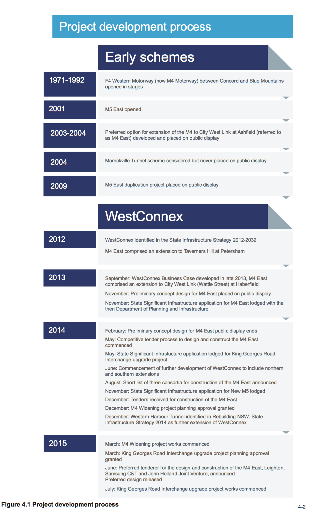
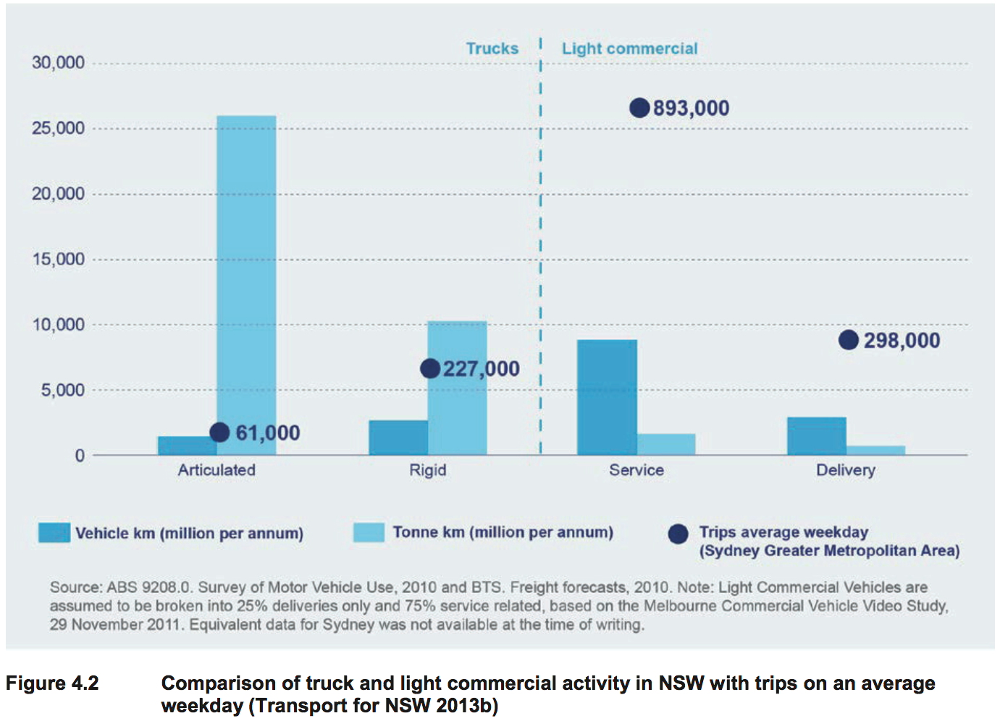
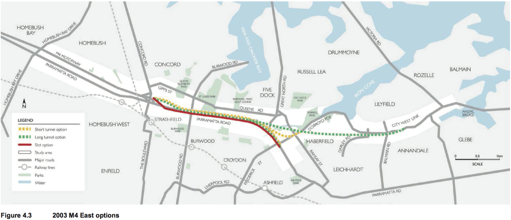
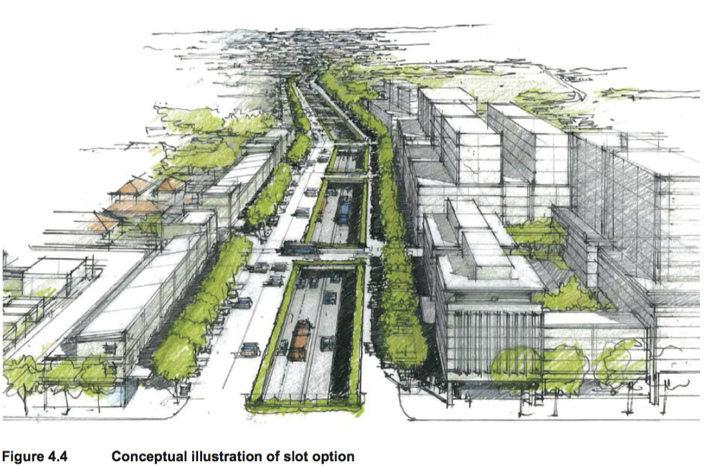

## 4 Project development and alternatives

This chapter describes the alternatives that were considered as part of the development process for
the M4 East project (the project), and explains how and why the project was selected as the preferred
option. Design options and refinements for particular elements of the project are also addressed.

The Secretary of the Department of Planning and Environment has issued a set of environmental
assessment requirements for the project; these are referred to as Secretary’s Environmental
Assessment Requirements (SEARs). Table 4.1 sets out the Secretary’s Environmental Assessment
Requirements that relate to project development and alternatives, and identifies where these have
been addressed in this environmental impact statement (EIS).

<table id="table-4-1">
  <caption>Secretary’s Environmental Assessment Requirements – project development and
alternatives</caption>
  <thead>
    <tr>
      <th>
        Secretary’s Environmental Assessment Requirement
      </th>
      <th>
        Where addressed in the EIS
      </th>
    </tr>
  </thead>
  <tbody>
    <tr>
      <td>
        [A]n analysis of feasible alternatives to the
        carrying out of the project and project
        justification, including:

        <ul><li>an analysis of alternatives/options considered
        having regard to the project objectives
        (including an assessment of the environmental
        costs and benefits of the project relative to
        alternatives and the consequences of not
        carrying out the project), and the provision of a
        clear discussion of the route development and
        selection process, the suitability of the chosen
        alignment taking into account environmental
        impacts, consideration of tunnel construction
        methods and whether or not the project is in
        the public interest</li></ul>
      </td>
      <td>
        Chapter 4 (this chapter)  

        Public interest is addressed in Chapter 30
        (Project justification and conclusion).
      </td>
    </tr>
  </tbody>
</table>

### 4.1 History of the M4 East and WestConnex

It has been acknowledged that no single project provides a complete solution to Sydney’s transport
requirements. Variations on the component projects of WestConnex have been under consideration
since the early 2000s and would augment and complete missing links in Sydney’s motorway network.

Figure 4.1 shows the project development process undertaken for theM4 East and WestConnex.

#### 4.1.1 M4 Motorway

The construction of the M4 Motorway (originally the F4 Western Freeway) occurred in several stages
between the late 1960s and the mid-1980s. It was first opened to traffic in 1971 and now comprises a
40 kilometre urban motorway connecting Concord with the Blue Mountains. The section between
Parramatta and Concord was opened in 1992. Since then, various schemes and multiple options
have been explored, developed and built to complement the M4.

Between 2003 and 2004 a preferred option for an eastern extension of the M4 to the Sydney central
business district (CBD) was developed and publicly exhibited. This option, referred to as the M4 East,
proposed extending the M4 to the City West Link and Parramatta Road at Ashfield as well as
widening the existing motorway between Homebush Bay Drive and Concord Road. This scheme was
put on hold indefinitely by the then NSW Government. The 2003 preferred option formed the basis of
the concept design for the M4 East project, which forms part of WestConnex. The M4 Widening,
which forms part of WestConnex, will upgrade the M4 to general y four lanes in each direction
between Pitt Street at Parramatta and Homebush Bay Drive at Homebush. As discussed in section
4.1.4, planning approval for the M4 Widening was granted in December 2014 and work began in
March 2015.

<figure id="figure-4-1">
  
  <figcaption>
    Figure 4.1 Project development process
  </figcaption>
</figure>

#### 4.1.2 M5 East Motorway

The M5 East Motorway is a 10 kilometre motorway connecting the M5 South West Motorway with
General Holmes Drive and the Eastern Distributor. The M5 East opened in 2001 and from this time
has operated at or near capacity. The M5 East Motorway has attracted ongoing community concern in
relation to tunnel air quality.

A proposal for the M5 East duplication was publicly displayed in 2009. Since that time the scheme
has undergone further development and now forms part of WestConnex – King Georges Road
Interchange Upgrade and New M5 (King Georges Road at Beverly Hills to St Peters).

#### 4.1.3 Connection between the M4 and M5 East

The Marrickville Tunnel was a scheme considered in around 2004 to create a direct connection
between the then M4 East and Mascot, in order to provide a direct route for traffic between Port
Botany, Sydney Airport and South Sydney. One option considered for this scheme was a truck only
tunnel, recognising that the main function of this link would be to enhance freight access between Port
Botany, Sydney Airport and north-western Sydney. This scheme was not progressed and was never
placed on public display. The Enfield Intermodal Terminal was then developed instead to increase the
volume of freight carried by rail to and from Port Botany, with distribution by road from Enfield using
existing arterial roads and the M4.

The concept of a connection between the M4 and M5 East has developed to become the possible
future M4–M5 Link (M4–M5 Link) which, subject to planning approval, forms part of WestConnex.
This would complete the orbital road network between western Sydney and the eastern gateways of
Port Botany and Sydney Airport, and provide a north–south bypass of the Sydney CBD.

#### 4.1.4 WestConnex and M4 East

WestConnex has evolved from the earlier schemes for the M4, M5 East and the connection between
the two. It is aimed at enhancing the capacity and connectivity of the M4 and M5 East motorways.
The WestConnex scheme was first set out in the State Infrastructure Strategy 2012-2032
(Infrastructure NSW 2012a) as a strategic concept, developed as a response to a series of strategic
challenges faced by Sydney and NSW.

The State Infrastructure Strategy identified the component projects of WestConnex to be delivered in
two stages:

* Northern Sector, comprising widening of the existing M4 (now M4 Widening) and M4 Extension
to Taverners Hill and St Peters (now M4 East and M4–M5 Link)

* Southern Sector, comprising the M5 East Expansion (now New M5 and King Georges Road
Interchange Upgrade).

The ‘M4 Extension’ component of WestConnex comprised a connection between the existing M4 at
Concord and Taverners Hill in Petersham (Infrastructure NSW 2012b). The M4 Extension was to be
constructed in sections variously in tunnel, in cutting (or ‘slot’), at grade or on elevated road, to
optimise urban renewal along Parramatta Road.

To reduce risks and costs, NSW Roads and Maritime Services (Roads and Maritime) engaged
leading Australian and international construction industry partners to review and optimise the design
(as developed to 2013) along with earlier works for the WestConnex scheme, and to develop
innovative solutions for different forms of alignment options. The outcome of this work was
incorporated into the project design development and assessment.

In September 2013, the WestConnex Business Case Executive Summary was released (Sydney
Motorways Project Office 2013a). The Business Case Executive Summary identified the component
projects of WestConnex to be delivered in three stages:

* Stage 1: Parramatta to Haberfield (now M4 Widening and M4 East)

* Stage 2: Beverly Hills to St Peters (now King Georges Road Interchange Upgrade and New M5)

* Stage 3: Haberfield to St Peters (now M4–M5 Link).

The M4 East component of WestConnex was proposed to continue the M4 from Homebush Bay Drive
to Parramatta Road and City West Link at Haberfield, by providing a tunnel with three lanes in each
direction, general y following the alignment of Parramatta Road. The preliminary concept design for
the M4 East was publicly displayed between November 2013 and February 2014. Submissions
received during the public display were considered and informed the development of the M4 East
concept design.

A competitive tender process to design and construct the M4 East commenced in May 2014, when
expressions of interest were called. A shortlist of three consortia to build the M4 East was announced
by the NSW Government in August 2014. Tenders from shortlisted contractors to build the M4 East
were received in December 2014, and tender evaluation and design refinement to cater for changes
to WestConnex as described below took place over the first half of 2015. The preferred tenderer, a
consortium comprising Leighton, Samsung C&T and John Holland, was announced on 4 June 2015.

Concurrent with the design and construct tender process, in June 2014, the NSW Government
requested that the WestConnex Delivery Authority (WDA) assess the potential for enhancing the
scope of WestConnex through northern and southern extensions to the scheme. The northern
extension is proposed as a link to the former Rozelle Goods Yards, enabling connection to the
Victoria Road corridor to the north and Anzac Bridge and Western Distributor to the east. The
southern extension is proposed as a connection between the proposed New M5 tunnels (to be built as
part of WestConnex) and President Avenue at Rockdale. WDA is currently developing a business
case for the northern and southern extensions that sets out their strategic and economic rationale and
indicates a path for their further development. The northern and southern extensions are shown in
Figure 1.2 in Chapter 1 (Introduction).

In addition to the northern and southern extensions of WestConnex, Rebuilding NSW: State
Infrastructure Strategy 2014 (NSW Government 2014b) identifies the proposed Western Harbour
Tunnel project as the next major motorway to be developed after or at the same time as the M4–M5
Link. It would see the construction of an additional Sydney Harbour road crossing of approximately
seven kilometres, connecting the WestConnex northern extension around Rozelle with the Gore Hill
or Warringah freeways. Feasibility work and business case development for the project is underway.
Together, the WestConnex extensions and the Western Harbour Tunnel would facilitate a new
northísouth route through Sydney that avoids the Sydney Harbour Bridge and Tunnel, CBD, Eastern
Distributor and Anzac Bridge.

The status of the other component projects of WestConnex is as follows:

* A planning application was made for the New M5 in November 2014 and an EIS is currently
being prepared

* Planning approval for the M4 Widening was granted on 21 December 2014 and work began in
March 2015

* Planning approval for the King Georges Road Interchange Upgrade was granted on 3 March
2015 and work began in July 2015

* A separate planning application will be made for the M4–M5 Link following further concept
development.

### 4.2 Strategic alternatives

The merits of the project were considered by WDA and Roads and Maritime in the context of a range
of other alternatives. The alternatives considered are consistent with those considered for other
recent motorway upgrade and enhancement projects in the Sydney metropolitan area. Alternatives to
the project were considered based on the extent to which they could meet the project objectives and
how well they performed with reference to other transport, environmental, engineering, social and
economic factors.

The following strategic alternatives to the project were considered:

* Alternative 1 – the base case or ‘do nothing/do minimum’ (‘do minimum’)

* Alternative 2 – improvements to the existing arterial road network

* Alternative 3 – investment in public transport and freight rail improvements

* Alternative 4 – demand management

* Alternative 5 – extension of the M4 as part of WestConnex.

These alternatives are described below.

#### 4.2.1 Alternative 1 – Base case or ‘do nothing/do minimum’

The base case ‘do nothing/do minimum’ option (‘do minimum’) would involve retaining the M4 (with
the M4 Widening completed) and Parramatta Road, in essentially its current configuration, as the
main eastíwest route between Western Sydney and Haberfield. The M4 between Church Street at
Parramatta and Homebush Bay Drive at Homebush would be a tolled motorway as part of the ‘do
minimum’ option. Only minimal new infrastructure such as routine road network and intersection
upgrades would be provided over time to improve capacity.

Future transport demand in the Parramatta Road corridor represents a significant chal enge for
Sydney and NSW. Parramatta Road has one of the highest number of bus passengers, during the
morning peak, of any major bus route in Metropolitan Sydney. Road congestion on Parramatta Road
has led to bus services using the road being delayed and unreliable (ie not running to timetable).

Sections of Parramatta Road carry more than 90,000 vehicles each day, with up to 6,000 of these
being heavy vehicles (refer to section 8.2.2 in  Chapter 8 (Traffic and transport)). On an average
weekday, 2.8 million trips start or finish within the Parramatta Road corridor. This represents 14 per
cent of all trips made within Sydney daily. The locations with highest traffic volumes are between the
end of the M4 at Concord and Wattle Street. Average travel speeds of private vehicles during the
morning peak are about 30 kilometres an hour (Transport for NSW 2012a). Without the project,
Parramatta Road would continue to operate at and beyond capacity in peak hours.

The current network does not support a growing population that needs to efficiently and reliably
access dispersed employment areas and services. Currently, road congestion costs NSW $5.1 billion
each year, due largely to time delays. This figure is expected to increase to $8.8 billion by 2020
(Transport for NSW 2012a). If no improvements are made to this corridor, traffic model forecasts
show that travel times between Strathfield and the Sydney CBD will continue to increase, even
assuming the implementation of the various public transport improvements currently planned or under
construction. Without the project, congestion on Parramatta Road will continue to impact on the NSW
economy through longer delivery and transport times in Sydney, and particularly for businesses in
Western Sydney.

Traffic modelling under the ‘do minimum’ scenario indicates that, by 2031, morning peak travel times
between Homebush Bay Drive at Sydney Olympic Park and Flood Street at Leichhardt would
increase by about 17 minutes in the westbound direction and by less than two minutes in the
eastbound direction. In the afternoon peak, travel times in both directions would increase by between
five and eight minutes.

##### Summary

In the context of the transport challenges identified in Chapter 3 (Strategic context and project need),
a ‘do minimum’ option is considered unrealistic and would not address a number of Australian and
NSW government commitments, including key goals in *NSW 2021: A Plan to Make NSW Number
One* (NSW Department of Premier and Cabinet 2011) (see section 3.1). It would also not meet the
project objectives as outlined in section 3.3.

#### 4.2.2 Alternative 2 – Improvements to the existing arterial road network

Infrastructure NSW recognises that the wider road network, including major arterials, will also require
improvement and that some of the highest value infrastructure investments come from ‘pinch point’
relief that addresses road congestion ‘hotspots’ (Infrastructure NSW 2012a). Improvements to the
existing arterial road network are seen as complementary to the project objectives, reinforcing the
function of the arterial road network as providing high order access routes to the broader road
network, as distinct from the long distance through route function performed by Sydney’s motorway
network.

##### Improvements to Parramatta Road

Consideration was given to upgrading Parramatta Road to improve traffic flow and reduce congestion.
These works would likely include multiple improvements to roads and intersections along the
Parramatta Road corridor and Parramatta Road itself, in an attempt to maintain an acceptable level of
traffic operation.

Parramatta Road east of the intersection with the existing M4 generally experiences high levels of
congestion during much of the day, including on weekends. As such, localised intersection
improvements, refinements to traffic signal timing and/or phasing, road safety measures or similar
small scale works may provide some improvement to travel times and would have an acceptable level
of traffic impacts during their construction phase. More substantial improvements would likely require
grade separation of intersections, which would have substantial traffic impacts during construction.
These measures would still only manage current congestion issues, rather than catering for future
demands related to increased traffic volumes and improved public transport, such as the planned bus
rapid transit or light rail service. These demands could only be accommodated by providing additional
lanes along the length of Parramatta Road. Construction of additional lanes would likely require
considerable private property acquisition along the length of Parramatta Road.

##### Improvements to Patterson Street, Gipps Street, Queens Road and Ramsay Road

Patterson Street, Gipps Street, Queens Road and Ramsay Road provide an alternative road corridor
between the end of the M4 at Concord and Wattle Street (City West Link) at Haberfield. Existing
congestion on Parramatta Road between Concord Road and Wattle Street causes drivers to use
these local roads as an alternative route. These roads are generally one lane in each direction, with
Queens Road carrying up to 27,325 vehicles during an average weekday (refer to section 8.2.2 of
Chapter 8 (Traffic and transport)).

Substantial improvements to these roads would require considerable private property acquisition and
removal of dedicated cycle lanes to accommodate additional traffic lanes. The amenity and safety of
pedestrians and cyclists using these roads would likely be reduced as a result of traffic, noise and air
quality impacts.

In addition, increasing the traffic capacity of these roads would further restrict northísouth movements
across the Parramatta Road corridor, as the dominant traffic flow would be eastíwest movements.
This would not meet the project objective to enhance northísouth movements across the Parramatta
Road corridor.

##### Improvements to Victoria Road

Victoria Road provides an alternative transport corridor from Parramatta to the Sydney CBD north of
the Parramatta River. The character of this route differs from the M4 and Parramatta Road corridor
because its topography is much more varied, with steeper slopes and tight bends. The Victoria Road
corridor passes through a number of established centres and crosses major natural features and
service/transport infrastructure, which presents significant chal enges for increasing road capacity.

Improvements to the Victoria Road corridor would not meet the M4 East project objectives. They
would not enhance movements across the Parramatta Road corridor, nor would they create
opportunities for urban revitalisation, improved liveability, and public and active transport
improvements along and around Parramatta Road.

Similar to the option to improve the Parramatta Road corridor, substantial improvements to Victoria
Road would likely require grade separation of intersections, which would have substantial traffic
impacts. These measures would still only manage current congestion issues rather than catering for
the future traffic demands expected in these corridors. Construction would also likely require removal
of bus lanes and/or considerable private property acquisition along the length of Victoria Road to
accommodate additional general traffic lanes.

##### Summary

The arterial road improvement alternatives described in the preceding sections are considered
inadequate responses to the significant transport challenges on the Parramatta Road corridor.
Localised road corridor improvements would only provide an incremental change to the network,
rather than supporting the additional capacity required for improved bus services and regional traffic
growth.

For alternatives to be worthy of consideration, they must be broadly capable of accommodating the
identified transport task and challenges being addressed by WestConnex. These can only be met by
major arterial road improvements that will have significant construction impacts or require the
construction of new infrastructure. Arterial road improvement options would therefore not meet the
project objectives as outlined in section 3.3 of Chapter 3 (Strategic context and project need).

#### 4.2.3 Alternative 3 – Investment in public transport and rail freight improvements

As discussed in Chapter 3, WestConnex is a key component of the *NSW Long Term Transport
Master Plan* (Transport for NSW 2012a) (Transport Master Plan), the *State Infrastructure Strategy
2012–2032* (Infrastructure NSW 2012a) (State Infrastructure Strategy) and *A Plan for Growing
Sydney* (NSW Government 2014a). As part of a broader integrated transport solution, the project
supports a coordinated approach to the management of freight and passenger movements, as well as
all modes of transport including road, rail, bus, ferries, light rail, cycling and walking. There is,
however, recognition that Sydney’s freight, commercial and services tasks require distribution of
goods and services across the Sydney basin, which relies on more diverse and dispersed point-to-
point transport connections that can only be provided by the road network.

##### Public transport

The Parramatta Road corridor runs paral el to the Main Western Rail Line. Trains provide the trunk
public transport service in this corridor, connecting Western Sydney and centres in the corridor to the
Sydney CBD. *Sydney’s Rail Future* (Transport for NSW 2012b) identified the need for service
improvements on the Main Western Rail Line, which are being considered separately by the NSW
Government. *Sydney’s Rail Future* also outlines the establishment of Sydney Rapid Transit (now
Sydney Metro) which, while not directly servicing the Parramatta Road corridor, would assist in
removing some key bottlenecks on the Sydney Trains network. This would then improve train
movements along the Main Western Rail Line.

Commercial and retail centres have developed around stations along the Main Western Rail Line,
including at Strathfield, Burwood and Ashfield. Consequently, many bus services on and around the
Parramatta Road corridor act as feeder services to train stations and centres, although there remains
a strong demand for eastíwest services along Parramatta Road between Burwood and the Sydney
CBD.

Public transport options such as rail, light rail or bus would be feasible potential alternatives if the
project, as part of WestConnex, was primarily concerned with transporting people to and from
centres. However, the key customer markets identified for the project include highly dispersed and
long distance passenger movements, as well as heavy and light freight and commercial services and
businesses whose travel patterns are also greatly dispersed and diverse in nature. These customers
have highly varied requirements when it comes to the transfer of goods and services. These
requirements include the transport of containerised freight by rigid and articulated trucks, light trucks,
vans, utility vehicles and cars.

Public transport would only partially address these customer demands. There are no feasible strategic
transport alternatives í such as heavy or light rail options or bus corridor enhancements í that would
meet the diverse range of customer needs for travel in this corridor and address the project objectives
as effectively as the project and WestConnex more broadly.

This does not preclude a number of these public transport alternatives being complementary to the
project and the broader WestConnex scheme. In particular, the project is expected to reduce traffic
volumes along Parramatta Road. As described in Chapter 3 (Strategic context and project need), this
would allow for the establishment of a mass transit corridor along Parramatta Road, and the project
has been designed to allow for the provision of this mass transit corridor (refer to section 5.5.5
(Project Description)). Such a corridor would provide suitable facilities for the transport of a high
number of people along Parramatta Road by bus. In the long term and as outlined in *Sydney’s Bus
Future* (Transport for NSW 2013a), if demand permits, this corridor could be upgraded to light rail.

##### Combined transport options

A ‘park and ride’ scenario, supplemented with a light rail line along Parramatta Road or express heavy
rail services to Central Station, has been identified by a public transport advocacy group known as
Eco-Transit. This transport alternative would introduce a ‘park and ride’ facility and busírail
interchange in Olympic Park, an additional railway station on the Olympic Rail Line near its crossing
of the existing M4, and an express service linking the new station with Central Station via the Main
Western Rail Line. The park and ride facility would be supplemented by a light rail line from this new
station, along Parramatta Road to Central Station.

Passenger trips for work, education, health, recreation and personal business are recognised as a
key customer market on the M4 East. A majority of these trips are by private vehicle, as many
destinations are located outside the major centres. Commuting and education trips typically occur in
the morning and afternoon travel peaks, whereas other passenger trips are more discretionary and
can occur in inter-peak times and on weekends. These trips are typically highly dispersed and travel
patterns are complex.

Public transport is not the most effective way of servicing a majority of these passenger trips. It also
fails to address demand for the movement of freight and trades and services. For these reasons,
public transport options are seen as complementary services supporting, but not whol y able to
address, the transport demands that would be addressed by the project and the broader WestConnex
scheme.

##### Rail freight

Apart from moving passengers, Sydney's rail network plays a significant role in moving freight
between Sydney's ports and destinations around Sydney, regional NSW and other states. The *Trade
and Logistics Report 2011-12* (Sydney Ports Corporation 2012) indicates that some 98 per cent of
imported containers and over 60 per cent of exported containers through Port Botany have their origin
and destination within Greater Sydney.

The Transport Master Plan identifies a number of current and future freight-related projects that
complement the existing freight network. These include:

* Completion of the Southern Sydney Freight Line

* Development of an intermodal terminal at Enfield (commenced limited operation in March 2015
with some construction work ongoing)

* Stage one of the Northern Sydney Freight Corridor Program (under construction)

* Development of an intermodal terminal at Moorebank (in planning approval phase)

* A Western Sydney Freight Line (corridor for future preservation under investigation)

* Western Sydney Intermodal Terminal (sites being considered as part of investigation for the
Western Sydney Freight Line).

There are opportunities to shift more freight onto rail, and this remains a priority for the NSW
Government. However, assuming the target of doubling the share of container freight moved by rail is
achieved by 2020 (Transport for NSW 2013d), more than 70 per cent of Port Botany’s projected trade
would still be moved by road, requiring investment in an efficient road network to support the port and
airport precincts.

Rail freight transport is more effective for long distance transport of goods to regional centres.
However, Sydney’s freight, service and business task requiring distribution within the Sydney
metropolitan area relies on dispersed point-to-point transport connections to customers.
Predominantly, freight rail serves the first leg of the freight journey, with containerised freight broken
down at distribution nodes and further distributed across Sydney. In managing the freight task, heavy
commercial vehicles require a primary network with high quality connections between major freight
hubs, whereas light commercial vehicles depend on a multi-layered network with many connections to
service more diverse and dispersed markets across Sydney.

This arrangement means that there are around four times as many light commercial vehicle trips on
Sydney’s road network as heavy commercial vehicle trips (Transport for NSW 2013b) (refer to
Figure 4.2), and this trend is forecast to continue. A key reason for this trend is that heavy freight
activity precincts are concentrated in a few key locations in the vicinity of the port and across Western
Sydney, and this land use pattern is also set to continue into the future.

<figure id="figure-4-2">
  
  <figcaption>
    Figure 4.2 Comparison of truck and light commercial activity in NSW with trips on an average weekday (Transport for NSW 2013b)
  </figcaption>
</figure>

The *Sydney Airport Master Plan 2033* (Sydney Airport Corporation Limited 2014) notes that Sydney
Airport handles about half of Australia’s international air freight. The total amount of freight handled at
Sydney Airport is 76 per cent more than any other Australian airport. The volume of freight handled by
Sydney Airport is projected to increase from 615,378 tonnes in 2012 to 1,011,312 tonnes in 2033
(Sydney Airport Corporation Limited 2014). Air freight exports from Australia are dominated by fresh,
chilled or frozen perishables such as meat, seafood, fruit, vegetables, flowers, livestock and
manufactured goods.

A key location for supply and re-distribution of fresh, chilled or frozen perishables in Sydney is the
Sydney Markets at Flemington, adjacent to the M4 at Homebush. These time-critical exports rely on
productive, efficient and effective landside and airside logistics that are best met by road rather than
rail. Rail freight transport remains reliant on road transport to move freight to a train from the source,
and from the train to the final destination. In Sydney, road transport provides a direct link between the
source of the produce (eg regional areas) and the Sydney Markets, and from the markets to retail
outlets as well as Sydney Airport.

The development of the Western Sydney Airport has the potential to change the way some freight is
moved around Sydney, by providing an alternative entry or exit point for freight. Overall, however, the
movement of freight around Sydney is not considered to be significantly altered by the introduction of
the new airport, for the following reasons:

* The operation of the Western Sydney Airport would be staged, ramping up over time, with initial
operations only commencing in the mid-2020s (a minimum of five years after the completion of
the project)

* Freight arriving at the new airport would still have destinations across wider Sydney

* Port Botany and Sydney Airport would still be key freight entry and exit points, with the new
airport to complement the existing airport.

In combination with the freight-related projects identified above, the project and the broader
WestConnex scheme would provide a robust freight solution and would best address the project
objectives.

##### Summary

There are no feasible strategic public transport or rail freight alternatives that would fully meet the
diverse range of needs for travel in the Parramatta Road corridor, and address the project objectives
as outlined in section 3.3. Public transport and rail freight options are seen as complementary
services supporting the project and the broader WestConnex scheme, and the NSW Government is
currently implementing a number of public transport and rail freight projects.

#### 4.2.4 Alternative 4 – Demand management

Demand management can be defined as a policy, planning and operational approach to the
movement of goods or people. Demand management encompasses policies intended to reduce
individual trips and make various mode options more viable. These policies include:

* Urban consolidation and 'centres’ policies (land use planning) to reduce the need for travel

* Other planning control policies such as restricting parking provisions in new developments

* Road network management and network connectivity policies, including implementation of
intelligent transport systems to improve public transport operation, management of clearways
and transit lanes, and providing greater priority for public transport over general traffic

* Transport pricing to reduce travel demand; including demand based, tolling or transport pricing to
discourage discretionary travel by private vehicle for trips that can be served by public transport.

The Transport Master Plan highlights that Western Sydney is currently home to 47 per cent of
Sydney’s residents but only 37 per cent of Sydney’s jobs (Transport for NSW 2012a). This disparity is
due to a number of factors that include greater housing affordability in Sydney’s west, and the existing
agglomerations and infrastructure that support stronger business investment (and therefore location
decisions) in the global economic corridor and Sydney’s east more general y.

Demand management measures can take many years to achieve changes in travel behaviour, as
existing customer practices need to be modified and existing investment priorities changed. In the
context of this project, travel demand management would require modifying travel decisions and
reducing dependence on cars, especially during peak periods.

While demand management could help to spread the demand for peak travel to less congested time
periods, its effectiveness would be limited by other constraints, such as availability of other travel
modes at the user’s origin and destination, and flexibility of working arrangements to take advantage
of ‘time of day’ tolling or transport pricing benefits.

#### Summary

Demand management measures are seen as complementary initiatives rather than a viable stand-
alone alternative to the project. To have a major impact on road traffic, demand management would
also require major changes in social attitudes, travel behaviour and government policy.

#### 4.2.5 Alternative 5 – Extension of the M4 as part of the WestConnex scheme

This alternative would involve extending the M4 to the east as part of the broader WestConnex
scheme. As described in the *WestConnex Strategic Environmental Review* (Sydney Motorways
Project Office 2013b), it would link the existing M4 at Homebush Bay Drive, Homebush to Parramatta
Road and the City West Link at Haberfield. The extension would be a new motorway comprised of
some surface road sections and two tunnels with three lanes in each direction. The extension would
be a controlled access road with on and off ramps connecting to various locations on Parramatta
Road subject to design.

As indicated in Chapter 3 (Strategic context and project need), the WestConnex scheme has been
developed as a key transport component of the Transport Master Plan integrated with the strategic
land use outcomes as identified in *A Plan for Growing Sydney*. The Transport Master Plan identifies
the WestConnex scheme as a critical link in Sydney’s motorway network and an immediate priority for
the NSW Government.

The extension of the M4 was identified, along with the M4 Widening project, as forming part of the first
stage of the WestConnex scheme. It would complete a missing link in the motorway network between
growing population, employment and industrial centres of Sydney’s west and east.

#### 4.2.6 Preferred strategic alternative

Extension of the M4 (Alternative 5) and the project as described in this EIS is the preferred strategic
alternative. Investment in public transport and rail freight and demand management (Alternatives 3
and 4 respectively) are considered to be viable complementary strategic alternatives. A number of
public transport and rail freight projects are being investigated and implemented in conjunction with
the preferred strategic alternative. The NSW Government is also considering implementing ‘smart
motorway’ operations on the M4.

The preferred option, as described in sections 4.3 to 4.6, has evolved from a series of ongoing
concept developments and evaluations since 2003. Chapter 3 demonstrates the need for the project
and provides detail on its strategic context. The preferred option best achieves all of the project
objectives as set out in section 3.3. It  would:

* Support Sydney’s long-term economic growth through improved motorway access and
connections linking Sydney’s international gateways (Sydney Airport and Port Botany), Western
Sydney and places of business across the city

* Relieve road congestion to improve the speed, reliability and safety of travel in the Parramatta
Road corridor, including parallel arterial roads

* Cater for the diverse travel demands along this corridor that are best met by road infrastructure

* Create opportunities for urban revitalisation, improved liveability, and public and active transport
improvements along and around Parramatta Road

* Enhance the productivity of commercial and freight generating land uses strategically located
near transport infrastructure

* Enhance the currently restricted movements across the Parramatta Road corridor.

* Fit within the financial capacity of the NSW and Australian Governments, in partnership with the
private sector

* Optimise user pays contributions to support funding in a way that is affordable and equitable

* Integrate with the preceding and next stages of WestConnex, without creating significant impacts
on the surrounding environment or duplicating any potential issues across the construction
periods.

The preferred option is described in detail in Chapter 5 (Project description). In summary, it
comprises widening and realigning the M4 between Homebush Bay Drive and Underwood Road at
Homebush; two new three-lane tunnels extending from west of Pomeroy Street at Homebush to near
Alt Street at Haberfield; provision of interchanges at Concord Road at Concord, Wattle Street (City
West Link) at Haberfield, and Parramatta Road at Ashfield; installation of tunnel ventilation systems
and other operational ancillary facilities; and associated upgrades and modifications to surface roads.

### 4.3 Motorway options

#### 4.3.1 Earlier options development

As outlined in section 4.1, there has been ongoing development of the project since 2003. This
section discusses the early options considered for the M4 East.

##### 2003 options

Three options were considered during the M4 East options study (RTA 2003):

* Short tunnel option – construction of twin 3.6 kilometre tunnels running roughly below the
alignment of Parramatta Road from the existing end of the M4 to City West Link (at Dobroyd
Parade) and Parramatta Road at Haberfield

* Long tunnel option – construction of twin 6.5 kilometre tunnels running roughly below Parramatta
Road until just west of Great North Road, then connecting with the City West Link at Lilyfield. A
spur tunnel would be constructed where the main tunnels end north of Parramatta Road. This
spur would include twin 1.3 kilometre tunnels for a connection to Parramatta Road at Haberfield

* Slot option – a number of surface options were considered; however, the ‘slot’ option was
considered to be most viable. This option would involve lowering of the motorway into a ‘slot’,
similar to the Eastern Distributor at Moore Park. The alignment would generally run paral el to
Parramatta Road and be positioned to the south. This option would run between the end of the
existing M4 and Parramatta Road at Haberfield.

<figure id="figure-4-3">
  
  <figcaption>
    Figure 4.3 2003 M4 East options
  </figcaption>
</figure>

The short tunnel option was preferred for a number of reasons. When compared to the long tunnel
option, the short tunnel was considered to have lower costs both during construction and operation (ie
lower tolls) and would require fewer ventilation stacks. The long tunnel option was considered to have
the potential to increase congestion on the approaches to the Anzac Bridge, including unacceptable
queuing back into the eastbound tunnels.

The slot option could be constructed at a similar cost to the short tunnel; however, it was considered
to not provide the same level of traffic benefits as the tunnel option. The construction period for this
option would be longer, due to the need to acquire a substantial number of properties. The impacts on
the community and traffic on Parramatta Road during construction were also considered to make the
slot option less attractive.

##### 2012 original WestConnex slot scheme

The original WestConnex scheme set out in the State Infrastructure Strategy and WestConnex –
Sydney’s next motorway priority (Infrastructure NSW 2012b) comprised a connection between the
existing M4 at North Strathfield and Taverners Hill at Petersham.

A key feature of the conceptual scheme was a slotted motorway running parallel to Parramatta Road,
to optimise opportunities for urban renewal. Figure 4.4 provides a conceptual il ustration of the
proposed slot arrangement as shown in the State Infrastructure Strategy.

<figure id="figure-4-4">
  
  <figcaption>
    Figure 4.4 Conceptual illustration of slot option.
  </figcaption>
  Source: Infrastructure NSW 2012a
</figure>

##### 2013 industry partner development

Following the advice of Infrastructure NSW for “greater private sector involvement at the design
phase” (Infrastructure NSW 2012a), four Australian and international construction industry consortia
lead by Ferrovial Agroman, Leighton Contractors, Thiess and Baulderstone/Bouygues were selected
as partners to assist with developing improved design and construction solutions for specific sections
of WestConnex. Ferrovial Agroman and Leighton Contractors were assigned to the Northern Corridor,
from the existing M4 and Parramatta Road at Homebush Bay Drive to Campbell Street at St Peters.
Thiess and Baulderstone/Bouygues were assigned to the Southern Corridor, from the M5 to the
Airport Link at St Peters.

The purpose of these engagements was to ensure that a wide variety of efficient and innovative
options were identified and considered in the development of WestConnex. Preferred options were
subject to multi-criteria analysis and further design refinement using traffic, financial and economic
evaluation as part of the development of the 2013 business case.

Following the industry partner development process, the slot option was not preferred due to:

* The extent of property acquisition required

* Complex traffic management and substantial traffic impacts on Parramatta Road during
construction

* Difficulties in managing surface water around and over the open slot.

##### 2013 WestConnex Business Case

In September 2013, the Sydney Motorways Project Office (then part of Roads and Maritime and the
precursor agency to the WestConnex Delivery Authority) released the WestConnex Business Case
Executive Summary. The M4 East component of WestConnex was proposed to continue the M4 from
Homebush Bay Drive to Parramatta Road and City West Link at Haberfield, by providing a tunnel with
three lanes in each direction, general y following the alignment of Parramatta Road.

#### 4.3.2 Tunnel corridor options

Three tunnel corridor options were considered and assessed against the project objectives:

* Generally following the alignment of Parramatta Road. This option was included in the concept
design that was publicly displayed between 2013 and February 2014

* North of Parramatta Road for the full length of the project

* Generally south of Parramatta Road, except for a section at the western end.

The advantages and disadvantages of these options are outlined in Table 4.2.

<table id="table-4-2">
  <caption>Table 4.2 Advantages and disadvantages of tunnel corridor options</caption>
  <thead>
    <tr>
      <th>Option</th>
      <th>Advantages</th>
      <th>Disadvantages</th>
    </tr>
  </thead>
  <tbody>
    <tr>
      <td>Following Parramatta Road</td>
      <td>
        <ul>
          <li>
            Construction impacts of tunnelling would occur beneath commercial
            and industrial properties
          </li>
          <li>Ground conditions are expected to be suitable for tunneling.</li>
        </ul>
      </td>
      <td>
        <ul>
          <li>
            Tunnels below Parramatta Road
            would restrict the depths to which
            buildings could be constructed, in
            particular basements or footings for
            taller buildings
          </li>
          <li>
            This would restrict opportunities for
            urban revitalisation and improved
            liveability along and around
            Parramatta Road.
          </li>
        </ul>
      </td>
    </tr>
    <tr>
      <td>
        North of Parramatta Road
      </td>
      <td>
        <ul>
          <li>
            Tunnels would be shorter, which would reduce construction cost
          </li>
          <li>
            Tunnels would not cross beneath
            Parramatta Road, preserving the
            corridor for future urban renewal.
          </li>
        </ul>
      </td>
      <td>
        <ul>
          <li>
            Ground conditions are expected to
            be unsuitable for tunnelling, because
            of:
          </li>
          <ul>
            <li>Less stable rock</li>
            <li>Higher groundwater inflows</li>
            <li>Landfil ing that has historically occurred in a number of areas including near Concord Oval.</li>
          </ul>
        </ul>
      </td>
    </tr>
    <tr>
      <td>
        Generally south of
        Parramatta Road
      </td>
      <td>
        <ul>
          <li>
            Tunnels would be shorter, which would reduce construction cost
          </li>
          <li>
            Tunnels would only cross beneath
            Parramatta Road for a short
            distance, preserving the majority of
            the corridor for future urban renewal
          </li>
          <li>
            Ground conditions are expected to
            be favourable for tunnel ing, which
            would al ow for quicker construction
            and lower risks associated with
            tunnelling activities.
          </li>
        </ul>
      </td>
      <td>
        <ul>
          <li>
            Construction impacts of tunnelling
            would occur beneath residential
            properties.
          </li>
        </ul>
      </td>
    </tr>
  </tbody>
</table>

Positioning the tunnels generally to the south of Parramatta Road was preferred as ground conditions
are general y considered to be better, which would allow for quicker construction and lower risks
associated with tunnelling activities. This option would also result in a shorter tunnel length, which
would in turn reduce construction cost.

The positioning of the tunnels south of Parramatta Road would also preserve the corridor for future
development as part of the Parramatta Road urban renewal strategy. This would allow development
along the majority of Parramatta Road to occur without the restriction of a tunnel below.

#### 4.3.3 Number of lanes within tunnels

Three options were considered for the number of lanes within the tunnels, and assessed against the
project objectives:

* Two lanes

* Three lanes. This option was included in the concept design that was publicly displayed between
2013 and February 2014

* Four lanes.

The advantages and disadvantages of these options are outlined in Table 4.3.

<table id="table-4-3">
  <caption>Table 4.3 Advantages and disadvantages of tunnel lane number options</caption>
  <thead>
    <tr>
      <th>Option</th>
      <th>Advantages</th>
      <th>Disadvantages</th>
    </tr>
  </thead>
  <tbody>
    <tr>
      <td>Two lanes</td>
      <td>
        <ul>
          <li>
            Reduced tunnel width would be cheaper
            to build.
          </li>
        </ul>
      </td>
      <td>
        <ul>
          <li>Not considered adequate to carry the expected traffic volumes</li>
          <li>
            Costly and disruptive upgrading to three
            lanes would likely be required not long
            after the project opened.
          </li>
        </ul>
      </td>
    </tr>
    <tr>
      <td>
        Three lanes
      </td>
      <td>
        <ul>
          <li>
            Would match the number of lanes on the
            existing M4 at Concord and Parramatta
            Road at Haberfield/Ashfield
          </li>
          <li>
            Would cater for projected initial and
            future traffic volumes within the tunnel.
          </li>
        </ul>
      </td>
      <td>
        <ul>
          <li>
            Wider tunnel, which would be more
            expensive to build (but not as expensive
            as a four lane tunnel).
          </li>
        </ul>
      </td>
    </tr>
    <tr>
      <td>
        Four lanes
      </td>
      <td>
        <ul>
          <li>
            Would allow for considerable capacity in
            the event of increases in traffic volume
          </li>
        </ul>
      </td>
      <td>
        <ul>
          <li>
            Wider tunnel, which would be more
            expensive to build
          </li>
          <li>
            Would result in bottlenecks at the
            eastern tunnel portals, as above ground
            infrastructure is unlikely to be greater
            than three lanes in each direction.
          </li>
        </ul>
      </td>
    </tr>
  </tbody>
</table>

The construction of three lanes in each direction within the tunnels was the preferred option, as it
would match the number of lanes on the existing M4 at Concord and on Parramatta Road at
Haberfield/Ashfield. It would cater for projected initial and future traffic volumes within the tunnel (refer
to Chapter 8 (Traffic and Transport)).

#### 4.3.4 Preferred motorway option

Having considered the motorway options against the project objectives, the preferred motorway
option is for a three-lane tunnel located generally on the southern side of Parramatta Road.

### 4.4 Interchange options

#### 4.4.1 Western tunnel portals

##### Options considered

The following options were considered for the western tunnel portals:

* Option H1 – Concord Road interchange: This would have involved duplicating the existing M4
viaduct between Underwood Road at Homebush and Queen Street at North Strathfield. The
western tunnel portals would form part of the Concord Road interchange

* Option H2 – west of Homebush Bay Drive: This option would involve locating the western tunnel
portals on the western side of Homebush Bay Drive

* Option H3 – east of Homebush Bay Drive: This option would involve locating the western tunnel
portals between Homebush Bay Drive and Powells Creek, but as a separate interchange to the
Concord Road interchange. This option would al ow all movements to and from both the existing
M4 and Homebush Bay Drive into the mainline tunnels. This option was included in the concept
design that was publicly displayed between 2013 and February 2014.

The general location of these portal options is shown on Figure 4.5.

<figure id="figure-4-5">
  
  <figcaption>
    Figure 4.5 Western tunnel portal options
  </figcaption>
</figure>

##### Assessment of options

The advantages and disadvantages of these options are outlined in Table 4.4.

Table 4.4

Advantages and disadvantages of western tunnel portal options

Option

Advantages

Disadvantages

H1

x There would be cost savings as a result

of integrating the western tunnel portals
with the Concord interchange.

x Grades into the tunnel would have been

greater than six per cent, which is
considered too steep, and would have
required substantial cut and cover tunnel
sections, with associated significant
impacts on residential properties on the
eastern side of Concord Road

x Duplicating the existing M4 viaduct would

limit future development potential of land
at Railway Lane and George Street
(Bakehouse Quarter)

x Construction staging in the vicinity of

Concord Road while maintaining existing
high traffic volumes would have been
complex and would have had significant
traffic impacts

x Concord Road would likely need to be

widened, with associated impacts on
residential properties.

H2

x Surrounding development comprises

Sydney Olympic Park and industrial
development, and construction and
operation impacts of the portals would
avoid residential areas.

x This option would not allow traffic from

the key centres of Sydney Olympic Park
and Rhodes to access the M4 East
tunnels

x It would have lengthened the tunnel,

increasing cost.

H3

x Grade and impacts on residential

properties east of Concord Road would
be minimised

x Future development potential of land at

Railway Lane and George Street would
not be restricted

x Traffic would be able to connect to the

key centres of Sydney Olympic Park and
Rhodes.

x Assuming a Concord interchange is also

provided (see section 4.4.2), there would
be two interchanges within less than two
kilometres.

Preferred option

Option H3, locating the western portals east of Homebush Bay Drive, was selected as the preferred
option, as it would:

* Minimise grade and impacts on residential properties east of Concord Road

* Not limit future development potential of land at Railway Lane and George Street

* Connect to the key centres of Sydney Olympic Park and Rhodes.

Location refinement

Once Option H3, between Homebush Bay Drive and Powells Creek, was selected as the preferred
western portal option, a number of design refinements were considered for the location of the portals,
including:

* H3a – near Saleyards Creek

background image

WestConnex M4 East

4-19

WestConnex Delivery Authority
Environmental Impact Statement

* H3b – near Bill Boyce Reserve at Wentworth Avenue and Pomeroy Street

* H3c – near Underwood Road.

The general location of these is shown on Figure 4.5. The selected design refinement was H3b,
which is a location to the east of Saleyards Creek, about near the footbridge over the existing M4.
This location was selected because it would:

* Avoid areas of flood inundation near Saleyards Creek

* Maintain the existing pedestrian bridge across the M4

* Not affect Wentworth Road South or Pomeroy Street on the northern side of the existing M4

* Allow the tunnel to be far enough below ground so as to not prevent high density development
within the Bakehouse Quarter due to potential basements or building footings

* Utilise land within the existing M4 road reserve.

#### 4.4.2 M4 westbound access options

Options considered

The following options were considered for access to the M4 westbound:

* Option OR1 – retain the existing arrangement: This option would involve retaining the westbound
on-ramp to the M4 from Concord Road northbound, retaining the left turn from Parramatta Road
eastbound to the M4 westbound, and not providing a new on-ramp

* Option OR2 – remove the westbound on-ramp to the M4 from Concord Road northbound and
the left turn from Parramatta Road eastbound to the M4 westbound, and not provide a new on-
ramp: Traffic would be required to access the M4 westbound by either approaching the
Parramatta Road and M4 intersection from the east, or using the Homebush Bay Drive
interchange

* Option OR3 – at the intersection of Parramatta Road and Station Street: This option would
involve removing the westbound on-ramp to the M4 from Concord Road northbound and the left
turn from Parramatta Road eastbound to the M4 westbound, and providing a new westbound on-
ramp at the intersection of Parramatta Road and Station Street at Homebush

* Option OR4 – immediately to the west of Powells Creek: This option would involve removing the
westbound on-ramp to the M4 from Concord Road northbound and the left turn from Parramatta
Road eastbound to the M4 westbound, and providing a new westbound on-ramp to the west of
Powells Creek.

Assessment of options

The advantages and disadvantages of these options are outlined in Table 4.5.

Table 4.5

Advantages and disadvantages of M4 westbound on-ramp options

Option

Advantages

Disadvantages

OR1

x This option requires no changes to the

existing arrangement and is cost neutral.

x The performance of the intersection of

Parramatta Road, Concord Road and
Leicester Avenue at North Strathfield
would decline further, resulting in
increased significant delays.

background image

WestConnex M4 East

4-20

WestConnex Delivery Authority
Environmental Impact Statement

Option

Advantages

Disadvantages

OR2

x This option would provide relief to the

intersection of Parramatta Road, Concord
Road and Leicester Avenue at North
Strathfield, by reducing through
movements from Leicester Avenue to
Concord Road and right turn movements
from Parramatta Road to Concord Road

x It would be cheaper than options that

involve building a new on-ramp.

x Vehicles coming from Leicester Avenue

and other areas south of Parramatta
Road at North Strathfield and wishing to
access the M4 westbound would be
required to either:
 Travel east via local roads to enter

Parramatta Road and turn right at the
Parramatta Road and M4 intersection

 Travel further west along Parramatta

Road and use the Marlborough Road
loop road to access the Homebush
Bay drive interchange.

OR3

x This option would provide relief to the

intersection of Parramatta Road, Concord
Road and Leicester Avenue at North
Strathfield, by reducing through
movements from Leicester Avenue to
Concord Road and right turn movements
from Parramatta Road to Concord Road

x This option would involve acquisition of

privately-owned land, which has recently
had development consent granted for a
new residential flat building

x This option would be more expensive

than options that involve not building a
new on-ramp.

OR4

x This option would provide relief to the

intersection of Parramatta Road, Concord
Road and Leicester Avenue at North
Strathfield, by reducing through
movements from Leicester Avenue to
Concord Road and right turn movements
from Parramatta Road to Concord Road

x This option would not involve acquisition

of privately-owned land.

x This option would involve acquisition from

Strathfield Council of a small part of the
proposed future Arnotts Reserve

x It would involve constructing an on-ramp

over Powells Creek, which is a concrete
channel at this location

x This option would be more expensive

than options that involve not building a
new on-ramp.

Preferred option

Option OR4, involving an on-ramp adjacent to Powells Creek, was considered the preferred option as
it would:

* Provide relief to the intersection of Parramatta Road, Concord Road and Leicester Avenue at
North Strathfield

* Provide an alternate access to the M4 westbound within close proximity to the existing accesses,
so as to not significantly increase travel time and affect network performance in other locations

* Not involve acquisition of privately-owned land.

Location refinement

As a number of options in different locations were considered for the M4 westbound on-ramp, there
was no need to consider location refinements during preferred design development.

#### 4.4.3 Concord interchange

Options considered

The following options were considered for an interchange at or near Concord:

* Option C1 – no interchange: This option would involve having no interchange between the
western portals and Wattle Street/Parramatta Road

* Option C2 – interchange on Parramatta Road near Wentworth Road: This option would involve
providing an interchange on Parramatta Road near Wentworth Road at Strathfield and
Shaftesbury Road at Burwood. This option would have provided an eastbound on-ramp and a
westbound off-ramp

background image

WestConnex M4 East

4-21

WestConnex Delivery Authority
Environmental Impact Statement

* Option C3 – interchange on Parramatta Road near Shaftesbury Road: This option would involve
providing an interchange on Parramatta Road near Shaftesbury Road at Burwood. This option
would have provided an eastbound on-ramp and a westbound off-ramp

* Option C4 – Concord Road: This option would involve providing an interchange at Concord
Road, with an eastbound on-ramp and a westbound off-ramp. Movements to and from the
existing M4 would be maintained. This option was included in the concept design that was
publicly displayed between 2013 and February 2014.

The general location of these interchange options is shown on Figure 4.6.

Assessment of options

The advantages and disadvantages of these options are outlined in Table 4.6.

Table 4.6

Advantages and disadvantages of Concord interchange options

Option

Advantages

Disadvantages

C1

x There would be cost savings as a result

of not having an interchange at Concord
as well as the western portals.

x This option would restrict access from the

key centres of Strathfield and Rhodes to
the M4 East tunnels, and would therefore
not provide adequate transport
connectivity to these centres.

C2

x This option would involve only minimal

impact on residential properties.

x This option would require very long on-

and off-ramps due to topography

x This would have substantial impacts on

commercial and industrial properties
along Parramatta Road.

C3

x This option could utilise a construction

access tunnel excavated to access the
mainline tunnels at Cintra Park for the on-
and off-ramps, which would reduce
property impacts and provide cost
savings

x The proximity of the on-ramp connections

to Wattle Street and Parramatta Road
would have presented problems for the
safe movement of vehicles entering or
exiting at this location. The end of the on-
ramp at this location would have been too
close to the Wattle Street and Parramatta
Road off-ramp, requiring vehicles to
perform unsafe weave movements.

C4

x This option would provide access from

the key centres of Strathfield and Rhodes
to the M4 East tunnels, and would
therefore provide adequate transport
connectivity to these centres

x There would be impact on residential

properties.

Preferred option

Option C4, involving an interchange at Concord Road, was considered the preferred option as it
would:

* Provide access to the key centres of Strathfield and Rhodes

* Not involve substantial impacts to commercial and industrial properties on Parramatta Road

* Not involve unsafe weave movements within the tunnel.

Location refinement

Once Option C4 was selected as the preferred interchange option at Concord, a number of
refinements were considered for the location and design of the interchange. The general location of
these is shown on Figure 4.6.

background image

C3

C2

C4

C1

Figure 4.6 Concord interchange options

Parramatta Road

M4 Motorway

Concord Road

Parramatta Road

Queens Road

St Lukes Park Canal

Gipps Street

Shaftesbury Road

Burwood Road

W

e

ntworth Road

Option C1 involves no interchange between the western tunnel portals and Wattle Street

4-

2

2

background image

WestConnex M4 East

4-23

WestConnex Delivery Authority
Environmental Impact Statement

Two main designs for the interchange and locations of the on- and off-ramp portals were considered:

* C4a – mostly on the western side of Concord Road, including:



New northbound and southbound on-ramps connecting Concord Road to the eastbound
tunnel



New northbound and southbound off-ramps connecting the westbound tunnel to Concord
Road



Widening of Concord Road at the on- and off-ramps



Realignment of the existing M4 between Sydney Street and Parramatta Road

* C4b – mostly on the eastern side of Concord Road, including:



New eastbound on-ramp and westbound off-ramp connecting the new tunnels to Concord
Road (via Sydney Street)



New westbound exit to Parramatta Road via the existing M4, including modification of the
M4 between the Concord Road overbridge and Parramatta Road intersection, and lane
changes on Parramatta Road



Widening of Concord Road to provide extra turning lanes into Sydney Street for the new
eastbound on-ramp.

Location C4b would result in acquisition of a large number of properties to the east of the existing M4
associated with cut and cover works for connections to the driven tunnels. This location and design
would have resulted in a number of residential properties in Ada Street and Franklyn Street being
separated from the remainder of the residential area and facilities such as schools located to the north
of Sydney Street. The physical barrier created by the cut-and-cover tunnels would have resulted in
impacts on pedestrian connectivity. This concern was raised by a number of residents during early
consultation activities for the project. Option C4b was the arrangement included in the concept design
that was publicly displayed between 2013 and February 2014.

Location C4a was preferred as it would reduce the length of cut-and-cover tunnels and the number of
properties to be acquired on the eastern side of Concord Road. It would, however, increase the
number of properties to be acquired on the western side of Concord Road, including a number of
heritage items and other dwellings located within a heritage conservation area. Location C4a would
also provide connections between the tunnels and Concord Road as left-in and left-out only, which
would result in improved traffic performance along Concord Road and at the intersection of Concord
Road/Leicester Avenue and Parramatta Road.

As a further design refinement at Location C4a, the existing westbound on-ramp from Concord Road
northbound to the M4 would be removed and replaced with a new westbound on-ramp about 500
metres to the west, near Powells Creek. In addition, a new westbound on-ramp would be provided
from Concord Road southbound to the M4 westbound. These new ramps would reduce the volume of
traffic using the Concord Road/Leicester Avenue and Parramatta Road intersection, and the existing
M4 and Parramatta Road intersection.

#### 4.4.4 Wattle Street (City West Link) interchange

Options considered

The following options were considered for an interchange at or near Wattle Street (City West Link):

* Option W1 – no interchange: This would involve not providing an interchange to Wattle Street
(City West Link), and would mean there would only be an interchange to Parramatta Road at the
eastern end of the project

* Option W2 – interchange at Wattle Street (City West Link): This option would involve providing
on- and off-ramps from the mainline tunnels to Wattle Street (City West Link). This option was
included in the concept design that was publicly displayed between 2013 and February 2014.

The general location of these interchange options is shown on shown on Figure 4.7.

background image

N

Figure 4.7 Wattle Street and Parramatta Road interchange options

Ramsay Road

Hawthorne Canal

Parramatta Road

Dobroyd

Canal (Iron Cove Cr

ee

k)

P1+P2

P4

P5

W2

P3

W1 Option W1 involves no interchange on Wattle Street (City West Link)

4-2


background image

WestConnex M4 East

4-25

WestConnex Delivery Authority
Environmental Impact Statement

Assessment of options and preferred option

The State Infrastructure Strategy proposed a Western Harbour Tunnel that would connect Rozelle
with the Warringah Freeway on the lower north shore. It would relieve pressure on the Harbour
Bridge, the Anzac Bridge and the Eastern Distributor, and would complement and strengthen the
benefits of the WestConnex scheme. As a result, rather than travel under Parramatta Road, the
concept alignment of the M4–M5 Link was modified to travel north, connecting to the Western
Harbour Tunnel, before turning south and connecting to the New M5 at St Peters.

This change in alignment of the M4–M5 Link meant that a connection to Wattle Street (City West Link)
was required. Therefore Option W1 was not considered further, and Option W2 was the preferred
option.

Location refinement

Once Option W2 was selected as the preferred interchange option at Wattle Street, a number of
refinements were considered for the design of the interchange. The location of the on- and off-ramp
portals for all design refinements was near Ramsay Street.

The following design options for the interchange were considered:

* W2a – eastbound off-ramp and westbound on-ramp only, to be constructed as part of the project

* W2b – eastbound off-ramp and westbound on-ramp, as well as eastbound on-ramp to and
westbound off-ramp from the M4–M5 Link, to be constructed as part of the project.

Design refinement W2b was preferred, as it would involve all infrastructure associated with the
:HVW&RQQH[ VFKHPH ERWK 0 (DVW DQG WKH 0í0 /LQN QHDU :DWWOH 6WUHHW DQG 5DPVD\ 6WUHHW
being constructed at the same time, reducing the impacts of construction in this area.

#### 4.4.5 Parramatta Road interchange

Options considered

The following options were considered for an interchange at Parramatta Road:

* Option P1 – interchange with M4 East near Ashfield Park: This option would provide an
eastbound off-ramp and westbound on-ramp near Ashfield Park

* Option P2 – interchange with M4 East and M4–M5 Link near Ashfield Park (the same location as
Option P1): This option would provide an eastbound off-ramp and westbound on-ramp, as well
as an eastbound on-ramp to and westbound off-ramp from the M4–M5 Link near Ashfield Park,
to be constructed as part of the project. This option was included in the concept design that was
publicly displayed between 2013 and February 2014

* Option P3 – interchange with M4 East and M4–M5 Link at Taverners Hill: This option would
provide an eastbound off-ramp from and westbound on-ramp to the M4 East near Sloane Street
at Haberfield/Summer Hill, as well as an eastbound on-ramp to and westbound off-ramp from the
M4–M5 Link near Flood Street at Leichhardt, to be constructed as part of the project. This option
would include either a tunnel to Flood Street or a substantial viaduct from Haberfield Road to
Flood Street, over Hawthorne Canal, connecting the project to the M4–M5 Link

* Option P4 – interchange with M4 East and M4–M5 Link west of Wattle Street: This option would
provide an eastbound off-ramp and westbound on-ramp, as well as an eastbound on-ramp to
and westbound off-ramp from the M4–M5 Link on the western side of Wattle Street, to be
constructed as part of the project. This option was considered in conjunction with Option W1,
which did not include an interchange at Wattle Street (City West Link)

* Option P5 – interchange with M4 East near Bland Street: This option would provide an
eastbound off-ramp and westbound on-ramp near Bland Street. On- and off-ramps to and from
the M4–M5 Link would not be provided under this option.

The general location of these interchange options is shown on Figure 4.7.

background image

WestConnex M4 East

4-26

WestConnex Delivery Authority
Environmental Impact Statement

Assessment of options

The advantages and disadvantages of these options are outlined in Table 4.7.

Table 4.7

Advantages and disadvantages of Parramatta Road interchange options

Option

Advantages

Disadvantages

P1 and
P2

x The topography at this location is

favourable and would mean that on- and
off-ramps would require relatively low
grades.

x This option would affect Ashfield Park

(locally listed heritage item) and the
Yasmar Estate (State listed heritage item)

x A number of local roads would be closed

where they currently connect to
Parramatta Road, reducing local
connectivity

x A number of commercial and industrial

properties on the northern side of
Parramatta Road would be affected.

P3

x Locating the interchange further east at

Taverners Hill would remove the need for
an interchange on Parramatta Road near
Wattle Street, and provide cost savings.

x This option would have lengthened the

tunnel by about one kilometre

x It would involve an indirect connection

from Taverners Hill to the proposed
Western Harbour Tunnel, which would
have further lengthened the tunnel

x A viaduct would have significant visual

impacts,

P4

x The tunnels would be slightly shorter,

representing represented a minor cost
saving for the M4 East component of
WestConnex.

x This option would have resulted in

significant and unacceptable traffic
impacts at the Wattle Street/Parramatta
Road/Frederick Street intersection,
particularly during the morning and
afternoon peaks

x There would be issues with vehicles

queuing back into the tunnel during the
morning peak.

P5

x This option would not affect Ashfield Park

(locally listed heritage item) or the
Yasmar Estate (State listed heritage item)

x No local roads would be permanently

closed at Parramatta Road, maintaining
local connectivity.

x A number of commercial and industrial

properties on the southern side of
Parramatta Road would be affected

x There would be issues with vehicles

queuing back into the tunnel during the
morning peak.

Preferred option

Option P5, involving an interchange near Bland Street, was considered the preferred option. It would
not involve impacts on Ashfield Park and Yasmar, and would not create unacceptable traffic impacts
on the Wattle Street/Parramatta Road/Frederick Street intersection. The change in alignment of the
M4–M5 Link to connect with the proposed Western Harbour Tunnel removed the need to provide an
eastbound on-ramp or westbound off-ramp at this location.

Location refinement

As a number of options in different locations were considered for the Parramatta Road interchange,
there was no need to consider location refinements for the preferred Parramatta Road interchange
option during concept design development.

background image

WestConnex M4 East

4-27

WestConnex Delivery Authority
Environmental Impact Statement

### 4.5 Design development of ancillary facilities

#### 4.5.1 Ventilation system design

On an open roadway, vehicle emissions are diluted and dispersed by natural surface flows. A tunnel
is defined in NSW as an enclosed roadway that is greater than 120 metres in length and all tunnels in
NSW are unidirectional, meaning that traffic travels in one direction only within the tunnel. Usually two
tunnels are constructed side by side (for example, the Lane Cove tunnel), or one on top of the other
(for example, the Eastern Distributor), to enable traffic to travel in both directions.

The basic function of tunnel ventilation is the dilution of vehicle emissions by providing fresh air to,
and removing exhaust air from, the tunnel. The movement of vehicles through a tunnel drives air flow,
called the ‘piston-effect’, drawing fresh air in through the tunnel entrance, diluting the vehicle exhaust
emissions. In short tunnels up to around 500 metres long, this volume of fresh air is usually adequate
to manage in-tunnel air quality. In longer tunnels, under some circumstances, additional air may need
to be forced through the tunnel by fans to dilute emissions and maintain appropriate air quality.

The requirements for tunnel ventilation are determined by the vehicle emissions in the tunnel and the
limits of pollutant levels set by regulatory authorities. The levels of pollutants increase along the length
of the tunnel as vehicles generate emissions as they travel through the tunnel. Air quality is managed
by ensuring that the volume of fresh air coming into the tunnel adequately dilutes the pollutants. For
longer tunnels the flow of fresh air can be supplemented where required by ventilation fans or by air
exchanges which remove exhaust air and/or supplies additional fresh air depending on tunnel size
and length and number and mix of vehicles.  Elevated ventilation outlets are used for longer tunnels in
urban areas to disperse tunnel air to protect local air quality.

A number of options for design of the ventilation system were considered. The advantages and
disadvantages of the various systems are described below, and shown in Figure 4.8. Further
discussion on the ventilation system can be found in Chapter 9 (Air quality).

Longitudinal ventilation

The simplest form of ventilation is longitudinal ventilation in which fresh air is drawn in at the entry
portal and passes out through the exit portal with the flow of traffic. For longer tunnels, the air flow is
supplemented by fans that are used when traffic is moving too slowly to maintain adequate air flow, or
to draw air back from the exit portals against the flow of exiting traffic. This air is then exhausted
through an elevated ventilation outlet to maximise dispersion into the outside air. All road tunnels built
in Australia in the last 20 years have been designed and operated with longitudinal ventilation
systems.

Transverse ventilation

Another way to ensure adequate dilution of emissions is to provide fresh air inlets along the length of
the tunnel along the side and to balance the amount of air coming in, outlets on the opposite of the
side. This system requires two ducts to be constructed along the length of the tunnel: one for the fresh
air supply and for the exhaust air. Transverse ventilation has been used in the past when vehicle
emissions produced greater levels of pollutants than they do today in Australia. A transverse
ventilation system is more expensive to construct because of the additional ducts that need to be
excavated for each tunnel. This type of system is less effective than a longitudinal system at
controlling smoke in the tunnel in case of a fire.

Semi transverse ventilation

Semi-transverse ventilation combines both longitudinal and transverse ventilation. Fresh air can be
supplied through the portals and be continuously exhausted through a duct along the length of the
tunnel. Alternatively fresh air can be supplied through a duct and exhausted through the portals.

background image

WestConnex M4 East

4-28

WestConnex Delivery Authority
Environmental Impact Statement

Figure 4.8

Ventilation system design options

Ventilation outlets

Currently a key operating requirement for the longer tunnels opened in Sydney since 2000, is to
minimise emissions through the portals, or tunnel entrances. Essentially this means that the
ventilation systems are designed to have zero portal emissions with all air being expelled through an
elevated ventilation outlet. Air is drawn in from all the portals, including the exit portals where it is
drawn against the flow of traffic. The ventilation system is more complex than it would be if portal
emissions were permitted with more fans required and with higher capital and operational costs

Drawing air from the exit portal increases the quantity of ventilation air to be discharged through the
ventilation outlet and can significantly increase the diameter of the outlet required. Zero portal
emissions also means that the ventilation system needs to be operating all the time regardless of
whether in-tunnel or ambient air quality warrants this operation.

Summary

The development of cleaner vehicles in response to cleaner fuel and emissions standards means that
a significant reduction in vehicle emissions has occurred over the past 20 years. Longitudinal
ventilation was once not suitable for long tunnels due to the need to supply large volumes of fresh air
to dilute vehicle emissions. A well-designed longitudinal ventilation system can now easily maintain
acceptable air quality in long tunnels and is considered the most efficient and effective tunnel
ventilation system (Roads and Maritime 2014c).

background image

WestConnex M4 East

4-29

WestConnex Delivery Authority
Environmental Impact Statement

Although all three ventilations systems could be designed to ensure that in-tunnel air quality criteria
would be met, a longitudinal system has been selected for the project. Longitudinal ventilation is less
costly to construct and to operate than transverse systems and, importantly for fire and life safety, is
more effective for management of smoke in a tunnel.

Discharging tunnel air through an elevated ventilation outlet ensures that it is dispersed and diluted so
that there is minimal or no effect on ambient air quality. The effectiveness of elevated ventilation
outlets in dispersing emissions is well established. Chapter 9 (Air quality) presents the air quality
assessments for both in-tunnel and external air quality.

The preferred ventilation system is longitudinal ventilation with elevated ventilation outlets.

#### 4.5.2 Ventilation facility locations

The main considerations in relation to ventilation facilities are; minimising local air quality impacts on
nearby receptors and maximising the operational efficiency of the tunnel ventilation system.
Minimising local air quality impacts is primarily achieved through the design and operation of the
ventilation outlet and is relatively insensitive to the location of the outlet for similar landform and
surrounding development. The location of road tunnel ventilation outlets is very important for the
efficiency of the tunnel ventilation system.

Background and design considerations that affect location

As described in section 4.5.1, vehicles travelling through tunnels create a piston effect, whereby the
movement of vehicles draws air into the tunnel system through the entrance portals, with emission
levels rising toward the tunnel exit in a tunnel with longitudinal ventilation as proposed for the project.
A longitudinal system relies on single directional traffic flow, and therefore separate tunnels for
eastbound and westbound traffic would be required. This also results in the need for a ventilation
outlet at each end of the project, with at least one outlet for each tunnel.

No portal emissions are proposed for the project. This is unique to recent Australian road tunnels, with
no international precedence for this approach to ventilation design. Zero portal emissions essentially
requires that no air (pol uted or otherwise) can be allowed to exhaust from the tunnel exit portals (or
entry portals). This affects the design and location of the ventilation exhaust points and outlets.

The ventilation outlet needs to be located close to but not at the end of the tunnel exit portals. This is
to allow some air to be drawn into the portals against the traffic flow. This forced reverse flow is
achieved by jet fans positioned within the tunnel. Minimising the use of these fans increases the
performance of the tunnels, reduces operational power consumption and thus reduces the cost
associated with operation. This also has environmental benefits, by reducing greenhouse gas
emissions associated with energy generation.

Western ventilation facility

The western ventilation facility would be located above the cut-and-cover section of the westbound
mainline tunnel west of Underwood Road, avoiding the need for additional property acquisition. The
requirement for zero portal emissions means that the ventilation outlet cannot be located right at the
portal, because of the difficulty this would cause for managing air flow at this location. The location of
the western ventilation facility is 200 metres from the western tunnel exit portal, optimising the
distance over which air is drawn back from the portal while ensuring that there would be zero portal
emissions. It would also not be possible to locate the facility closer to the tunnel portal given the
presence of surface road infrastructure at this location.

The location of the western ventilation facility has also considered the potential future high rise
residential redevelopment at Homebush north of the M4, which is contemplated in the New
Parramatta Road: Draft Parramatta Road Urban Renewal Strategy (UrbanGrowth NSW 2015).

Potential alternative locations for the western ventilation facility were considered as follows:

* Above the westbound tunnel further to the west – while this would be closer to the tunnel exit
portal, it would conflict with the realigned surface M4 in this location. As described above, it is not
possible to locate the exhaust point at the end of the tunnel exit portal

background image

WestConnex M4 East

4-30

WestConnex Delivery Authority
Environmental Impact Statement

* Above the westbound tunnel further to the east – this would increase the distance from the
tunnel exit portal, and would require additional reverse flow jet fans to draw the air back to the
ventilation outlet

* At one of the sites near Underwood Road proposed to be used as a construction ancillary facility
(refer to Chapter 6 (Construction work)) – these sites would be closer to a greater number of
residential dwel ings, and would increase the distance from the tunnel exit portal, requiring
additional jet fans.

It was therefore considered that there are no other feasible and reasonable alternatives for the
location of the western ventilation facility.

On this basis, the preferred option for the western ventilation facility was selected as above the cut-
and-cover section of the westbound mainline tunnel west of Underwood Road. This location was
considered to best meet the main considerations of minimising local air quality impacts on nearby
receptors and maximising the operational efficiency of the tunnel ventilation system.

Eastern ventilation facility

Number of ventilation outlets

The design of the eastbound tunnel and ventilation facility has been determined by the requirement
for:

* Eastbound exit portals to Wattle Street and Parramatta Road

* A possible future connection to the M4–M5 Link

* A possible future westbound exit onto Wattle Street from the M4–M5 Link.

This results in the need for five ventilation exhaust points, one for each off-ramp and two at the M4–
M5 Link interface (one for each direction). The number of outlets is determined by the road geometry
not the level of pollutants in the tunnel.

Based on the design considerations that affect the location of ventilation facilities discussed above, it
may seem that the most efficient location of the outlets would lead to five separate ventilation outlets.
This is not the case for the eastern ventilation facility because of the staging of WestConnex. At the
completion of project, all of the air would be required to be exhausted from the Wattle Street and
Parramatta Road off-ramps, because the M4–M5 Link would not yet be constructed and all of the
traffic will use the off-ramps. Once the M4–M5 Link is complete (if approved), the required capacity of
the Wattle Street and Parramatta Road off-ramps to exhaust air from the mainline tunnels would be
reduced as the majority of air would continue through the mainline tunnels. Due to the project staging,
a combined ventilation outlet for both the M4 East and M4–M5 Link projects would have a total
exhaust capacity which is less than the total exhaust capacity if each ventilation outlet was separate.
Other advantages include not having to acquire additional land, build separate structures, or provide
separate power supply. The disadvantages of a combined outlet are additional underground
tunnelling for ventilation ducts and a reduction in air flow efficiency because of these ducts.

Consideration was given to this ventilation facility only servicing the current project only (and not the
M4-M5 Link as well). This would have meant that a second, separate ventilation facility would need to
be constructed at another location near the M4–M5 Link tunnel portals (if approved), potentially
involving additional property acquisition and two separate periods of construction would be required
within a few years. This was considered to have an unacceptable impact on residents in this area,
and two separate periods of construction would be needed within a few years.

Location

The location of the eastern ventilation facility, on the north-eastern corner of the Wattle Street and
Parramatta Road intersection, provides optimal ventilation performance for both the project (including
the mainline tunnels and the Wattle Street and Parramatta Road off-ramps) and the M4–M5 Link
(including the mainline tunnels and the Wattle Street off-ramp). The air quality assessment (see
Chapter 9) shows that the ventilation outlet at the proposed location has minimal impact on nearby
community receptors such as Haberfield Public School.

background image

WestConnex M4 East

4-31

WestConnex Delivery Authority
Environmental Impact Statement

Other locations considered for the eastern ventilation facility, and the reasons they were discarded,
were:

* On the south-eastern side of the Parramatta Road and Frederick Street intersection (the
Bunnings site) – this would have involved impacts on a locally listed heritage item. Consideration
was given to incorporating the ventilation outlet within the clock tower at this building; however, it
is not sufficiently high or wide to meet operational needs and achieve air quality goals. Bunnings
is a major local employer and construction of the ventilation facility at this location would have
required acquisition of the property and relocation or closure of the Bunnings store

* On the south-western side of the Parramatta Road and Frederick Street intersection – this would
increase the distance from the tunnel exit portals, and would require additional reverse flow jet
fans to draw the air back to the ventilation outlet. It would also involve the acquisition of
residential properties in Earle Avenue at Ashfield that are located within The Ranch heritage
conservation area

* On land identified for use during construction of the project at Northcote Street, west of the
Wattle Street intersection – this option would utilise land to be acquired for construction
purposes. However this would mean that construction of the ventilation facility could not
commence until tunnelling works are complete, extending the duration of construction and
delaying project commissioning

* On land identified for use during construction of the project along Parramatta Road, further to the
east – this would have been located a significant distance from the Wattle Street on- and off-
ramps, resulting in the need to reverse air flow by jet fans through longer sections of tunnel, with
increased energy use

* On land identified for use during construction of the project along Wattle Street, further to the
north-east – this would have been located a significant distance from the Parramatta Road off-
ramp, resulting in the need to reverse air flow by jet fans through longer sections of tunnel with
increased energy use.

On this basis, a combined ventilation facility for the project and the possible future M4–M5 Link
located on the north-eastern corner of Wattle Street and Parramatta Road was selected as the
preferred option. It was considered to best meet the main considerations of minimising local air quality
impacts on nearby receptors and maximising the operational efficiency of the tunnel ventilation
system. It would also minimise cumulative impacts of construction on the local community.

#### 4.5.3 Emergency smoke exhaust facility

A key aspect of safe tunnel operation is the efficient removal of smoke in the event of a fire in the
tunnel. One option to achieve this in long tunnels is to provide an emergency smoke exhaust facility.

The need for an emergency smoke exhaust facility was considered during the development of the
project. An emergency smoke exhaust facility was included in the preliminary concept design.
Following design development and in consultation with relevant agencies (eg Fire & Rescue NSW),
such a facility was considered to not be required.

#### 4.5.4 Fresh air supply facility

The project includes the construction of a fresh air supply facility in the vicinity of Cintra Park at the
mid-point of the tunnels which could potentially reduce the number of jet fans required in the tunnels.
This facility would allow fresh air to be introduced into the tunnels. Table 4.8 outlines the alternative
locations that were considered for the location of the fresh air supply facility.

background image

WestConnex M4 East

4-32

WestConnex Delivery Authority
Environmental Impact Statement

Table 4.8

Fresh air supply facility location options

Location

Advantages

Disadvantages

Cintra Park

x Land would be acquired for the

construction of the project

x Would not require acquisition of

additional residential or commercial
properties

x The existing hockey field would be

relocated prior to the start of
construction.

x Affects the Cintra Park hockey field,

however, this would be relocated to St
Lukes Park in any case to enable the
site to be used as a construction
ancillary facility (mid-point tunnel site).

Concord Oval

x Located close the mainline tunnels
x Would not require the acquisition of

additional residential or commercial
properties.

x This site would not be required for

construction

x Concord Oval is a major sporting

facility which is important to the region
and is used by many sporting clubs.

St Lukes Park
and Cintra
Park north of
Gipps Street

x Would not require the acquisition of

additional residential or commercial
properties.

x These sites would not be required for

construction

x This option would affect additional

open space and sporting facilities,
potentially further reducing the amount
of open space in the locality

x These sites are located a greater

distance from the mainline tunnels,
making it less efficient to operate.

Burwood Bus
Depot

x Located close to the mainline tunnels,

making the system more efficient to
operate

x Land is owned by the NSW

Government.

x This site would not be required for

construction

x This is a major bus depot within inner

western Sydney and is very important
for buses which travel along
Parramatta Road

x Relocating the depot would be difficult

due to land use conflicts associated
with such a land use and the
additional property acquisition that
would be required.

Residential
and/or
commercial
properties

x Location can be selected to be directly

above the mainline tunnels, making
the system more efficient operate.

x Would require acquisition of additional

residential and/or commercial
properties.

Cintra Park was considered to be the preferred location for the fresh air supply facility as it would use
land that would be acquired for construction of the project. This would minimise the amount of open
space, commercial and residential properties acquired by the proposal. The extent of permanent
works would not prevent this land would be returned to Canada Bay Council and being used for open
space in the future.

#### 4.5.5 Motorway control centre

Each WestConnex project would require a control centre to monitor and manage the operation of the
motorway and, where relevant, tunnels.

The respective merits of a stand-alone control centre for each stage, or a single control centre for all
projects, have been considered. Should the separate components of WestConnex be operated by
different operators, a stand-alone control centre for each stage would be preferred. Should
WestConnex be operated by a single operator, a combined motorway control centre could be
constructed. In this case, the motorway control centre constructed for the M4 East project would be
used as a backup facility.

background image

WestConnex M4 East

4-33

WestConnex Delivery Authority
Environmental Impact Statement

The proposed motorway control centre of the project would be located on the northern side of the
existing M4 to the east of Homebush Bay Drive and south of the Ausgrid Mason Park substation.
Access to the centre would be from the eastbound M4 on-ramp at Homebush Bay Drive.

This site was considered the best option for the location of the centre as it would make use of residual
land that is required during construction but not during operation of the project. This would mean that
additional residential, commercial or open space land would not need to be acquired. The location of
this residual land adjacent to the M4 and near the eastbound mainline tunnel portal also means that
access to the motorway would be readily available for emergency response and maintenance
vehicles and equipment that would be stored at the site in the adjoining maintenance facility and bulky
equipment store.

### 4.6 Construction methodology development

#### 4.6.1 Tunnel construction methods

A number of options for tunnel construction methods were considered. The advantages and
disadvantages of the various methods are described below.

Tunnel boring machine

A tunnel boring machine (TBM) is a specialist machine which excavates a circular bore of fixed
diameter by rotary action. The machine comprises of a rotating head fitted with disc cutters, drag bits
and clay spade. Soft ground TBMs include a facility for the fixing of fabricated permanent wall lining
panels (generally precast concrete) immediately behind the cutting face. Hard ground (rock) TBMs
include a gripper facility that allows the TBM to push off the wall of the excavation. The TBMs are
normally custom made to suit the particular requirement of the individual project and require
considerable time to deliver and mobilise for full operation. They also require a large open area on
site to assemble and align in position for driving.

Drill and blast

The drill and blast excavation method involves a sequence of the dril ing of holes, charging the holes
with explosive, blasting, mucking out and instal ing the roof and wall ground support. The method is
an efficient and cost effective way of excavation of rock, providing an effective tunnel excavation
method assisting in achieving an overall shorter project delivery. This method of excavation offers the
shortest exposure to noise and vibration for residents and businesses above the tunnels compared to
other methods of tunnel excavation.

Road header excavation

A road header is a commonly used machine for excavation in sandstone and has been successfully
used in recent tunnel projects in Sydney. It is a specialist tunnelling plant, which excavates with picks
mounted on a rotary cutter head attached to a hydraulically operated boom. In areas of very hard
rock, ripper dozers and rock breakers would also be used to assist with the excavation. The
excavated material would be continually removed by conveyors onto special dumpers designed to
operate in an underground environment. The excavated material would then be stockpiled near the
tunnel access where it would be removed from via truck to disposal or reuse locations. As the
excavation advances, ground support would be installed behind the excavation face. The support
could be permanent or temporary and would normally include rock bolts, steel mesh and sprayed
concrete.

Preferred tunnel construction method

A combination of road header excavation and dril  and blast was chosen. A heading about six metres
high would be excavated with a road header and then a bench of about 1.8 metres deep would be
excavated using drill and blast. Ramps would be excavated in two passes with a road header.

The combination of using both road header and drill and blast techniques was selected for the
following reasons:

* The combination of methods speeds up excavation compared to work being undertaken solely
with the use of road headers

background image

WestConnex M4 East

4-34

WestConnex Delivery Authority
Environmental Impact Statement

* It is more economic due to reduced time taken for excavation

* It reduces the noise and vibration impacts on residential and commercial properties to shorter
periods due to the short impacts associated with blasting

* Geological conditions along the alignment are suitable for both methods to be used.

#### 4.6.2 Spoil disposal

Construction of the project would generate around 2.4 million bank cubic metres of spoil. As
described in Chapter 6 (Construction work), spoil reuse and disposal would be prioritised in
accordance with the following hierarchy:

* Within the project for earthworks fill

* Environmental works/community works

* Development works/land restoration.

As the project comprises predominantly a road tunnel, there are limited opportunities for use of spoil
within the project for earthworks fill. On this basis, Chapter 6 identifies the currently proposed
locations for spoil use and disposal, all of which are in western Sydney. Consideration has been given
to the various modes available to transport this spoil to the reuse or disposal location, and included
rail, barge and truck. Table 4.9 outlines the advantages and disadvantages of each of these transport
mode options.

Table 4.9

Spoil disposal transport options

Disposal
method

Advantages

Disadvantages

Rail

x Ability to move large volumes of spoil

x Reduces the number of heavy vehicles

on the wider road network.

x Availability of train paths on the Sydney

rail network is limited

x Trucks would stil  be required to

transport material to a train loading
facility and potentially to its final
destination

x Infrastructure upgrades at rail yards

would be required to allow the loading of
material to trains.

Barge

x Ability to move large volumes of spoil

x Reduces the number of heavy vehicles

on the wider road network.

x Trucks would stil  be required to

transport material to a barge loading
facility and potentially to its final
destination

x Infrastructure upgrades would potentially

be required to allow the loading of
material to a barge

x Barges would not be able to travel all the

way to the currently proposed spoil re-
use and disposal locations.

Truck

x Avoids double handling of material, with

trucks taking material directly from the
project site to its destination.

x Limited to small volumes of spoil in each

truck, and therefore there a large number
of truck movements would be required.

Spoil removal and disposal using trucks was considered to be the preferred option as it would involve
transporting material from the construction site directly to the final disposal location. This option would
streamline the handling of spoil (removes double and potentially triple handling spoil), but would result
in a higher number of trucks on the road. This increase in truck numbers is not considered to be any
more significant than the alternatives, since other transport options (rail and barging) would stil
require trucks to initially move material to the loading facility and, potentially, to the final destination.
