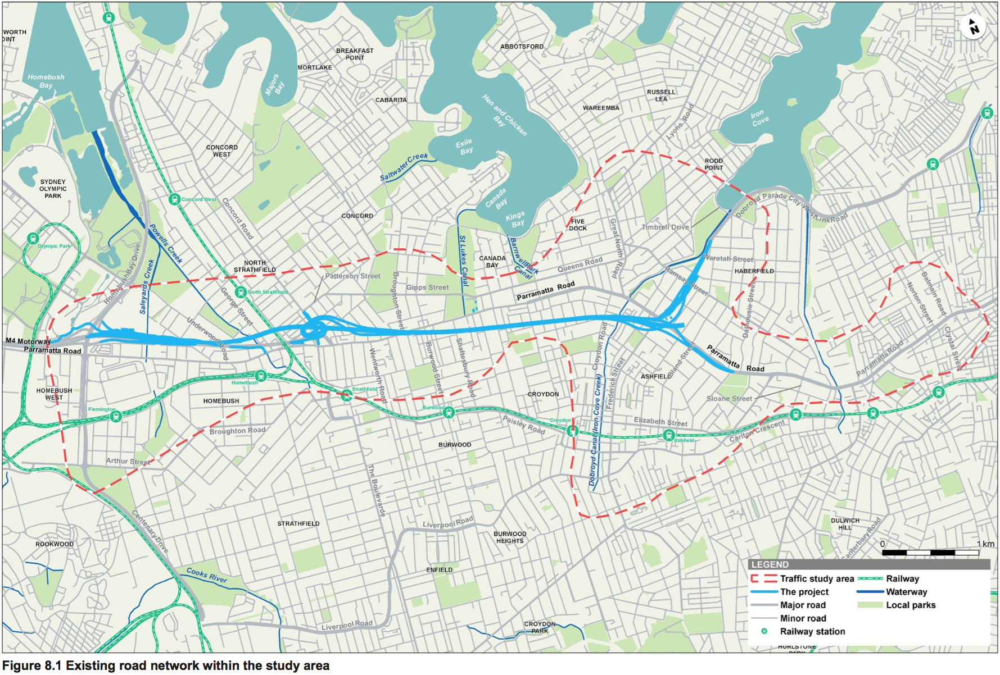
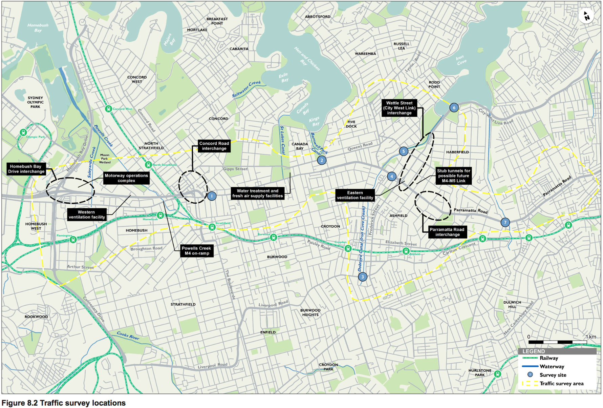
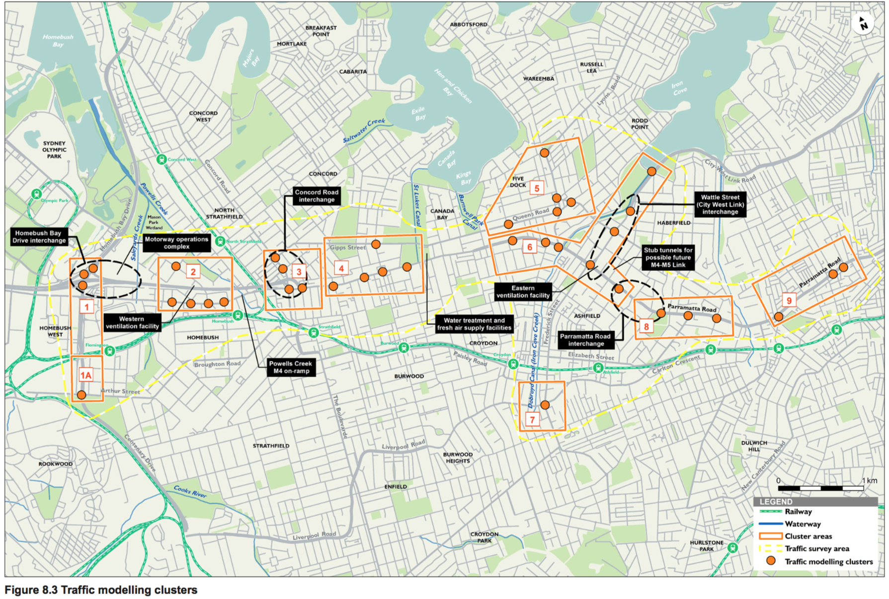

# WestConnex M4 East Environmental Impact Statement
September 2015

Prepared for WestConnex Delivery Authority
Prepared by AECOM Australia Pty Ltd, GHD Pty Ltd

## 8. Traffic and transport

This chapter outlines the potential traffic and transport impacts associated with the M4 East project (the project). A detailed traffic and transport assessment has been undertaken for the project and is included in Appendix G.

The Secretary of the NSW Department of Planning and Environment has issued a set of environmental assessment requirements for the project; these are referred to as Secretary’s Environmental Assessment Requirements (SEARs). Table 8.1 sets out these requirements as they relate to traffic and transport, and identifies where they have been addressed in this environmental impact statement (EIS).

<table id="table-8-1">
  <caption>Table 8.1 Secretary’s Environmental Assessment Requirements – traffic and transport</caption>
  <thead>
    <tr>
      <th>Secretary’s Environmental Assessment Requirement</th>
      <th>Where addressed in the EIS</th>
    </tr>
  </thead>
  <tbody>
    <tr>
      <td>
        Details of how the following meet the traffic and transport objectives of the project,
        taking into account adjacent sensitive land uses, future growth areas, approved
        and proposed infrastructure projects, and traffic (vehicular, cyclist and
        pedestrian) needs:

        <ul>
          <li>The preferred alignment and design</li>
          <li>The proposed interchanges and connections to the surrounding road network</li>
          <li>Associated road infrastructure facilities</li>
        </ul>
      </td>
      <td>
        Section 8.4
      </td>
    </tr>
    <tr>
      <td>
        An assessment and modelling of operational traffic and transport impacts on the local
        and regional road network (including Parramatta Road, Queens Road, Gipps Street,
        and other arterials), and the Sydney motorway network
      </td>
      <td>
        Section 8.4
      </td>
    </tr>
    <tr>
      <td>
        Induced traffic and operational implications for public transport (particularly with
        respect to strategic bus corridors and bus routes) and consideration of
        opportunities to improve public transport patronage
      </td>
      <td>
        Section 8.1 and 8.4.2
      </td>
    </tr>
    <tr>
      <td>
        Impacts on cyclists and pedestrian access and safety and consideration of
        opportunities to integrate cycleway and pedestrian elements with surrounding
        networks
      </td>
      <td>
        Section 8.4.3
      </td>
    </tr>
    <tr>
      <td>
        Construction traffic and transport impacts of the project (including ancillary facilities) and associated management measures, in particular:

        <ul>
          <li>Impacts to the road network (including safety and level of service, pedestrian and cyclist access, and disruption to public transport services and access to properties)</li>
          <li>Route identification and scheduling of transport movements</li>
          <li>The number, frequency and size of construction related vehicles (both passenger, commercial and heavy vehicles)</li>
          <li>The nature of existing traffic on construction access routes (including consideration of peak traffic times)</li>
          <li>The need to close, divert or otherwise reconfigure elements of the road network associated with construction of the project having reference to the cumulative construction impacts of other infrastructure preparing for or commencing construction</li>
        </ul>
      </td>
      <td>
        <ul>
          <li>Section 8.3</li>
          <li>Section 8.3.1</li>
          <li>Section 8.3.1</li>
          <li>Section 8.2.2</li>
          <li>Section 8.3.4</li>
        </ul>
      </td>
    </tr>
    <tr>
      <td>
        Details of how the project meets the objectives of the overall WestConnex Scheme.
      </td>
      <td>
        Section 8.4.4
      </td>
    </tr>
  </tbody>
</table>

### 8.1 Assessment methodology

An integrated traffic modelling and forecasting approach was adopted for the
traffic assessment for the project. This approach involved:

* Reviewing existing conditions along the Parramatta Road corridor
* Determining existing and future intersection and roadway traffic volumes
* Assessing potential construction impacts
* Assessing potential operational impacts of the project on the existing and future road network using LinSig, which is an intersection modelling platform that is capable of assessing the performance of isolated or coordinated networks of signalised intersections
* Recommending measures to mitigate and manage the traffic and transport impacts of the project during construction and operation.

A summary of the main tasks involved in the assessment is provided in sections 8.1.1 to 8.1.4. A detailed description of the methodology is provided in Appendix G.

### 8.1.1 Determine existing and future traffic volumes

Existing and future year intersection and roadway traffic volumes were
calculated using outputs from the WestConnex Road Traffic Model (WRTM) Version
2.1, with a particular focus on the project area between Homebush Bay Drive at
Homebush and Balmain Road at Leichhardt, and including the predicted transfer of
principal and induced travel demand to the project from alternative transport
corridors.

The following six key scenarios were modelled using the WRTM to provide morning
(AM) peak and afternoon (PM) peak roadway and intersection turning volumes:

* Existing case (2012) – current road network with no new projects or upgrades
* Construction ‘do minimum’ (2017) – current road network with the inclusion of the completed M4 Widening project
* Operation ‘do minimum’ (2021) – assumes that the King Georges Road Interchange Upgrade and the M4 Widening projects are complete, but the remaining WestConnex projects, including the M4 East, are not built. It is called ‘do minimum’ rather than ‘do nothing’ as it assumes that projects currently incomplete but scheduled for opening prior to the assessment year are operational, thus the network conditions are different to the 'Existing case (2012)'
* Operation 'do something' (2021) – as per 'do minimum' with the M4 East complete and open to traffic, but without any other proposed future WestConnex projects, This scenario includes provision of kerbside bus lanes on Parramatta Road between Burwood Road at Burwood and Chandos Street at Haberfield/Ashfield (however, these bus lanes do not form part of the project)
* Operation ‘do minimum’ (2031) – a future network including the King Georges Road Interchange Upgrade and M4 Widening projects and some upgrades to the broader transport network, but does not include the project or any other proposed future WestConnex projects
* Operation 'do something' (2031) – all WestConnex projects are complete, and also includes the Sydney Gateway and the Southern Extension. Bus lanes were included in this scenario as per the 2021 ‘do something’ scenario, along with an eastbound bus lane from west of Hume Highway at Ashfield to east of Sloane Street at Haberfield/Summer Hill, and a westbound bus lane from west of Norton Street at Leichhardt to Hume Highway at Ashfield (however, these bus lanes do not form part of the project).

### 8.1.2 Assess construction impacts

The construction impact assessment involved an assessment of anticipated
construction related vehicles travelling to, from, and within the project
footprint on the existing M4, Parramatta Road and local roads that would provide
access to construction ancillary facilities. Based on the construction program,
the fourth quarter of 2017 has been used as the assessment year for construction
impacts, as this is when peak construction traffic volumes are expected.

### 8.1.3 Assess operational impacts

LinSig traffic models were developed to determine the operational performance of
the existing and future road network during the AM and PM peak periods. The
modelling included interchanges with the project intersections along Parramatta
Road and the surrounding road network in the vicinity of the project.

Following the calibration of AM peak and PM peak base LinSig models, future year
networks and traffic demands were developed for the five key modelling scenarios
to be assessed:

* 2017 future year construction model
* 2021 and 2031 future year 'do minimum' models
* 2021 and 2031 future year 'do something' models.

The objective of the 'do minimum' models was to provide a benchmark to compare
the operational performance of the 'do something' scenarios against future
network conditions without the project and subsequent WestConnex stages.

The operational traffic assessment also included crash analysis, travel speeds
and travel time analysis, and opportunities to enhance public and active
transport networks within the project area.

### 8.2 Existing environment

#### 8.2.1 Route description

Figure 8.1 shows the road network in the vicinity of the project.

##### Parramatta Road

Parramatta Road is classified as a State Significant Road and forms a major
east–west Sydney metropolitan road corridor. The road extends from the
intersection of the M4 and Church Street at Granville in the west, to Broadway
on the south-western outskirts of the Sydney CBD in the east. It connects to
several other major east–west road corridors, including the M4.

The road varies between two and three lanes in each direction. In the eastbound
direction, two lanes are provided from Homebush Bay Drive to Bedford Road at
Homebush West, then three lanes to Knight Street at Homebush. Parramatta Road
then narrows to two lanes to Concord Road at North Strathfield/Concord, and then
widens to three lanes to Sloane Street at Haberfield. Continuing east, beyond
the project area, two lanes remain after Sloane Street up until immediately
after Flood Street at Leichhardt, where a bus lane is added.

In the westbound direction, two lanes are provided from Crystal Street at
Petersham to Norton Street at Leichhardt, where it widens to three lanes. The
road narrows to two lanes just after Liverpool Road (Hume Highway) at Ashfield,
and then widens to three lanes after Dalhousie Street at Haberfield, where it
continues as three lanes to the intersection with the existing M4. The approach
to the M4 consists of one through lane and two right-turn lanes to the M4
westbound, which extend back to Phillip Street at Strathfield. Continuing west,
the configuration increases to two lanes from Concord Road at North
Strathfield/Concord to George Street at North Strathfield, followed by three
lanes from George Street to Homebush Bay Drive.

Parramatta Road has a posted speed limit of 60 kilometres per hour in both
directions. There are 22 signalised intersections along the 9.6 kilometre long
section of the road between Centenary Drive/Homebush Bay Drive at Homebush and
Orpington Street at Ashfield.

In the vicinity of the project, Parramatta Road is of local and regional
importance. It provides the main route for road vehicles travelling to, from, or
through the corridor. The main Parramatta Road transport corridor accommodates a
mix of travel demand characteristics that range from short local trips to longer
through vehicle movements. The diverse types of business along the Parramatta
Road transport corridor service both the local and wider community, meaning that
a number of medium distance, one way trips are generated along the corridor.

<figure id="figure-8-1">
  
  <figcaption>
    Figure 8.1 Existing road network within the study area
  </figcaption>
</figure>

Adjacent transport corridors in the vicinity of the project, such as the Hume
Highway, Wattle Street, Concord Road and the M4, connect Parramatta Road to
major centres across the Sydney metropolitan area.

Parramatta Road currently accommodates high levels of demand to and from the M4,
but functions as an arterial roadway, generally favouring through movements.

##### M4 Motorway

The M4 extends between the Blue Mountains at its western end and Parramatta Road
at Concord at its eastern end. The M4 and Parramatta Road transport corridor is
the main road freight, commercial and passenger route between the Sydney CBD,
the inner-western suburbs, Parramatta, greater western Sydney and beyond to the
Blue Mountains.

The M4 varies from two to four lanes in each direction, with on-ramps merging
with the mainline carriageways in some locations resulting in operational
constraints. East of Homebush Bay Drive, the posted speed limit varies between
60 and 90 kilometres per hour in each direction.

Work on the M4 Widening project began in March 2015. This project involves
widening the M4 between Pitt Street at Parramatta and Homebush Bay Drive at
Homebush, to include generally four lanes in each direction. The M4 Widening
project also includes a new access from Hill Road to the M4 eastbound and a new
on-ramp southbound from Homebush Bay Drive to the M4 westbound.

##### East–west routes

Alternative east–west arterial roads located in the vicinity of the project
include:

* Frederick Street/Wattle Street/Dobroyd Parade/City West Link – this route, which is about 2.8 kilometres long, is a major connector between Sydney’s western and south-western suburbs and the Sydney CBD. It carries high volumes of traffic and provides an alternative route to Parramatta Road into Sydney CBD from inner-southern and inner-western Sydney
* Queens Road/Gipps Street/Patterson Street – this route extends about 3.4 kilometres from its intersection with Great North Road and Fairlight Street at Five Dock in the east, to Concord Road at Concord in the west. It provides an alternative route between Five Dock and Concord/M4 and serves a significant number of local businesses
* Hume Highway/Liverpool Road – this route, located to the south of Parramatta Road, is classified as a State Significant Road and provides an important metropolitan connection for both local and regional traffic. It extends from Liverpool in south-western Sydney, to join Parramatta Road near Summer Hill in the east, about 450 metres south-east of the project.

##### North–south routes

Key north–south arterial roads within the study area include:

* Homebush Bay Drive/Centenary Drive – this route extends about 6.5 kilometres between the northern Concord Road intersection at Rhodes and southern Hume Highway/Roberts Road intersection at Strathfield/Greenacre. It links the St George region, Sydney Olympic Park, Ryde, Sydney’s northern suburbs and the Northern Beaches. It includes east and west facing ramps to and from the M4.  There are four signalised intersections along this corridor
* Concord Road/Leicester Avenue – this route extends about five kilometres between the intersection with Church Street at Meadowbank and the intersection with Everton Road at Strathfield. The Homebush Bay Drive/Centenary Drive route connects to Concord Road in Rhodes. Therefore, both routes share a similar north–south connectivity function in terms of linking the St George region with Sydney’s northern suburbs. However, Concord Road intersects with Parramatta Road further to the east and provides access to Strathfield rather than to Sydney Olympic Park. East facing ramps on the northern side of Parramatta Road provide direct access to and from the M4
* Great North Road and Lyons Road – extends about four kilometres through Five Dock and Drummoyne. It provides a north–east connection between Parramatta Road and Victoria Road.

#### 8.2.2 Traffic volumes and patterns

To understand and analyse existing traffic volumes and patterns in the vicinity
of the project, traffic surveys were undertaken between 2012 and 2014. The
surveys recorded hourly traffic volumes at seven locations over a one week
survey period. Survey locations are shown in Figure 8.2.

The following volumes are shown in Table 8.2 for the seven survey sites:

* AM peak: morning single hour peak recorded between 6.00 am and 10.00 am
* PM peak: evening single hour peak recorded between 3.00 pm and 7.00 pm
* Average weekday traffic (AWT) volume: daily traffic volume – derived from 24 hour traffic counts recorded between Monday and Friday during the survey week
* Average daily traffic (ADT) volume: daily traffic volume – derived from 24 hour traffic counts recorded between Monday and Sunday during the survey week.

<table id="table-8-2">
  <caption>Table 8.2 Summary of traffic volumes</caption>
  <thead>
    <tr>
      <th>Site</th>
      <th>AM peak hour</th>
      <th>PM peak hour</th>
      <th>Average weekday traffic (AWT)</th>
      <th>Average daily traffic (ADT)</th>
    </tr>
  </thead>
  <tbody>
    <tr>
      <th id="site-1" colspan="5">Site 1: Parramatta Road, Concord/Strathfield, east of the M4</th>
    </tr>
    <tr>
      <th>Eastbound</th>
      <td>3150</td>
      <td>3345</td>
      <td>53470</td>
      <td>52425</td>
    </tr>
    <tr>
      <th>Westbound</th>
      <td>3053</td>
      <td>2691</td>
      <td>49735</td>
      <td>101375</td>
    </tr>
    <tr>
      <th>Two-way</th>
      <td>6203</td>
      <td>6035</td>
      <td>103205</td>
      <td>101375</td>
    </tr>
    <tr>
      <th id="site-2" colspan="5">Site 2: Queens Road, Five Dock, between William Street and Coonardoo Close</th>
    </tr>
    <tr>
      <th>Eastbound</th>
      <td>995</td>
      <td>962</td>
      <td>13715</td>
      <td>13200</td>
    </tr>
    <tr>
      <th>Westbound</th>
      <td>941</td>
      <td>987</td>
      <td>13610</td>
      <td>13245</td>
    </tr>
    <tr>
      <th>Two-way</th>
      <td>1936</td>
      <td>1949</td>
      <td>27325</td>
      <td>26445</td>
    </tr>
    <tr>
      <th id="site-3" colspan="5">Site 3: Hume Highway, Ashfield, between Lion Street and Frederick Street</th>
    </tr>
    <tr>
      <th>Eastbound</th>
      <td>1068</td>
      <td>913</td>
      <td>14585</td>
      <td>14000</td>
    </tr>
    <tr>
      <th>Westbound</th>
      <td>850</td>
      <td>1313</td>
      <td>1715</td>
      <td>15235</td>
    </tr>
    <tr>
      <th>Two-way</th>
      <td>1918</td>
      <td>2226</td>
      <td>30300</td>
      <td>29235</td>
    </tr>
    <tr>
      <th id="site-4" colspan="5">Site 4: Parramatta Road, Ashfield/Haberfield, west of Wattle Street</th>
    </tr>
    <tr>
      <th>Eastbound</th>
      <td>2535</td>
      <td>2370</td>
      <td>43470</td>
      <td>43190</td>
    </tr>
    <tr>
      <th>Westbound</th>
      <td>2701</td>
      <td>2809</td>
      <td>46700</td>
      <td>45870</td>
    </tr>
    <tr>
      <th>Two-way</th>
      <td>5236</td>
      <td>5179</td>
      <td>90070</td>
      <td>89060</td>
    </tr>
    <tr>
      <th id="site-5" colspan="5">Site 5: Ramsay Street, Five Dock/Haberfield, between Henley Marine Drive and Wolseley Street</th>
    </tr>
    <tr>
      <th>Eastbound</th>
      <td>930</td>
      <td>840</td>
      <td>12930</td>
      <td>12415</td>
    </tr>
    <tr>
      <th>Westbound</th>
      <td>829</td>
      <td>990</td>
      <td>13170</td>
      <td>12740</td>
    </tr>
    <tr>
      <th>Two-way</th>
      <td>1759</td>
      <td>1830</td>
      <td>26100</td>
      <td>25155</td>
    </tr>
    <tr>
      <th id="site-6" colspan="5">Site 6: Dobroyd Parade, Haberfield, east of Timbrell Drive</th>
    </tr>
    <tr>
      <th>Eastbound</th>
      <td>1993</td>
      <td>2117</td>
      <td>32285</td>
      <td>32175</td>
    </tr>
    <tr>
      <th>Westbound</th>
      <td>1534</td>
      <td>1825</td>
      <td>30670</td>
      <td>31080</td>
    </tr>
    <tr>
      <th>Two-way</th>
      <td>3527</td>
      <td>3942</td>
      <td>62955</td>
      <td>63255</td>
    </tr>
    <tr>
      <th id="site-7" colspan="5">Site 7: Parramatta Road, Haberfield/Lewisham/Leichhardt/Summer Hill, at the Hawthorne Canal</th>
    </tr>
    <tr>
      <th>Eastbound</th>
      <td>2384</td>
      <td>1883</td>
      <td>32925</td>
      <td>32140</td>
    </tr>
    <tr>
      <th>Westbound</th>
      <td>1621</td>
      <td>2278</td>
      <td>32120</td>
      <td>31395</td>
    </tr>
    <tr>
      <th>Two-way</th>
      <td>4005</td>
      <td>4161</td>
      <td>65045</td>
      <td>63535</td>
    </tr>
  </tbody>
</table>

<figure id="figure-8-2">
  
  <figcaption>
    Figure 8.2 Traffic survey locations
  </figcaption>
</figure>

The following key findings can be drawn from the traffic volumes shown in Table
8.2, and the figures in section 5.4 of the traffic and transport assessment in
Appendix G:

* Parramatta Road:
    * Two-way AWT ranges from 101,375 east of the M4 to 89,060 west of Wattle
    Street, which equates to a 12 per cent reduction in daily traffic along
    Parramatta Road between these two locations. Moreover, AWT decreases to 63,535
    vehicles per day on Parramatta Road at the Hawthorne Canal, which is a 37 per
    cent and 29 per cent reduction in comparison to the respective volumes east of
    the M4 and west of Wattle Street
    * AWT is generally around two per cent greater than ADT at all three locations
    on Parramatta Road, by direction and in combination. This indicates that average
    daily weekend traffic is generally at similar levels to ADT and hence the road
    corridor accommodates consistently high volumes of travel demand that are not
    biased towards weekday work-related trips
    * Peak period traffic volumes show similar trends to daily figures with the
    two-way AM peak and PM peak being 6,205 and 6,035 vehicles per hour respectively
    east of the M4. Importantly, the graphics show a fairly 'flat' profile of
    traffic throughout the day between the AM peak and PM peak periods at the three
    Parramatta Road locations. This confirms that traffic volumes on Parramatta Road
    are consistent throughout an average weekday, both during and between the more
    conventional morning and evening 'peak' periods
    * Traffic surveys recorded at three locations on Parramatta Road confirm that
    there is typically an even spread of directional volumes during the AM peak, PM
    peak and daily periods. The only location that shows a considerable deviation
    from this statistic is on Parramatta Road at the Hawthorne Canal during the AM
    peak, where eastbound volumes around 30 per cent higher than westbound traffic
* Dobroyd Parade:
    * Two-way AM peak and PM peak volumes recorded on Dobroyd Parade was 3,525 and
    3,940 vehicles per hour respectively. Interestingly, the highest hourly volume
    was 2,115 vehicles in the eastbound direction during the PM peak period, which
    suggests that more vehicles are travelling towards the Sydney CBD in the evening
    * The two-way AWT volume on Dobroyd Parade is slightly less than the equivalent
    ADT figure, which suggests that traffic levels are fairly consistent across the
    seven day period, in line with patterns on the connecting Parramatta Road
    corridor
* Queens Road:
    * Directional peak period traffic volumes on Queens Road are at similar levels,
    ranging from 960 to 1045 vehicles per hour in the respective eastbound direction
    and westbound direction; during the average PM peak hour. This trend continues
    throughout the day with directional and two-way AWT and ADT volumes at similar
    levels, which peak to 27,325 vehicles during an average weekday. The profile of
    traffic across an average weekday on shows a more predictable pattern for
    two-way volumes, with more defined peaks during the morning and evening peak
    periods.
* Ramsay Street:
    * Peak hour volumes recorded on Ramsay Street are similar by direction and
    time-period, with the maximum flow around 1,000 vehicles per hour. Two-way AWT
    and ADT volumes were 26,100 and 25,155 vehicles per day, which equates to a four
    per cent increase in daily traffic during the five day period.
* Hume Highway:
    * Peak period counts on the Hume Highway show higher volumes of traffic in the
    eastbound and westbound direction during the respective AM peak and PM peak
    period. This suggests that the majority of vehicles are travelling towards the
    CBD in the morning and from the CBD in the evening.

#### 8.2.3 Existing road network performance

##### Level of service

‘Level of service’ (LoS) is a measure to determine the operational conditions
and efficiency of a roadway or intersection. The six levels of service range
from A to F, with A representing the best operating conditions and F the worst.
It is generally the practice of NSW Roads and Maritime Services (Roads and
Maritime) to initiate investigations when the level of service of a roadway or
intersection falls to D, and provide suitable remediation prior to the level of
service decreasing further E or F. Further information on the definitions and
calculation of level of service is provided in section 6.1 of the traffic and
transport assessment (Appendix G).

##### Operational performance – roadways

Levels of service along the Parramatta Road and Wattle Street corridors under
existing conditions are provided in Table 8.3 for the AM and PM peak. The
Parramatta Road corridor currently experiences high levels of mid-block traffic
demand. West of Concord Road, the level of service generally exceeds D, with the
mid-block volumes often exceeding the theoretical capacity of the road. The
results indicate that, east of the M4, there are eastbound capacity issues
during the AM peak. This reflects the relatively low traffic volumes on
Parramatta Road west of Concord Road since the removal of tolls on the M4. An
exception is east of Bland Street, where the traffic volumes on Parramatta Road
are lower due to congestion at the Wattle Street intersection. High northbound
volumes are also evident on Dobroyd Parade, reflecting city bound demand in the
morning peak. The results for the PM peak are similar, although high traffic
volumes are recorded in both directions. Low westbound traffic east of Bland
Street can be explained by congestion at the Hume Highway intersection and the
extra lane on Parramatta Road west of Dalhousie Street.

The Gipps Street and Queens Road corridor also experiences high traffic volumes
and has a level of service of E/F in both peaks, with the exception of PM
eastbound west of Great North Road. The midblock level of service for the
existing M4 is generally D, but is somewhat distorted by queuing at the
Parramatta Road intersection which artificially limits throughput.

<table id="table-8-3">
  <caption>Table 8.3 Base year midblock operational performance summary</caption>
  <thead>
    <tr>
      <th colspan="2">Location and direction</th>
      <th>No. lanes</th>
      <th>AM peak hour LoS</th>
      <th>PM peak hour LoS</th>
    </tr>
  </thead>
  <tbody>
    <tr>
      <th rowspan="2">Parramatta Road west of Bridge Road - Homebush</th>
      <th>EB</th>
      <td>3</td>
      <td>B</td>
      <td>C</td>
    </tr>
    <tr>
      <th>WB</th>
      <td>3</td>
      <td>C</td>
      <td>C</td>
    </tr>
    <tr>
      <th rowspan="2">Parramatta Road between Knight Street and Concord Road - Strathfield</th>
      <th>EB</th>
      <td>2</td>
      <td>D</td>
      <td>D</td>
    </tr>
    <tr>
      <th>WB</th>
      <td>2</td>
      <td>D</td>
      <td>D</td>
    </tr>
    <tr>
      <th rowspan="2">Parramatta Road between Mosely Street and Burwood Road - Strathfield</th>
      <th>EB</th>
      <td>3</td>
      <td>F</td>
      <td>F</td>
    </tr>
    <tr>
      <th>WB</th>
      <td>3</td>
      <td>F</td>
      <td>E</td>
    </tr>
    <tr>
      <th rowspan="2">Parramatta Road between Shaftesbury Road and Harris Street - Burwood</th>
      <th>EB</th>
      <td>3</td>
      <td>E</td>
      <td>E</td>
    </tr>
    <tr>
      <th>WB</th>
      <td>3</td>
      <td>D</td>
      <td>E</td>
    </tr>
    <tr>
      <th rowspan="2">Parramatta Road between Bland Street and Dalhousie Street - Haberfield</th>
      <th>EB</th>
      <td>3</td>
      <td>D</td>
      <td>D</td>
    </tr>
    <tr>
      <th>WB</th>
      <td>3</td>
      <td>D</td>
      <td>C</td>
    </tr>
    <tr>
      <th rowspan="2">Parramatta Road between Sloane Street and West Street - Haberfield</th>
      <th>EB</th>
      <td>2</td>
      <td>F</td>
      <td>F</td>
    </tr>
    <tr>
      <th>WB</th>
      <td>3</td>
      <td>D</td>
      <td>E</td>
    </tr>
    <tr>
      <th rowspan="2">Parramatta Road east of Crystal Street - Petersham</th>
      <th>EB</th>
      <td>2</td>
      <td>F</td>
      <td>E</td>
    </tr>
    <tr>
      <th>WB</th>
      <td>2</td>
      <td>D</td>
      <td>F</td>
    </tr>
    <tr>
      <th rowspan="2">Dobroyd Parade north of Timbrell Drive - Haberfield</th>
      <th>NB</th>
      <td>2</td>
      <td>F</td>
      <td>F</td>
    </tr>
    <tr>
      <th>SB</th>
      <td>2</td>
      <td>E</td>
      <td>F</td>
    </tr>
    <tr>
      <th rowspan="2">Queens Road west of Great North Road - Five Dock</th>
      <th>EB</th>
      <td>1</td>
      <td>F</td>
      <td>E</td>
    </tr>
    <tr>
      <th>WB</th>
      <td>1</td>
      <td>F</td>
      <td>E</td>
    </tr>
    <tr>
      <th rowspan="2">Queens Road west of Harris Street - Five Dock</th>
      <th>EB</th>
      <td>1</td>
      <td>F</td>
      <td>D</td>
    </tr>
    <tr>
      <th>WB</th>
      <td>1</td>
      <td>F</td>
      <td>F</td>
    </tr>
    <tr>
      <th rowspan="2">Gipps Street west of Burwood Road - Concord</th>
      <th>EB</th>
      <td>1</td>
      <td>E</td>
      <td>F</td>
    </tr>
    <tr>
      <th>WB</th>
      <td>1</td>
      <td>E</td>
      <td>F</td>
    </tr>
    <tr>
      <th rowspan="2">M4 Motorway west of Concord Road off- ramp – Strathfield</th>
      <th>EB</th>
      <td>2</td>
      <td>D</td>
      <td>D</td>
    </tr>
    <tr>
      <th>WB</th>
      <td>2</td>
      <td>D</td>
      <td>D</td>
    </tr>
  </tbody>
</table>

##### Operational performance - intersections

Table 8.3 provides a summary of the level of service (average intersection
delays) at key intersections along Parramatta Road corridor for the AM and PM
peak. The intersections were grouped into nine clusters for assessment purposes
(as shown in Figure 8.3).

<table id="table-8-4">
  <caption>Table 8.4 Base year intersection operational performance summary</caption>
  <thead>
    <th>Cluster</th>
    <th>Intersection</th>
    <th>AM peak hour LoS</th>
    <th>AM peak hour LoS</th>
  </thead>
  <tbody>
    <tr>
      <th rowspan="4">1</th>
      <td>Homebush Bay Drive | M4 eastbound on-ramp</td>
      <td>A</td>
      <td>A</td>
    </tr>
    <tr>
      <td>Homebush Bay Drive | M4 eastbound off-ramp</td>
      <td>D</td>
      <td>C</td>
    </tr>
    <tr>
      <td>Homebush Bay Drive | M4 westbound on-ramp & off-ramp</td>
      <td>D</td>
      <td>D</td>
    </tr>
    <tr>
      <td>Arthur Street | Centenary Drive</td>
      <td>E</td>
      <td>D</td>
    </tr>
    <tr>
      <th rowspan="5">2</th>
      <td>Underwood Road | Pomeroy Street</td>
      <td>D</td>
      <td>E</td>
    </tr>
    <tr>
      <td>Parramatta Road | Bridge Road</td>
      <td>C</td>
      <td>B</td>
    </tr>
    <tr>
      <td>Parramatta Road | Park Road</td>
      <td>A</td>
      <td>A</td>
    </tr>
    <tr>
      <td>Parramatta Road | Underwood Road</td>
      <td>B</td>
      <td>C</td>
    </tr>
    <tr>
      <td>Parramatta Road | Knight Street</td>
      <td>A</td>
      <td>A</td>
    </tr>
    <tr>
      <th rowspan="4">3</th>
      <td>Patterson Road | Concord Road</td>
      <td>F</td>
      <td>D</td>
    </tr>
    <tr>
      <td>Sydney Street | Concord Road</td>
      <td>D</td>
      <td>E</td>
    </tr>
    <tr>
      <td>Parramatta Road | Concord Road</td>
      <td>E</td>
      <td>F</td>
    </tr>
    <tr>
      <td>Parramatta Road | M4</td>
      <td>E</td>
      <td>E</td>
    </tr>
    <tr>
      <th rowspan="5">4</th>
      <td>Parramatta Road | Wentworth Road</td>
      <td>F</td>
      <td>D</td>
    </tr>
    <tr>
      <td>Parramatta Road | Broughton Street</td>
      <td>D</td>
      <td>B</td>
    </tr>
    <tr>
      <td>Parramatta Road | Burwood Road</td>
      <td>F</td>
      <td>B</td>
    </tr>
    <tr>
      <td>Gipps Street | Burwood Road</td>
      <td>F</td>
      <td>C</td>
    </tr>
    <tr>
      <td>Parramatta Road | Shaftesbury Road</td>
      <td>E</td>
      <td>D</td>
    </tr>
    <tr>
      <th rowspan="5">5</th>
      <td>Harris Street | Queens Road</td>
      <td>D</td>
      <td>D</td>
    </tr>
    <tr>
      <td>Great North Road | Queens Road</td>
      <td>D</td>
      <td>C</td>
    </tr>
    <tr>
      <td>Great North Road | Ramsay Road</td>
      <td>D</td>
      <td>E</td>
    </tr>
    <tr>
      <td>Ramsay Road | Fairlight Street</td>
      <td>F</td>
      <td>E</td>
    </tr>
    <tr>
      <td>Great North Road | Lyons Road</td>
      <td>F</td>
      <td>E</td>
    </tr>
    <tr>
      <th rowspan="8">6</th>
      <td>Parramatta Road | Harris Road</td>
      <td>D</td>
      <td>C</td>
    </tr>
    <tr>
      <td>Parramatta Road | Croydon Road</td>
      <td>D</td>
      <td>E</td>
    </tr>
    <tr>
      <td>Parramatta Road | Great North Road</td>
      <td>E</td>
      <td>D</td>
    </tr>
    <tr>
      <td>Parramatta Road | Frederick Street</td>
      <td>F</td>
      <td>F</td>
    </tr>
    <tr>
      <td>Parramatta Road | Bland Street</td>
      <td>B</td>
      <td>B</td>
    </tr>
    <tr>
      <td>Wattle Street | Ramsay Street</td>
      <td>F</td>
      <td>E</td>
    </tr>
    <tr>
      <td>Dobroyd Parade | Waratah Street</td>
      <td>B</td>
      <td>B</td>
    </tr>
    <tr>
      <td>Dobroyd Parade | Timbrell Drive</td>
      <td>E</td>
      <td>D</td>
    </tr>
    <tr>
      <th>7</th>
      <td>Hume Hightway | Frederick Street</td>
      <td>F</td>
      <td>F</td>
    </tr>
    <tr>
      <th rowspan="3">8</th>
      <td>Parramatta Road | Dalhousie Street</td>
      <td>C</td>
      <td>B</td>
    </tr>
    <tr>
      <td>Parramatta Road | Hume Highway</td>
      <td>F</td>
      <td>F</td>
    </tr>
    <tr>
      <td>Parramatta Road | Sloane Street</td>
      <td>D</td>
      <td>C</td>
    </tr>
    <tr>
      <th rowspan="3">9</th>
      <td>Parramatta Road | Flood Street</td>
      <td>D</td>
      <td>D</td>
    </tr>
    <tr>
      <td>Parramatta Road | Norton Street</td>
      <td>E</td>
      <td>D</td>
    </tr>
    <tr>
      <td>Parramatta Road | Crystal Street</td>
      <td>F</td>
      <td>D</td>
    </tr>
  </tbody>
</table>

<figure id="figure-8-3">
  
  <figcaption>
    Figure 8.3 Traffic modelling clusters
  </figcaption>
</figure>

The Parramatta Road and Wattle Street corridors experience significant
congestion during the AM and PM peaks. The traffic signals are coordinated to
provide priority along the corridor to reduce the average delays to the major
through movements in the peak direction. The results shown in the table indicate
that a number of the intersections operate at or close to capacity.
Intersections with a number of conflicting movements experience higher average
intersection delays.
##### Traffic crash history

###### Parramatta Road

Between July 2009 and June 2014, 919 crashes were recorded on Parramatta Road
between Homebush Bay Drive and Balmain Road. Two were fatal crashes, 400
resulted in injury and 517 were non-casualty crashes. Of these crashes, 621 (68
per cent) occurred at intersections.

The crash breakdown indicates that about 43 per cent of crashes were rear end
crashes. This is consistent with roadways that are approaching capacity and
along which high levels of queuing occur on the approaches to intersections.
About 15 per cent of crashes were between opposing vehicles, and about 10 per
cent resulted from lane changes.

###### Corridor analysis

Crash severity indices provide an assessment of road safety based on the type
and number of crashes occurring. All crash types carry different weightings with
fatal crashes having the highest weighting. The crash severity index for
Parramatta Road is 1.22 which is equal to the average for the Sydney
Metropolitan Area. The M4 has a slightly lower rating of 1.18.

Existing tunnels in Sydney (eg Lane Cove, Eastern Distributor, Cross City Tunnel
and Sydney Harbour Tunnel) have a crash severity index of 1.16 which is
reflective of the more controlled conditions, lower speeds and greater drive
care when travelling in tunnels.

Table 8.5 outlines the average crash rates for Parramatta Road, M4 and existing
Sydney tunnels. Parramatta Road has a significantly higher crash rate compared
to the M4 and existing Sydney Tunnels. Crash rates within Sydney’s tunnels are
substantially lower than on the M4 Motorway (ie three times lower) and
Parramatta Road (ie about 12 times lower).

<table id="table-8-5">
  <caption>Table 8.5 Crash rates per 100 million vehicle kilometres travelled</caption>
  <thead>
    <tr>
      <th rowspan="2">Road</th>
      <th colspan="4">Crash rate per 100MVKT</th>
    </tr>
    <tr>
      <th>Total</th>
      <th>Fatal</th>
      <th>Injury</th>
      <th>Tow-away</th>
    </tr>
  </thead>
  <tbody>
    <tr>
      <th>Parramatta Road</th>
      <td>136.0</td>
      <td>0.3</td>
      <td>54.8</td>
      <td>70.9</td>
    </tr>
    <tr>
      <th>M4 Motorway</th>
      <td>33.9</td>
      <td>0.1</td>
      <td>11.7</td>
      <td>22.1</td>
    </tr>
    <tr>
      <th>Existing Sydney Tunnels (Lane Cove, Eastern Distributor, Cross City Tunnel and Sydney Harbour Tunnel)</th>
      <td>11.9</td>
      <td>0.0</td>
      <td>4.2</td>
      <td>7.4</td>
    </tr>
  </tbody>
</table>

Crashes on Parramatta Road between 1 July 2009 and 30 June 2014 cost an
estimated total of $62,395,968, or $12,479,194 per annum. The analysis indicates
an average crash cost per 100 million vehicle kilometres travelled of
$14,670,060 for the four sections analysed.

#### 8.2.4 Public and active transport

##### Bus network

The project falls within the Sydney Metropolitan Bus Region 6, which is operated
by Sydney Buses. The bus network in the vicinity of the project includes buses
servicing the Hurstville to Macquarie Park strategic north–south bus corridor
(route M41) and the Burwood to the CBD strategic east–west bus route (route
461), which runs along Parramatta Road. There are several bus routes that
operate within particular sections of the project area via train station hubs,
such as Strathfield, Burwood and Ashfield.

There are a number of bus services that travel along sections of Parramatta Road
between Homebush Bay Drive and Wattle Street (routes 525, 526, 461, 415, 490,
492 and 491). Six Sydney Metropolitan Bus Region 6 routes cross Parramatta Road
during peak periods between Homebush Bay Drive and Wattle Street.

Sydney’s Bus Future (Transport for NSW 2013) and the Parramatta Road Urban
Transformation Program (being undertaken by Urban Growth NSW in conjunction with
the project) will result in changes to the bus network using Parramatta Road and
the wider project area.

##### Rail network

The project area is serviced by the North Shore, Northern and Western Rail Line
(T1), and the Airport, Inner West and South Rail Line (T2). To the north of the
project, North Strathfield Station is serviced by the Main Northern Rail Line
which provides limited stops services to Sydney Central. To the south, up to 10
stations are serviced by the T1 and/or T2 Lines with some stations supporting
limited stop express services. Strathfield and Burwood stations (to the south)
accommodate the highest volume of passengers due to the large number of AM and
PM peak services.

##### Pedestrian network

The nature of the pedestrian network in the vicinity of the project varies.
Residential areas generally provide good local walking connections and
footpaths, particularly in areas away from major roads. Sydney Markets, Sydney
Olympic Park, Rhodes and Burwood are close to the study area and within walking
distance to rail station and bus connections.

There are a limited number of signalised pedestrian crossings on Parramatta
Road. The distance between signalised pedestrian crossings is up to 800 metres
in some sections.

##### Cycling network

There are limited segregated cycling facilities along the Parramatta Road
corridor. Dedicated cycleways or cycle lanes are generally aimed towards leisure
rather than commuter trips. There are major gaps in north–south connections, due
to the lack of permeability of Parramatta Road and the M4. In the project area,
cyclists currently use the shoulders of the existing M4 to travel both eastbound
and westbound. In the eastbound direction, cyclists are required to leave the M4
at Sydney Street due to the inadequate shoulder east of Sydney Street. In the
westbound direction, cyclists access the M4 from the westbound on-ramp at
Concord Road, due to the inadequate shoulder east of this location.

### 8.3 Assessment of construction impacts

Construction of the project has the potential to result in changes and
disruptions to the existing road and transport network as a result of:

* The movement of construction vehicles, particularly heavy vehicles
transporting spoil, to and from the construction footprint, including the 10
construction ancillary facilities

* Surface works requiring temporary traffic, cyclist and/or pedestrian
diversions, road occupation, alterations to access, alterations to bus stops,
temporary road closures, and alterations to speed limits.

A summary of the construction impact assessment is provided in the following
sections.

#### 8.3.1 Construction traffic volumes and routes

##### Type of traffic generated by construction

Construction would result in the generation of additional movements of both
heavy and light vehicles on the road network. Construction traffic was divided
into three categories for assessment purposes:

* Removal of spoil generated by construction activities
* Heavy vehicle deliveries and other heavy vehicles associated with construction activities
* Light vehicles travelling to and from ancillary construction facilities.

The impacts of the project during construction were assessed assuming that spoil
would be hauled in a westerly direction along the M4.

The majority of the ancillary construction facilities proposed for the project
would have some parking available, however parking would not be provided for the
whole construction workforce. The management of construction workforce parking
is discussed further in section 6.6.5 of Chapter 6 (Construction work). An
upgraded car park on the northern side of Concord Oval would provide about 250
car parking spaces for employees of the main project office during weekdays
(before 6.30 pm). During weekends and after 6.30 pm on weekdays, the following
indicative allocation of car spaces would occur:

* 145 public parking spaces on Saturdays (leaving 100 for the construction workforce)
* 195 public parking spaces on Sundays (leaving 50 for the construction workforce)
* 145 public parking spaces on weeknights after 6.30 pm (leaving 100 for the construction workforce).

In addition, an existing car park at Railway Lane at North Strathfield
containing about 50 car parking spaces would be used. This site is within
walking distance of the Underwood Road civil and tunnel site (C3), Powells Creek
civil site (C4), and the Concord Road civil and tunnel site (C5).

##### Construction traffic volumes

Table 6.20 in Chapter 6 (Construction work) shows the predicted construction
traffic volumes for each ancillary construction facility during a typical AM
peak, PM peak and daily period. The table shows that the highest volumes of
heavy vehicles are forecast to originate from the Concord Road civil and tunnel
site (C5) and Northcote Street tunnel site (C7), with the highest volumes of
light vehicles generated by the Cintra Park tunnel site (C6).

Table 8.6 provides indicative volumes on key roads during the AM and PM peak
periods for construction heavy vehicles. The volumes shown are based on spoil
haulage occurring between 7,00 am and 10.00 pm daily. However, 24 hour spoil
haulage would be required during tunnelling activity.

<table id="table-8.6">
  <caption>Table 8.6 Indicative peak period distribution of heavy construction vehicles (two-way)</caption>
  <thead>
    <tr>
      <th>Road location</th>
      <th>Road location AM construction peak hour (7.30 am - 8.30 am)</th>
      <th>PM construction peak hour (4.15 pm - 5.15 pm)</th>
    </tr>
  </thead>
  <tbody>
    <tr>
      <th>Wattle Street</th>
      <td>80</td>
      <td>60</td>
    </tr>
    <tr>
      <th>Concord Road</th>
      <td>34</td>
      <td>21</td>
    </tr>
    <tr>
      <th>Parramatta Road</th>
      <td>172</td>
      <td>161</td>
    </tr>
    <tr>
      <th>M4 Motorway</th>
      <td>240</td>
      <td>203</td>
    </tr>
  </tbody>
</table>

##### Construction traffic routes

Table 6.19 in Chapter 6 (Construction work) outlines the proposed access and
egress points to and from the construction ancillary facilities. The spoil
haulage routes from the tunnel sites are shown in Figure 6.22 to Figure 6.24 in
Chapter 6 (Construction work).

It has been assumed that concrete for tunnel construction would mainly originate
from batching plants close to the project, although other sources may also be
required. Other materials required for construction would, where as far as
practicable, originate from within the Sydney region. Vehicles would generally
use the arterial road network to access the various construction ancillary
facilities.

#### 8.3.2 Local road network impacts

Table 8.7 outlines the potential impacts of construction on the local road
network in the vicinity of each of the construction ancillary facilities.

<table id="table-8-7">
  <caption>
    Table 8.7 Summary of local impacts of construction ancillary facilities
  </caption>
  <thead>
    <tr>
      <th>Ancillary construction facility</th>
      <th>Potential impacts on local roads</th>
    </tr>
  </thead>
  <tbody>
    <tr>
      <th>Homebush Bay Drive civil site (C1)</th>
      <td>Impacts would be minimal as vehicle access would be directly to and from the M4 or from the Homebush Bay Drive on-ramp. Temporary diversions at various stages and potential reduction in speed limit. There would be no reduction in the number of traffic lanes (except during night works) or impact on movements.</td>
    </tr>
    <tr>
      <th>Pomeroy Street civil site (C2)</th>
      <td>Impacts would be minimal as the majority of construction vehicles would access the site directly to and from the M4 via the Homebush Bay Drive civil site (C1) – this would include all heavy vehicle movements. Some light vehicles would use Pomeroy Street, however, the low daily vehicle numbers would result in only minor impacts. Parking along Pomeroy Street in the vicinity of the work zone would be impacted.</td>
    </tr>
    <tr>
      <th>Underwood Road civil and tunnel site (C3)</th>
      <td>Impacts would be limited to Underwood Road and Short Street East. Access to the site would be via a new traffic signal on Underwood Road. This new signal would potentially result in minor delays to traffic along Underwood Road. No impacts to Ismay Avenue or Allen Street are predicted, as all movements would be via the Underwood Road access. Parking along Underwood Road and Short Street East in the vicinity of the site would be impacted.</td>
    </tr>
    <tr>
      <th>Powells Creek civil site (C4)</th>
      <td>Powell Street would be used as a heavy vehicle access route. Construction vehicles would access Powell Street from the signalised intersection of Underwood Road and Parramatta Road. There could be minor delays for northbound vehicles on Underwood Road, and localised parking restrictions may be required to enable turning movements.</td>
    </tr>
    <tr>
      <th>Concord Road civil and tunnel site (C5)</th>
      <td>Impacts would be limited to Concord Road and Sydney Street. The existing signals at Concord Road and Sydney Street would be modified to allow vehicles to enter and exit the site. This may result in delays to road users on Concord Road. Light vehicle impacts on surrounding streets are expected to be minimal. It is predicted that Ada and Alexandra streets would experience some additional light vehicle traffic. Parking along Ada, Edward and Alexandra streets in the vicinity of the site would be potentially impacted.</td>
    </tr>
    <tr>
      <th>Cintra Park tunnel site (C6)</th>
      <td>Impacts from heavy vehicles would be minimal, as movements would be directly to and from Parramatta Road. Light vehicle movements would result in impacts along Gipps Street. The impact of these movements on the performance of nearby intersections is considered in section 8.3.3.</td>
    </tr>
    <tr>
      <th>Northcote Street tunnel site (C7)</th>
      <td>Impacts would be confined to Wattle Street, as movements would be directly to and from Parramatta Road via Wattle Street. A new movement, to permit heavy vehicles to turn around to access Parramatta Road, would be included at the existing signalised intersection at Waratah Street. This new movement would cause additional delays at this intersection (see section 8.3.3).</td>
    </tr>
    <tr>
      <th>Eastern ventilation facility site (C8)</th>
      <td>Impacts would be confined to Parramatta Road and Wattle Street, as movements would be directly to and from these arterial roads. Walker Avenue would experience some additional light vehicle movements; however, these impacts are expected to be minimal. The eastbound lanes of Walker Avenue would be closed and left-in from Parramatta Road permitted only for construction traffic. The southbound traffic lane would remain open to the public and would permit left turn onto Parramatta Road.</td>
    </tr>
    <tr>
      <th>Wattle Street and Walker Avenue civil site (C9)</th>
      <td>Impacts would occur at Ramsay Street and Waratah Street due to the provision/modification of traffic signals and additional heavy vehicle movements. The impacts on these intersections are considered in section 8.3.3. Martin and Allum streets would be closed at Wattle Street during construction to allow for the construction of the project along Wattle Street. Martin Street would be reopened following construction (with changes to turning movements), while Allum Street would be closed permanently. Alternate access to Wattle Street would be available at Ramsay Street or Waratah Street.</td>
    </tr>
    <tr>
      <th>Parramatta Road civil site (C10)</th>
      <td>Impacts would be minimal as vehicles would access the site directly to and from Parramatta Road. Some delays for vehicles on Bland Street would be experienced due to heavy vehicles exiting the site via Bland Street to access Parramatta Road. One eastbound and one westbound lane of Parramatta Road would be closed as a result of the establishment of the civil site. This would result in two lanes in each direction during construction. Chandos Street would be closed at Parramatta Road during construction, and reopened during following construction.</td>
    </tr>
  </tbody>
</table>

#### 8.3.3 Road and intersection performance

##### Road performance during construction

Table 8.8 shows the impact of construction on the operation of key roads. The
table shows that several sections of Parramatta Road are forecast to exceed the
roadway capacity with the increased background traffic and construction traffic
in the 2017 AM and PM peak hours. The existing traffic volumes on these road
sections are congested.

<figure>
<table id="table-8-8">
  <caption>
    Table 8.8 Construction year (2017) midblock operational performance summary
  </caption>
  <thead>
    <tr>
      <th rowspan="2">Location and direction</th>
      <th rowspan="2">No. lanes</th>
      <th colspan="3">AM peak hour (veh/hr)</th>
      <th colspan="3">PM peak hour (veh/hr)</th>
    </tr>
    <tr>
      <th>Flow</th>
      <th>V/C</th>
      <th>LOS</th>
      <th>Flow</th>
      <th>V/C</th>
      <th>LOS</th>
    </tr>
  </thead>
  <tbody>
    <tr>
      <th rowspan="2">Parramatta Road west of Bridge Road - Homebush</th>
      <td>EB</td>
      <td>3</td>
      <td>1332</td>
      <td>0.49</td>
      <td>C</td>
      <td>1678</td>
      <td>0.62</td>
      <td>D</td>
    </tr>
    <tr>
      <td>WB</td>
      <td>3</td>
      <td>1804</td>
      <td>0.67</td>
      <td>D</td>
      <td>1694</td>
      <td>0.63</td>
      <td>D</td>
    </tr>
    <tr>
      <th rowspan="2">Parramatta Road between Knight Street and Concord Road - Strathfield</th>
      <td>EB</td>
      <td>2</td>
      <td>1341</td>
      <td>0.75</td>
      <td>D</td>
      <td>1489</td>
      <td>0.83</td>
      <td>E</td>
    </tr>
    <tr>
      <td>WB</td>
      <td>2</td>
      <td>1636</td>
      <td>0.91</td>
      <td>E</td>
      <td>1565</td>
      <td>0.87</td>
      <td>E</td>
    </tr>
    <tr>
      <th rowspan="2">Parramatta Road between Mosely Street and Burwood Road - Strathfield</th>
      <td>EB</td>
      <td>3</td>
      <td>2768</td>
      <td>1.03</td>
      <td>F</td>
      <td>2823</td>
      <td>1.05</td>
      <td>F</td>
    </tr>
    <tr>
      <td>WB</td>
      <td>3</td>
      <td>2830</td>
      <td>1.05</td>
      <td>F</td>
      <td>2490</td>
      <td>0.92</td>
      <td>E</td>
    </tr>
    <tr>
      <th rowspan="2">Parramatta Road between Shaftesbury Road and Harris Street - Burwood</th>
      <td>EB</td>
      <td>3</td>
      <td>2376</td>
      <td>0.88</td>
      <td>E</td>
      <td>2457</td>
      <td>0.91</td>
      <td>E</td>
    </tr>
    <tr>
      <td>WB</td>
      <td>3</td>
      <td>2078</td>
      <td>0.77</td>
      <td>D</td>
      <td>2358</td>
      <td>0.87</td>
      <td>E</td>
    </tr>
    <tr>
      <th rowspan="2">Parramatta Road between Bland Street and Dalhousie Street - Haberfield</th>
      <td>EB</td>
      <td>3</td>
      <td>2099</td>
      <td>0.78</td>
      <td>D</td>
      <td>2185</td>
      <td>0.81</td>
      <td>D</td>
    </tr>
    <tr>
      <td>WB</td>
      <td>3</td>
      <td>1840</td>
      <td>0.68</td>
      <td>D</td>
      <td>1668</td>
      <td>0.62</td>
      <td>D</td>
    </tr>
    <tr>
      <th rowspan="2">Gipps Street west of Burwood Road - Concord</th>
      <td>EB</td>
      <td>1</td>
      <td>872</td>
      <td>0.97</td>
      <td>E</td>
      <td>994</td>
      <td>1.10</td>
      <td>F</td>
    </tr>
    <tr>
      <td>WB</td>
      <td>1</td>
      <td>861</td>
      <td>0.96</td>
      <td>E</td>
      <td>1067</td>
      <td>1.19</td>
      <td>F</td>
    </tr>
    <tr>
      <th rowspan="2">M4 Motorway west of Concord Road off-ramp - Strathfield</th>
      <td>EB</td>
      <td>2</td>
      <td>3168 &ast;</td>
      <td>0.70</td>
      <td>D</td>
      <td>3135</td>
      <td>0.70</td>
      <td>C</td>
    </tr>
    <tr>
      <td>WB</td>
      <td>2</td>
      <td>3290 &ast;</td>
      <td>0.73</td>
      <td>D</td>
      <td>2426</td>
      <td>0.54</td>
      <td>C</td>
    </tr>
  </tbody>
</table>
<footer>

Notes: V/C = volume to capacity ratio

&ast; Freeway level of service is evaluated in passenger car units

</footer>
</figure>

##### Intersection level of service

The performance of key intersections in the vicinity of the project was modelled
for the intersections that would be likely to experience the highest traffic
volumes of construction traffic. The detailed results of modelling are provided
in section 7.4.3 of the Traffic and Transport Report in Appendix G. A summary of
these results is provided below.

The results indicate that for the 2017 ‘do minimum’ scenario, a number of key
intersections on the Parramatta Road corridor would operate at or above capacity
and experience high levels of delay during the AM and PM peak periods. The
following intersections would operate at a level of service F for this scenario:

* Patterson Street/Concord Road (AM peak)
* Parramatta Road/Concord Road (PM peak)
* Parramatta Road/Wentworth Road (AM peak)
* Parramatta Road/Burwood Road (AM peak)
* Parramatta Road/Frederick Street (AM and PM peak)
* Wattle Street/Ramsay Street (AM peak).

As each of these intersections already operates at capacity without construction
vehicles, the intersections are susceptible to large increases in average delay
with only small increases in demand as a result of construction traffic.
Background traffic growth accounts for part of the deterioration of the road
network. In addition to those intersections already forecast to operate at or
beyond capacity (without construction traffic), the modelling results indicate
that the performance of the following intersections would deteriorate to a LoS F:

* Parramatta Road/George Street (PM peak)
* Sydney Street/Concord Road (PM peak)
* Parramatta Road/Concord Road (AM peak)
* Parramatta Road/M4 Motorway (AM peak)
* Parramatta Road/Broughton Street (AM peak)
* Parramatta Road/Croydon Road (AM and PM peak)
* Parramatta Road/Shaftsbury Road (AM peak).

The above results represent a worst case cumulative effect of construction
traffic. This would not occur for the entire duration of the construction
period.

It is noted that at some intersections, stable or minor improvements in
performance (with the addition of construction traffic) would occur as a result
of upstream intersections operating over capacity. Once capacity is reached,
upstream intersections behave as bottlenecks, reducing traffic flow to
downstream intersections. This explains why some intersections show slight
improvements to performance with the addition of construction traffic.

#### 8.3.4 Access changes

Table 6.16 in Chapter 6 (Construction work) shows the temporary road closures
and diversions on the existing road network required to facilitate construction.
The majority of road and lane closures are anticipated to result in limited
impacts to road users, as they would mainly affect local roads with low traffic
volumes and/or streets where land acquisition is taking place. Alternative
routes could therefore be used with minimal impacts.

Traffic lanes would be maintained on Sydney Street during peak hours. Impacts on
the Sydney Street/Concord Road intersection as a result of construction traffic
and changes to signal phasing are considered in section 8.3.3.
Existing lanes would generally be maintained on Ramsay Street although some
short term detours, lane closures and temporary diversions may occur where
approved under a Traffic Management and Safety Plan.

It is predicted that the inclusion of new signals at Parramatta Road and
Orpington Street would only impact westbound vehicles. Potential impacts would
be limited as a result of the low construction vehicle volumes, which would mean
the turning signal would only be used infrequently. Impacts would also reduce if
the signal phasing is offset with the Dalhousie Street intersection.

Parking restrictions would be put in place on Underwood Road (at the Underwood
Road civil and tunnel site (C3)), and potentially at the Powell Street
intersection to accommodate movements to the Powells Creek civil site (C4) via
Powell Street.

#### 8.3.5 Road safety

Construction traffic volumes are expected to be relatively low compared to
existing traffic volumes on Parramatta Road and the M4. As a worst-case
scenario, around 2,000 vehicles per day would be generated by construction, with
heavy vehicles comprising slightly more than half this total. Compared to
existing traffic volumes, construction traffic would be the equivalent of around
two per cent of total daily traffic on Parramatta Road in the study area.

As the volume of traffic generated by construction is expected to be relatively
low compared to existing traffic volumes, the impacts of this short-term
increase in traffic on the existing road network is not expected to
significantly impact road safety in the vicinity of the project. In addition,
any foreseen impacts to road safety during construction would be mitigated
through the provision of tailored traffic management plans and other measures.

#### 8.3.6 Public transport

##### Bus network

An increase in heavy vehicles on the existing road network during the
construction period would be likely to result in increased delays at
intersections along the project corridor and in surrounding areas. It is likely
that the volumes of heavy vehicles on Parramatta Road and surrounding major
roads would increase. Construction would have the potential to result in the
following impacts to public transport services:

* An increase in bus service travel times due to slower travel speeds and increased intersection delays
* Longer travel times to and from bus stops by supplementary travel modes (eg car passenger, walking to/from bus stop) due to an increase in traffic volumes, slower travel speeds and increased intersection delays
* Reduced amenity for bus users waiting at stops
* At least four bus-stops would need to be relocated to protect community safety during construction
* Connections between bus services and trains services may be affected.

Table 6.18 in Chapter 6 (Construction work) outlines the indicative changes to
bus stop locations during construction. These would be subject to consultation
with Transport for NSW.

##### Rail network

No impacts to rail services in the project corridor and surrounding areas are
expected as a result of construction. Bus service connections to railway
stations may be affected due to a potential reduction in the reliability of bus
services during construction.

#### 8.3.7 Pedestrians and cyclists

Pedestrian and cyclist diversions required during construction are outlined in
Table 6.17 in Chapter 6 (Construction work).

The increase in heavy vehicle volumes during construction would potentially
impact walking and cycling as follows:

* Walking:
    * Increased walking distance as a result of diversions and road closures in some locations
    * Reduced pedestrian amenity
    * Potential adverse effect on pedestrian wait times at signalised intersections if adjustments are made to accommodate increased volumes
* Cycling:
    * Increased delays at intersections for on road cyclists due to an increase in traffic volumes
    * Increase in journey time and distance due to closed shoulders and detours
    * Reduced cyclist amenity.

A staging plan would be implemented to ensure connectivity is maintained for
cyclists during construction. This would involve the provision of detour routes
as the section of existing cycle route on the M4, around Homebush Bay Drive,
would be unavailable during construction. A diversion route, to remove cyclists
off the M4 has been implemented for the M4 Widening project, and this detour may
be used during construction of the M4 East project. To avoid Concord Road, a
further diversion would be provided (refer to section 6.6.2 and Figure 6.19 in
Chapter 6 (Construction work)). The route would be confirmed following
appropriate consultation with Roads and Maritime, local councils and cycling
groups.

### 8.4 Assessment of operation impacts

#### 8.4.1 Road and intersection performance

##### Road performance during operation

The midblock level of service at key locations in the vicinity of the project
was assessed for both the ‘do minimum’ and 'do something' scenarios. The results
of modelling the 2021 and 2031 AM peak and PM peak operational performance of
the project (the ‘do something’ scenarios) are summarised in Table 8.9 to Table
8.12. The results for the ‘do minimum’ scenarios are provided for comparison.

There will be a reduction in traffic volumes on some sections of Parramatta Road
as a result of the project which provides an opportunity to improve public
transport along the corridor (not included as part of this project). The results
of the 2021 AM peak and PM peak indicate that level of service along Parramatta
Road improves significantly between the M4 and Dalhousie Street, with small
deteriorations elsewhere. This reflects the extent of the project, and the fact
that a larger number of vehicles can access Parramatta Road east of the project
due to the increased capacity provided. It is noted that some of the higher
traffic densities are observed downstream of the project on- and off- ramps on
Parramatta Road and Wattle Street. This provides an indication of the extra
capacity provided to take vehicles to those locations, and of potential exit and
merge issues. A high level of service is provided within the section of the
project carrying the most vehicles, east of Concord Road.

<figure>
  <table id="table-8-9">
    <caption>Table 8.9 2021 ‘do something’ AM peak midblock operational performance</caption>
    <thead>
      <tr>
        <th rowspan="2" colspan="2">Location and direction</th>
        <th rowspan="2">No. lanes</th>
        <th colspan="3">Do minimum (veh/hr)</th>
        <th rowspan="2">No. lanes</th>
        <th colspan="3">Do something (veh/hr)</th>
      </tr>
      <tr>
        <th>Flow</th>
        <th>V/C</th>
        <th>LoS</th>
        <th>Flow</th>
        <th>V/C</th>
        <th>LoS</th>
      </tr>
    </thead>
    <tbody>
      <tr>
        <th rowspan="2">Parramatta Road west of Bridge Road - Homebush</th>
        <td>EB</td>
        <td>3</td>
        <td>1458</td>
        <td>0.54</td>
        <td>C</td>
        <td>3</td>
        <td>1559</td>
        <td>0.58</td>
        <td>C</td>
      </tr>
      <tr>
        <td>WB</td>
        <td>3</td>
        <td>1589</td>
        <td>0.59</td>
        <td>C</td>
        <td>3</td>
        <td>1840</td>
        <td>0.68</td>
        <td>D</td>
      </tr>
      <tr>
        <th rowspan="2">Parramatta Road between Knight Street and Concord Road - Strathfield</th>
        <td>EB</td>
        <td>2</td>
        <td>1376</td>
        <td>0.76</td>
        <td>D</td>
        <td>2</td>
        <td>17869</td>
        <td>0.98</td>
        <td>E</td>
      </tr>
      <tr>
        <td>WB</td>
        <td>3</td>
        <td>1632</td>
        <td>0.60</td>
        <td>D</td>
        <td>3</td>
        <td>2202</td>
        <td>0.82</td>
        <td>F</td>
      </tr>
      <tr>
        <th rowspan="2">Parramatta Road between Mosely Street and Burwood Road - Strathfield</th>
        <td>EB</td>
        <td>3</td>
        <td>2640</td>
        <td>0.98</td>
        <td>E</td>
        <td>3</td>
        <td>1589</td>
        <td>0.59</td>
        <td>C</td>
      </tr>
      <tr>
        <td>WB</td>
        <td>3</td>
        <td>2956</td>
        <td>1.09</td>
        <td>F</td>
        <td>3</td>
        <td>1763</td>
        <td>0.65</td>
        <td>D</td>
      </tr>
      <tr>
        <th rowspan="2">Parramatta Road between Shaftesbury Road and Harris Street - Burwood</th>
        <td>EB</td>
        <td>3</td>
        <td>2250</td>
        <td>0.83</td>
        <td>E</td>
        <td>2</td>
        <td>864</td>
        <td>0.48</td>
        <td>C</td>
      </tr>
      <tr>
        <td>WB</td>
        <td>3</td>
        <td>2215</td>
        <td>0.82</td>
        <td>E</td>
        <td>2</td>
        <td>640</td>
        <td>0.36</td>
        <td>B</td>
      </tr>
      <tr>
        <th rowspan="2">Parramatta Road between Bland Street and Dalhousie Street - Haberfield</th>
        <td>EB</td>
        <td>3</td>
        <td>2042</td>
        <td>0.76</td>
        <td>D</td>
        <td>3</td>
        <td>1312</td>
        <td>0.49</td>
        <td>C</td>
      </tr>
      <tr>
        <td>WB</td>
        <td>3</td>
        <td>1925</td>
        <td>0.71</td>
        <td>D</td>
        <td>3</td>
        <td>832</td>
        <td>0.31</td>
        <td>B</td>
      </tr>
      <tr>
        <th rowspan="2">Parramatta Road between Sloane Street and West Street - Haberfield</th>
        <td>EB</td>
        <td>2</td>
        <td>2632</td>
        <td>1.46</td>
        <td>F</td>
        <td>2</td>
        <td>2731</td>
        <td>1.52</td>
        <td>F</td>
      </tr>
      <tr>
        <td>WB</td>
        <td>3</td>
        <td>2749</td>
        <td>1.02</td>
        <td>F</td>
        <td>3</td>
        <td>2898</td>
        <td>1.07</td>
        <td>F</td>
      </tr>
      <tr>
        <th rowspan="2">Parramatta Road east of Crystal Street - Petersham</th>
        <td>EB</td>
        <td>2</td>
        <td>2005</td>
        <td>1.11</td>
        <td>F</td>
        <td>2</td>
        <td>2011</td>
        <td>1.12</td>
        <td>F</td>
      </tr>
      <tr>
        <td>WB</td>
        <td>2</td>
        <td>2201</td>
        <td>1.22</td>
        <td>F</td>
        <td>2</td>
        <td>2205</td>
        <td>1.22</td>
        <td>F</td>
      </tr>
      <tr>
        <th rowspan="2">Dobroyd Parade north of Timbrell Drive - Haberfield</th>
        <td>NB</td>
        <td>2</td>
        <td>1987</td>
        <td>1.10</td>
        <td>F</td>
        <td>2</td>
        <td>1989</td>
        <td>1.11</td>
        <td>F</td>
      </tr>
      <tr>
        <td>SB</td>
        <td>2</td>
        <td>1882</td>
        <td>1.05</td>
        <td>F</td>
        <td>2</td>
        <td>1916</td>
        <td>1.06</td>
        <td>F</td>
      </tr>
      <tr>
        <th rowspan="2">M4 East east of Concord Road - Strathfield</th>
        <td>EB</td>
        <td>-</td>
        <td>-</td>
        <td>-</td>
        <td>-</td>
        <td>3</td>
        <td>2443 &ast;</td>
        <td>0.36</td>
        <td>B</td>
      </tr>
      <tr>
        <td>WB</td>
        <td>-</td>
        <td>-</td>
        <td>-</td>
        <td>-</td>
        <td>3</td>
        <td>3045 &ast;</td>
        <td>0.45</td>
        <td>B</td>
      </tr>
      <tr>
        <th rowspan="2">Queens Road west of Great North Road - Five Dock</th>
        <td>EB</td>
        <td>1</td>
        <td>939</td>
        <td>1.04</td>
        <td>F</td>
        <td>1</td>
        <td>909</td>
        <td>1.01</td>
        <td>F</td>
      </tr>
      <tr>
        <td>WB</td>
        <td>1</td>
        <td>1065</td>
        <td>1.18</td>
        <td>F</td>
        <td>1</td>
        <td>909</td>
        <td>1.01</td>
        <td>F</td>
      </tr>
      <tr>
        <th rowspan="2">Queens Road west of Harris Street - Five Dock</th>
        <td>EB</td>
        <td>1</td>
        <td>1059</td>
        <td>1.18</td>
        <td>F</td>
        <td>1</td>
        <td>1002</td>
        <td>1.11</td>
        <td>F</td>
      </tr>
      <tr>
        <td>WB</td>
        <td>1</td>
        <td>1164</td>
        <td>1.29</td>
        <td>F</td>
        <td>1</td>
        <td>1028</td>
        <td>1.14</td>
        <td>F</td>
      </tr>
      <tr>
        <th rowspan="2">Gipps Street west of Burwood Road - Concord</th>
        <td>EB</td>
        <td>1</td>
        <td>859</td>
        <td>0.95</td>
        <td>E</td>
        <td>1</td>
        <td>814</td>
        <td>0.90</td>
        <td>E</td>
      </tr>
      <tr>
        <td>WB</td>
        <td>1</td>
        <td>869</td>
        <td>1.00</td>
        <td>E</td>
        <td>1</td>
        <td>799</td>
        <td>0.89</td>
        <td>E</td>
      </tr>
      <tr>
        <th rowspan="2">M4 Motorway west of Concord Road off-ramp - Strathfield</th>
        <td>EB</td>
        <td>2</td>
        <td>2883 &ast;</td>
        <td>0.64</td>
        <td>C</td>
        <td>2</td>
        <td>1066</td>
        <td>0.24</td>
        <td>A</td>
      </tr>
      <tr>
        <td>WB</td>
        <td>2</td>
        <td>3509</td>
        <td>0.78</td>
        <td>D</td>
        <td>2</td>
        <td>1592</td>
        <td>0.35</td>
        <td>B</td>
      </tr>
    </tbody>
  </table>
  <footer>
  
Notes: V/C = volume to capacity ratio

  
&ast; Freeway level of service is evaluated in passenger car units

  </footer>
</figure>

<figure>
  <table id="table-8-10">
    <caption>Table 8.10 2021 ‘do something’ PM peak midblock operational performance</caption>
    <thead>
      <tr>
        <th rowspan="2" colspan="2">Location and direction</th>
        <th rowspan="2">No. lanes</th>
        <th colspan="3">Do minimum (veh/hr)</th>
        <th rowspan="2">No. lanes</th>
        <th colspan="3">Do something (veh/hr)</th>
      </tr>
      <tr>
        <th>Flow</th>
        <th>V/C</th>
        <th>LoS</th>
        <th>Flow</th>
        <th>V/C</th>
        <th>LoS</th>
      </tr>
    </thead>
    <tbody>
      <tr>
        <th rowspan="2">Parramatta Road west of Bridge Road - Homebush</th>
        <td>EB</td>
        <td>3</td>
        <td>1839</td>
        <td>0.68</td>
        <td>D</td>
        <td>3</td>
        <td>1948</td>
        <td>0.72</td>
        <td>D</td>
      </tr>
      <tr>
        <td>WB</td>
        <td>3</td>
        <td>1594</td>
        <td>0.59</td>
        <td>D</td>
        <td>3</td>
        <td>1882</td>
        <td>0.70</td>
        <td>D</td>
      </tr>
      <tr>
        <th rowspan="2">Parramatta Road between Knight Street and Concord Road - Strathfield</th>
        <td>EB</td>
        <td>2</td>
        <td>1541</td>
        <td>0.86</td>
        <td>E</td>
        <td>2</td>
        <td>2037</td>
        <td>1.13</td>
        <td>F</td>
      </tr>
      <tr>
        <td>WB</td>
        <td>3</td>
        <td>1507</td>
        <td>0.56</td>
        <td>C</td>
        <td>3</td>
        <td>2096</td>
        <td>0.78</td>
        <td>D</td>
      </tr>
      <tr>
        <th rowspan="2">Parramatta Road between Mosely Street and Burwood Road - Strathfield</th>
        <td>EB</td>
        <td>3</td>
        <td>2912</td>
        <td>1.08</td>
        <td>F</td>
        <td>3</td>
        <td>1272</td>
        <td>0.47</td>
        <td>C</td>
      </tr>
      <tr>
        <td>WB</td>
        <td>3</td>
        <td>2420</td>
        <td>0.90</td>
        <td>E</td>
        <td>3</td>
        <td>1744</td>
        <td>0.65</td>
        <td>D</td>
      </tr>
      <tr>
        <th rowspan="2">Parramatta Road between Shaftesbury Road and Harris Street - Burwood</th>
        <td>EB</td>
        <td>3</td>
        <td>2582</td>
        <td>0.96</td>
        <td>E</td>
        <td>2</td>
        <td>847</td>
        <td>0.47</td>
        <td>C</td>
      </tr>
      <tr>
        <td>WB</td>
        <td>3</td>
        <td>2290</td>
        <td>0.85</td>
        <td>E</td>
        <td>2</td>
        <td>1052</td>
        <td>0.58</td>
        <td>C</td>
      </tr>
      <tr>
        <th rowspan="2">Parramatta Road between Bland Street and Dalhousie Street - Haberfield</th>
        <td>EB</td>
        <td>3</td>
        <td>2246</td>
        <td>0.83</td>
        <td>E</td>
        <td>3</td>
        <td>1132</td>
        <td>0.42</td>
        <td>C</td>
      </tr>
      <tr>
        <td>WB</td>
        <td>3</td>
        <td>1582</td>
        <td>0.59</td>
        <td>C</td>
        <td>3</td>
        <td>833</td>
        <td>0.31</td>
        <td>B</td>
      </tr>
      <tr>
        <th rowspan="2">Parramatta Road between Sloane Street and West Street - Haberfield</th>
        <td>EB</td>
        <td>2</td>
        <td>2320</td>
        <td>1.29</td>
        <td>F</td>
        <td>2</td>
        <td>2448</td>
        <td>1.36</td>
        <td>F</td>
      </tr>
      <tr>
        <td>WB</td>
        <td>3</td>
        <td>2373</td>
        <td>0.88</td>
        <td>E</td>
        <td>3</td>
        <td>2495</td>
        <td>0.92</td>
        <td>E</td>
      </tr>
      <tr>
        <th rowspan="2">Parramatta Road east of Crystal Street - Petersham</th>
        <td>EB</td>
        <td>2</td>
        <td>1987</td>
        <td>1.10</td>
        <td>F</td>
        <td>2</td>
        <td>2053</td>
        <td>1.14</td>
        <td>F</td>
      </tr>
      <tr>
        <td>WB</td>
        <td>2</td>
        <td>2154</td>
        <td>1.20</td>
        <td>F</td>
        <td>2</td>
        <td>2225</td>
        <td>1.25</td>
        <td>F</td>
      </tr>
      <tr>
        <th rowspan="2">Dobroyd Parade north of Timbrell Drive - Haberfield</th>
        <td>NB</td>
        <td>2</td>
        <td>2194</td>
        <td>1.22</td>
        <td>F</td>
        <td>2</td>
        <td>2206</td>
        <td>1.23</td>
        <td>F</td>
      </tr>
      <tr>
        <td>SB</td>
        <td>2</td>
        <td>1904</td>
        <td>1.06</td>
        <td>F</td>
        <td>2</td>
        <td>1923</td>
        <td>1.07</td>
        <td>F</td>
      </tr>
      <tr>
        <th rowspan="2">M4 East east of Concord Road - Strathfield</th>
        <td>EB</td>
        <td>-</td>
        <td>-</td>
        <td>-</td>
        <td>-</td>
        <td>3</td>
        <td>2854 &ast;</td>
        <td>0.42</td>
        <td>B</td>
      </tr>
      <tr>
        <td>WB</td>
        <td>-</td>
        <td>-</td>
        <td>-</td>
        <td>-</td>
        <td>3</td>
        <td>2897 &ast;</td>
        <td>0.42</td>
        <td>B</td>
      </tr>
      <tr>
        <th rowspan="2">Queens Road west of Great North Road - Five Dock</th>
        <td>EB</td>
        <td>1</td>
        <td>774</td>
        <td>0.86</td>
        <td>F</td>
        <td>1</td>
        <td>735</td>
        <td>0.82</td>
        <td>E</td>
      </tr>
      <tr>
        <td>WB</td>
        <td>1</td>
        <td>913</td>
        <td>1.01</td>
        <td>F</td>
        <td>1</td>
        <td>863</td>
        <td>0.96</td>
        <td>E</td>
      </tr>
      <tr>
        <th rowspan="2">Queens Road west of Harris Street - Five Dock</th>
        <td>EB</td>
        <td>1</td>
        <td>756</td>
        <td>0.84</td>
        <td>E</td>
        <td>1</td>
        <td>642</td>
        <td>0.71</td>
        <td>D</td>
      </tr>
      <tr>
        <td>WB</td>
        <td>1</td>
        <td>1000</td>
        <td>1.11</td>
        <td>F</td>
        <td>1</td>
        <td>958</td>
        <td>1.06</td>
        <td>F</td>
      </tr>
      <tr>
        <th rowspan="2">Gipps Street west of Burwood Road - Concord</th>
        <td>EB</td>
        <td>1</td>
        <td>1010</td>
        <td>1.12</td>
        <td>F</td>
        <td>1</td>
        <td>906</td>
        <td>1.01</td>
        <td>F</td>
      </tr>
      <tr>
        <td>WB</td>
        <td>1</td>
        <td>1045</td>
        <td>1.16</td>
        <td>F</td>
        <td>1</td>
        <td>1011</td>
        <td>1.12</td>
        <td>F</td>
      </tr>
      <tr>
        <th rowspan="2">M4 Motorway west of Concord Road off-ramp - Strathfield</th>
        <td>EB</td>
        <td>2</td>
        <td>3290 &ast;</td>
        <td>0.73</td>
        <td>D</td>
        <td>2</td>
        <td>1030 &ast;</td>
        <td>0.23</td>
        <td>A</td>
      </tr>
      <tr>
        <td>WB</td>
        <td>2</td>
        <td>2201 &ast;</td>
        <td>0.49</td>
        <td>C</td>
        <td>2</td>
        <td>783 &ast;</td>
        <td>0.17</td>
        <td>A</td>
      </tr>
    </tbody>
  </table>
  <footer>
  
Notes: V/C = volume to capacity ratio

  
&ast; Freeway level of service is evaluated in passenger car units

  </footer>
</figure>

<figure>
  <table id="table-8-11">
    <caption>Table 8.11 2031 ‘do something’ AM peak midblock operational performance</caption>
    <thead>
      <tr>
        <th rowspan="2" colspan="2">Location and direction</th>
        <th rowspan="2">No. lanes</th>
        <th colspan="3">Do minimum (veh/hr)</th>
        <th rowspan="2">No. lanes</th>
        <th colspan="3">Do something (veh/hr)</th>
      </tr>
      <tr>
        <th>Flow</th>
        <th>V/C</th>
        <th>LoS</th>
        <th>Flow</th>
        <th>V/C</th>
        <th>LoS</th>
      </tr>
    </thead>
    <tbody>
      <tr>
        <th rowspan="2">Parramatta Road west of Bridge Road - Homebush</th>
        <td>EB</td>
        <td>3</td>
        <td>1724</td>
        <td>0.64</td>
        <td>D</td>
        <td>3</td>
        <td>1781</td>
        <td>0.66</td>
        <td>D</td>
      </tr>
      <tr>
        <td>WB</td>
        <td>3</td>
        <td>1833</td>
        <td>0.68</td>
        <td>D</td>
        <td>3</td>
        <td>2012</td>
        <td>0.75</td>
        <td>D</td>
      </tr>
      <tr>
        <th rowspan="2">Parramatta Road between Knight Street and Concord Road - Strathfield</th>
        <td>EB</td>
        <td>2</td>
        <td>1551</td>
        <td>0.86</td>
        <td>E</td>
        <td>2</td>
        <td>1948</td>
        <td>1.08</td>
        <td>F</td>
      </tr>
      <tr>
        <td>WB</td>
        <td>3</td>
        <td>1908</td>
        <td>0.71</td>
        <td>D</td>
        <td>3</td>
        <td>2412</td>
        <td>0.89</td>
        <td>E</td>
      </tr>
      <tr>
        <th rowspan="2">Parramatta Road between Mosely Street and Burwood Road - Strathfield</th>
        <td>EB</td>
        <td>3</td>
        <td>2624</td>
        <td>0.97</td>
        <td>E</td>
        <td>3</td>
        <td>1674</td>
        <td>0.62</td>
        <td>D</td>
      </tr>
      <tr>
        <td>WB</td>
        <td>3</td>
        <td>3407</td>
        <td>1.26</td>
        <td>F</td>
        <td>3</td>
        <td>2425</td>
        <td>0.90</td>
        <td>E</td>
      </tr>
      <tr>
        <th rowspan="2">Parramatta Road between Shaftesbury Road and Harris Street - Burwood</th>
        <td>EB</td>
        <td>3</td>
        <td>2101</td>
        <td>0.78</td>
        <td>D</td>
        <td>2</td>
        <td>1016</td>
        <td>0.56</td>
        <td>C</td>
      </tr>
      <tr>
        <td>WB</td>
        <td>3</td>
        <td>2416</td>
        <td>0.89</td>
        <td>E</td>
        <td>2</td>
        <td>1061</td>
        <td>0.59</td>
        <td>C</td>
      </tr>
      <tr>
        <th rowspan="2">Parramatta Road between Bland Street and Dalhousie Street - Haberfield</th>
        <td>EB</td>
        <td>3</td>
        <td>2091</td>
        <td>0.77</td>
        <td>D</td>
        <td>3</td>
        <td>1449</td>
        <td>0.54</td>
        <td>C</td>
      </tr>
      <tr>
        <td>WB</td>
        <td>3</td>
        <td>2198</td>
        <td>0.81</td>
        <td>E</td>
        <td>3</td>
        <td>1084</td>
        <td>0.40</td>
        <td>B</td>
      </tr>
      <tr>
        <th rowspan="2">Parramatta Road between Sloane Street and West Street - Haberfield</th>
        <td>EB</td>
        <td>2</td>
        <td>2673</td>
        <td>1.49</td>
        <td>F</td>
        <td>2</td>
        <td>2627</td>
        <td>1.46</td>
        <td>F</td>
      </tr>
      <tr>
        <td>WB</td>
        <td>3</td>
        <td>2857</td>
        <td>1.06</td>
        <td>F</td>
        <td>2</td>
        <td>2702</td>
        <td>1.50</td>
        <td>F</td>
      </tr>
      <tr>
        <th rowspan="2">Parramatta Road east of Crystal Street - Petersham</th>
        <td>EB</td>
        <td>2</td>
        <td>2012</td>
        <td>1.12</td>
        <td>F</td>
        <td>2</td>
        <td>1890</td>
        <td>1.05</td>
        <td>F</td>
      </tr>
      <tr>
        <td>WB</td>
        <td>2</td>
        <td>2201</td>
        <td>1.22</td>
        <td>F</td>
        <td>2</td>
        <td>2034</td>
        <td>1.13</td>
        <td>F</td>
      </tr>
      <tr>
        <th rowspan="2">Dobroyd Parade north of Timbrell Drive - Haberfield</th>
        <td>NB</td>
        <td>2</td>
        <td>1957</td>
        <td>1.09</td>
        <td>F</td>
        <td>2</td>
        <td>1917</td>
        <td>1.07</td>
        <td>F</td>
      </tr>
      <tr>
        <td>SB</td>
        <td>2</td>
        <td>2100</td>
        <td>1.17</td>
        <td>F</td>
        <td>2</td>
        <td>1958</td>
        <td>1.09</td>
        <td>F</td>
      </tr>
      <tr>
        <th rowspan="2">M4 East east of Concord Road - Strathfield</th>
        <td>EB</td>
        <td>-</td>
        <td>-</td>
        <td>-</td>
        <td>-</td>
        <td>3</td>
        <td>4273 &ast;</td>
        <td>0.63</td>
        <td>C</td>
      </tr>
      <tr>
        <td>WB</td>
        <td>-</td>
        <td>-</td>
        <td>-</td>
        <td>-</td>
        <td>3</td>
        <td>6668 &ast;</td>
        <td>0.99</td>
        <td>E</td>
      </tr>
      <tr>
        <th rowspan="2">Queens Road west of Great North Road - Five Dock</th>
        <td>EB</td>
        <td>1</td>
        <td>953</td>
        <td>1.06</td>
        <td>F</td>
        <td>1</td>
        <td>919</td>
        <td>1.02</td>
        <td>F</td>
      </tr>
      <tr>
        <td>WB</td>
        <td>1</td>
        <td>1181</td>
        <td>1.31</td>
        <td>F</td>
        <td>1</td>
        <td>1053</td>
        <td>1.17</td>
        <td>F</td>
      </tr>
      <tr>
        <th rowspan="2">Queens Road west of Harris Street - Five Dock</th>
        <td>EB</td>
        <td>1</td>
        <td>1126</td>
        <td>1.25</td>
        <td>F</td>
        <td>1</td>
        <td>1057</td>
        <td>1.17</td>
        <td>F</td>
      </tr>
      <tr>
        <td>WB</td>
        <td>1</td>
        <td>1246</td>
        <td>1.38</td>
        <td>F</td>
        <td>1</td>
        <td>1172</td>
        <td>1.30</td>
        <td>F</td>
      </tr>
      <tr>
        <th rowspan="2">Gipps Street west of Burwood Road - Concord</th>
        <td>EB</td>
        <td>1</td>
        <td>898</td>
        <td>1.00</td>
        <td>E</td>
        <td>1</td>
        <td>816</td>
        <td>0.91</td>
        <td>E</td>
      </tr>
      <tr>
        <td>WB</td>
        <td>1</td>
        <td>979</td>
        <td>1.09</td>
        <td>F</td>
        <td>1</td>
        <td>900</td>
        <td>1.00</td>
        <td>F</td>
      </tr>
      <tr>
        <th rowspan="2">M4 Motorway west of Concord Road off-ramp - Strathfield</th>
        <td>EB</td>
        <td>2</td>
        <td>2879 &ast;</td>
        <td>0.64</td>
        <td>C</td>
        <td>2</td>
        <td>1133 &ast;</td>
        <td>0.25</td>
        <td>B</td>
      </tr>
      <tr>
        <td>WB</td>
        <td>2</td>
        <td>4159 &ast;</td>
        <td>0.92</td>
        <td>E</td>
        <td>2</td>
        <td>1892 &ast;</td>
        <td>0.42</td>
        <td>B</td>
      </tr>
    </tbody>
  </table>
  <footer>
  
Notes: V/C = volume to capacity ratio

  
&ast; Freeway level of service is evaluated in passenger car units

  </footer>
</figure>

<figure>
  <table id="table-8-12">
    <caption>Table 8.12 2031 ‘do something’ PM peak midblock operational performance</caption>
    <thead>
      <tr>
        <th rowspan="2" colspan="2">Location and direction</th>
        <th rowspan="2">No. lanes</th>
        <th colspan="3">Do minimum (veh/hr)</th>
        <th rowspan="2">No. lanes</th>
        <th colspan="3">Do something (veh/hr)</th>
      </tr>
      <tr>
        <th>Flow</th>
        <th>V/C</th>
        <th>LoS</th>
        <th>Flow</th>
        <th>V/C</th>
        <th>LoS</th>
      </tr>
    </thead>
    <tbody>
      <tr>
        <th rowspan="2">Parramatta Road west of Bridge Road - Homebush</th>
        <td>EB</td>
        <td>3</td>
        <td>2003</td>
        <td>0.74</td>
        <td>D</td>
        <td>3</td>
        <td>2060</td>
        <td>0.76</td>
        <td>D</td>
      </tr>
      <tr>
        <td>WB</td>
        <td>3</td>
        <td>1720</td>
        <td>0.64</td>
        <td>D</td>
        <td>3</td>
        <td>2020</td>
        <td>0.75</td>
        <td>D</td>
      </tr>
      <tr>
        <th rowspan="2">Parramatta Road between Knight Street and Concord Road - Strathfield</th>
        <td>EB</td>
        <td>2</td>
        <td>1725</td>
        <td>0.96</td>
        <td>E</td>
        <td>2</td>
        <td>2203</td>
        <td>1.22</td>
        <td>F</td>
      </tr>
      <tr>
        <td>WB</td>
        <td>3</td>
        <td>1604</td>
        <td>0.59</td>
        <td>D</td>
        <td>3</td>
        <td>2270</td>
        <td>0.84</td>
        <td>E</td>
      </tr>
      <tr>
        <th rowspan="2">Parramatta Road between Mosely Street and Burwood Road - Strathfield</th>
        <td>EB</td>
        <td>3</td>
        <td>3132</td>
        <td>1.16</td>
        <td>E</td>
        <td>3</td>
        <td>1757</td>
        <td>0.65</td>
        <td>D</td>
      </tr>
      <tr>
        <td>WB</td>
        <td>3</td>
        <td>2530</td>
        <td>0.94</td>
        <td>E</td>
        <td>3</td>
        <td>1890</td>
        <td>0.70</td>
        <td>D</td>
      </tr>
      <tr>
        <th rowspan="2">Parramatta Road between Shaftesbury Road and Harris Street - Burwood</th>
        <td>EB</td>
        <td>3</td>
        <td>2817</td>
        <td>1.04</td>
        <td>F</td>
        <td>2</td>
        <td>1644</td>
        <td>0.91</td>
        <td>E</td>
      </tr>
      <tr>
        <td>WB</td>
        <td>3</td>
        <td>2264</td>
        <td>0.84</td>
        <td>E</td>
        <td>2</td>
        <td>1514</td>
        <td>0.84</td>
        <td>D</td>
      </tr>
      <tr>
        <th rowspan="2">Parramatta Road between Bland Street and Dalhousie Street - Haberfield</th>
        <td>EB</td>
        <td>3</td>
        <td>2570</td>
        <td>0.95</td>
        <td>E</td>
        <td>3</td>
        <td>923</td>
        <td>0.34</td>
        <td>B</td>
      </tr>
      <tr>
        <td>WB</td>
        <td>3</td>
        <td>1602</td>
        <td>0.59</td>
        <td>D</td>
        <td>3</td>
        <td>552</td>
        <td>0.20</td>
        <td>A</td>
      </tr>
      <tr>
        <th rowspan="2">Parramatta Road between Sloane Street and West Street - Haberfield</th>
        <td>EB</td>
        <td>2</td>
        <td>2642</td>
        <td>1.47</td>
        <td>F</td>
        <td>2</td>
        <td>2562</td>
        <td>1.42</td>
        <td>F</td>
      </tr>
      <tr>
        <td>WB</td>
        <td>3</td>
        <td>2499</td>
        <td>1.39</td>
        <td>F</td>
        <td>2</td>
        <td>2404</td>
        <td>1.32</td>
        <td>F</td>
      </tr>
      <tr>
        <th rowspan="2">Parramatta Road east of Crystal Street - Petersham</th>
        <td>EB</td>
        <td>2</td>
        <td>2499</td>
        <td>1.39</td>
        <td>F</td>
        <td>2</td>
        <td>2374</td>
        <td>1.32</td>
        <td>F</td>
      </tr>
      <tr>
        <td>WB</td>
        <td>2</td>
        <td>2596</td>
        <td>1.44</td>
        <td>F</td>
        <td>2</td>
        <td>2280</td>
        <td>1.27</td>
        <td>F</td>
      </tr>
      <tr>
        <th rowspan="2">Dobroyd Parade north of Timbrell Drive - Haberfield</th>
        <td>NB</td>
        <td>2</td>
        <td>22589</td>
        <td>1.25</td>
        <td>F</td>
        <td>2</td>
        <td>2297</td>
        <td>1.28</td>
        <td>F</td>
      </tr>
      <tr>
        <td>SB</td>
        <td>2</td>
        <td>1955</td>
        <td>1.09</td>
        <td>F</td>
        <td>2</td>
        <td>1927</td>
        <td>1.07</td>
        <td>F</td>
      </tr>
      <tr>
        <th rowspan="2">M4 East east of Concord Road - Strathfield</th>
        <td>EB</td>
        <td>-</td>
        <td>-</td>
        <td>-</td>
        <td>-</td>
        <td>3</td>
        <td>5948 &ast;</td>
        <td>0.88</td>
        <td>D</td>
      </tr>
      <tr>
        <td>WB</td>
        <td>-</td>
        <td>-</td>
        <td>-</td>
        <td>-</td>
        <td>3</td>
        <td>5749 &ast;</td>
        <td>0.88</td>
        <td>D</td>
      </tr>
      <tr>
        <th rowspan="2">Queens Road west of Great North Road - Five Dock</th>
        <td>EB</td>
        <td>1</td>
        <td>802</td>
        <td>0.89</td>
        <td>E</td>
        <td>1</td>
        <td>756</td>
        <td>0.84</td>
        <td>E</td>
      </tr>
      <tr>
        <td>WB</td>
        <td>1</td>
        <td>958</td>
        <td>1.06</td>
        <td>F</td>
        <td>1</td>
        <td>915</td>
        <td>1.02</td>
        <td>F</td>
      </tr>
      <tr>
        <th rowspan="2">Queens Road west of Harris Street - Five Dock</th>
        <td>EB</td>
        <td>1</td>
        <td>842</td>
        <td>0.94</td>
        <td>E</td>
        <td>1</td>
        <td>710</td>
        <td>0.79</td>
        <td>D</td>
      </tr>
      <tr>
        <td>WB</td>
        <td>1</td>
        <td>1037</td>
        <td>1.15</td>
        <td>F</td>
        <td>1</td>
        <td>995</td>
        <td>1.11</td>
        <td>F</td>
      </tr>
      <tr>
        <th rowspan="2">Gipps Street west of Burwood Road - Concord</th>
        <td>EB</td>
        <td>1</td>
        <td>1057</td>
        <td>1.17</td>
        <td>F</td>
        <td>1</td>
        <td>1008</td>
        <td>1.12</td>
        <td>F</td>
      </tr>
      <tr>
        <td>WB</td>
        <td>1</td>
        <td>1057</td>
        <td>1.17</td>
        <td>F</td>
        <td>1</td>
        <td>1008</td>
        <td>1.12</td>
        <td>F</td>
      </tr>
      <tr>
        <th rowspan="2">M4 Motorway west of Concord Road off-ramp - Strathfield</th>
        <td>EB</td>
        <td>2</td>
        <td>3712 &ast;</td>
        <td>0.82</td>
        <td>D</td>
        <td>2</td>
        <td>1539 &ast;</td>
        <td>0.34</td>
        <td>B</td>
      </tr>
      <tr>
        <td>WB</td>
        <td>2</td>
        <td>2281 &ast;</td>
        <td>0.51</td>
        <td>C</td>
        <td>2</td>
        <td>814 &ast;</td>
        <td>0.18</td>
        <td>A</td>
      </tr>
    </tbody>
  </table>
  <footer>
  
Notes: V/C = volume to capacity ratio

  
&ast; Freeway level of service is evaluated in passenger car units

  </footer>
</figure>

For the 2031 scenario, the opening of the possible future M4–M5 Link (which is
subject to planning approval) (M4–M5 Link) provides scope for a limited
extension of bus lanes east of Dalhousie Street, which is discussed further in
Appendix G. This is accounted for in the assessment by a reduction in the number
of westbound general traffic lanes between Sloane Street at Haberfield and West
Street at Petersham.

In summary, the 2031 levels of service demonstrate the impact of the M4–M5 Link,
as there is a small reduction in traffic density east of the Parramatta Road
interchange (whereas there was an increase in 2021). However, the level of
service would remain at F for all these midblocks. The exception is westbound to
Sloane Street, where traffic increases substantially due to the provision of a
bus lane in the 2031 'do something' scenario. There would be limited change on
Dobroyd Parade east of Timbrell Drive, reflecting no significant fall in volumes
due to the M4–M5 Link. However increases would be experienced west of Concord
Road, with eastbound density approaching George Street of particular note. High
traffic densities would be recorded on the project east of Concord Road,
particularly westbound during the AM peak where capacity is reached.

##### Motorway performance

The midblock performance of the M4 East and M4 in 2021 and 2031 for the ‘do
minimum’ and ‘do something’ scenarios are shown in Table 8.13.

In the 2021 AM and PM peaks, a high level of service is provided within the M4
East. There would also be improvements to the level of service for the M4 west
of Concord Road as a result of the project.

In 2031, increased traffic densities are recorded within the M4 East tunnels, in
particular during the westbound AM peak and the eastbound PM peak where capacity
is reached.

High traffic densities are now recorded in the project's mainline tunnel east of
Concord Road, particularly westbound during the AM peak and eastbound in the PM
peak where capacity is reached.

<figure>
<table id="table-8-13">
  <caption>Table 8.3 Midblock operational performance of motorways</caption>
  <thead>
      <tr>
        <th rowspan="2" colspan="2">Location and direction</th>
        <th rowspan="2">No. lanes</th>
        <th colspan="3">Do minimum (veh/hr)</th>
        <th rowspan="2">No. lanes</th>
        <th colspan="3">Do something (veh/hr)</th>
      </tr>
      <tr>
        <th>Flow</th>
        <th>V/C</th>
        <th>LoS</th>
        <th>Flow</th>
        <th>V/C</th>
        <th>LoS</th>
      </tr>
  </thead>
  <tbody>
    <tr>
      <th colspan="10">AM peak - 2021</th>
    </tr>
    <tr>
      <th rowspan="2">M4 Motorway East east of Concord Road – Strathfield</th>
      <td>EB</td>
      <td>-</td>
      <td>-</td>
      <td>-</td>
      <td>-</td>
      <td>3</td>
      <td>2443 &ast;</td>
      <td>0.36</td>
      <td>B</td>
    </tr>
    <tr>
      <td>WB</th>
      <td>-</td>
      <td>-</td>
      <td>-</td>
      <td>-</td>
      <td>3</td>
      <td>3315 &ast;</td>
      <td>0.49</td>
      <td>C</td>
    </tr>
    <tr>
      <th rowspan="2">M4 Motorway west of Concord Road off-ramp – Strathfield</th>
      <td>EB</td>
      <td>2</td>
      <td>2883 &ast;</td>
      <td>0.64</td>
      <td>C</td>
      <td>2</td>
      <td>1066 &ast;</td>
      <td>0.24</td>
      <td>A</td>
    </tr>
    <tr>
      <td>WB</th>
      <td>2</td>
      <td>3509 &ast;</td>
      <td>0.78</td>
      <td>D</td>
      <td>2</td>
      <td>1592 &ast;</td>
      <td>0.35</td>
      <td>B</td>
    </tr>
    <tr>
      <th colspan="10">PM peak - 2021</th>
    </tr>
    <tr>
      <th rowspan="2">M4 East east of Concord Road – Strathfield</th>
      <td>EB</td>
      <td>-</td>
      <td>-</td>
      <td>-</td>
      <td>-</td>
      <td>3</td>
      <td>2864 &ast;</td>
      <td>0.42</td>
      <td>B</td>
    </tr>
    <tr>
      <td>WB</th>
      <td>-</td>
      <td>-</td>
      <td>-</td>
      <td>-</td>
      <td>3</td>
      <td>2864 &ast;</td>
      <td>0.42</td>
      <td>B</td>
    </tr>
    <tr>
      <th rowspan="2">M4 Motorway west of Concord Road off-ramp – Strathfield</th>
      <td>EB</td>
      <td>2</td>
      <td>3290 &ast;</td>
      <td>0.73</td>
      <td>D</td>
      <td>2</td>
      <td>1030 &ast;</td>
      <td>0.23</td>
      <td>A</td>
    </tr>
    <tr>
      <td>WB</th>
      <td>2</td>
      <td>2201 &ast;</td>
      <td>0.49</td>
      <td>C</td>
      <td>2</td>
      <td>783 &ast;</td>
      <td>0.17</td>
      <td>A</td>
    </tr>
    <tr>
      <th colspan="10">AM peak - 2031</th>
    </tr>
    <tr>
      <th rowspan="2">M4 Motorway East east of Concord Road – Strathfield</th>
      <td>EB</td>
      <td>-</td>
      <td>-</td>
      <td>-</td>
      <td>-</td>
      <td>3</td>
      <td>4274 &ast;</td>
      <td>0.63</td>
      <td>C</td>
    </tr>
    <tr>
      <td>WB</th>
      <td>-</td>
      <td>-</td>
      <td>-</td>
      <td>-</td>
      <td>3</td>
      <td>6668 &ast;</td>
      <td>0.99</td>
      <td>E</td>
    </tr>
    <tr>
      <th rowspan="2">M4 Motorway west of Concord Road off-ramp – Strathfield</th>
      <td>EB</td>
      <td>2</td>
      <td>2879 &ast;</td>
      <td>0.64</td>
      <td>C</td>
      <td>2</td>
      <td>1133 &ast;</td>
      <td>0.25</td>
      <td>A</td>
    </tr>
    <tr>
      <td>WB</th>
      <td>2</td>
      <td>4159 &ast;</td>
      <td>0.92</td>
      <td>E</td>
      <td>2</td>
      <td>1892 &ast;</td>
      <td>0.42</td>
      <td>B</td>
    </tr>
    <tr>
      <th colspan="10">PM peak - 2031</th>
    </tr>
    <tr>
      <th rowspan="2">M4 East east of Concord Road – Strathfield</th>
      <td>EB</td>
      <td>-</td>
      <td>-</td>
      <td>-</td>
      <td>-</td>
      <td>3</td>
      <td>6399 &ast;</td>
      <td>0.95</td>
      <td>E</td>
    </tr>
    <tr>
      <td>WB</th>
      <td>-</td>
      <td>-</td>
      <td>-</td>
      <td>-</td>
      <td>3</td>
      <td>5749 &ast;</td>
      <td>0.85</td>
      <td>D</td>
    </tr>
    <tr>
      <th rowspan="2">M4 Motorway west of Concord Road off-ramp – Strathfield</th>
      <td>EB</td>
      <td>2</td>
      <td>3712 &ast;</td>
      <td>0.82</td>
      <td>D</td>
      <td>2</td>
      <td>1539 &ast;</td>
      <td>0.34</td>
      <td>B</td>
    </tr>
    <tr>
      <td>WB</th>
      <td>2</td>
      <td>2281 &ast;</td>
      <td>0.51</td>
      <td>C</td>
      <td>2</td>
      <td>814 &ast;</td>
      <td>0.18</td>
      <td>A</td>
    </tr>
  </tbody>
</table>
<footer>
  
Notes: V/C = volume to capacity ratio

  
&ast; Freeway level of service is evaluated in passenger car units

</footer>
</figure>

##### Intersection performance

Modelling of intersection performance involved grouping the key intersections
into nine clusters (as shown in Figure 8.3). The intersection performance
results are summarised in Table 8.14.

In summary, the results of the intersection analysis show significant reductions
in delay during all operational scenarios as a result of the project. However, a
number of intersections have been assessed as presenting challenging conditions
for the 'do something' scenarios. These issues are summarised as follows:

* The intersection of Parramatta Road and George Street experiences significant
delay in all ‘do minimum’ and ‘do something’ scenarios. Proposed intersection
amendments, such as reinstating the north approach double right turn, mean that
the delay only increases in the 2031 AM peak. Delays at this intersection may
combine with the operation of the Powells Creek on-ramp to increase the risk of
queuing impacting the performance of other intersections. The modelled delays
indicate a risk of queued vehicles reaching the Concord Road intersection
* Concord Road would continue to experience a high level of delays due to a
significant increase in volumes. By 2031, northbound delays through Patterson
Street could lead to lengthy delays and the formation of significant queues on
the northbound off-ramp, and potentially through the congested Parramatta Road
intersection
* Substantially higher right turn volumes between Parramatta Road and
Shaftesbury Road lead to a significant increase in delays in the 2031 PM peak
* Capacity restrictions at the Dobroyd Parade/Timbrell Drive and Parramatta
Road/Hume Highway intersections are likely to block through adjacent
intersections and lead to significant queuing on the project off-ramps in 2021.
Particular issues result from higher right turn volumes from Timbrell Drive to
Dobroyd Parade, and from Parramatta Road to Hume Highway
* The opening of the M4–M5 Link and the provision of ramps on Wattle Street
significantly reduces congestion east of Bland Street, but re-introduces
significant delays at the Parramatta Road and Wattle Street intersection. A
large left turn movement from Parramatta Road is a key issue which could impact
bus travel times in the kerbside lane.

<table id="table-8-14">
  <caption>Table 8.14 Summary of intersection performance modelling results</caption>
  <thead>
  <tr>
    <th rowspan="2">Cluster</th>
    <th colspan="2">2021 ‘do something’</th>
    <th colspan="2">2031 ‘do something’</th>
  </tr>
  <tr>
    <th>AM peak</th>
    <th>PM peak</th>
    <th>AM peak</th>
    <th>PM peak</th>
  </tr>
  </thead>
  <tbody>
    <tr>
      <th>1</th>
      <td>Limited impacts with small reductions in delay at Arthur Street/Centenary Drive failing to significantly reduce congestion.</td>
      <td>Limited impacts at most intersections. Similar to the AM peak, existing congestion at George Street is retained which could combine with the introduction of the Powells Creek ramp to create queuing issues at Knight Street. An increase in delay is also forecast at the congested (level of service F) Underwood Road/Pomeroy Street intersection primarily due to an increase in right turn movements.</td>
      <td>Limited changes to performance with only the Arthur Street/Centenary Drive intersection experiencing significant delays.</td>
      <td>Minor performance improvements on Homebush Bay Drive although the Arthur Street and Centenary Drive intersection would continue to experience heavy delays.</td>
    </tr>
    <tr>
      <th>2</th>
      <td>Limited impacts on Parramatta Road west of Concord Road (despite the large increase in volume and introduction of Powells Creek ramp). The introduction of the ramp combined with long existing delays at George Street may however increase the risk of queuing impacting the operation of Knight Street and Underwood Road intersections as eastbound vehicles get held at the stopline west of the ramp.  A very large reduction in delay at the existing Parramatta Road and M4 intersection due to the substantial reduction in demand on the existing M4. This is forecast to provide a high quality level of service A rather than the pre-existing F.</td>
      <td></td>
      <td>A significant increase in the existing substantial delays at George Street. Queues from this intersection have the potential to interfere with operations at Concord Road, Knight Street and Underwood Road. The Parramatta Road and Underwood Road intersection also begins to experience higher delays due to a large volume increase.</td>
      <td>Congested conditions (level of service F) are retained at Underwood Road/Pomeroy Street, and Parramatta Road/George Street. Performance at the latter intersection may lead to queuing extending through other intersections such as the critical Concord Road junction.</td>
    </tr>
    <tr>
      <th>3</th>
      <td>Conditions on Concord Road remain highly congested but proposed intersection improvements at Patterson Street and Parramatta Road provide additional right turn capacity and help to maintain similar levels of delay despite significant increases in traffic volumes.</td>
      <td>Overall delays are similar with increases at Concord/Parramatta and Concord/Patterson balanced by sizable reductions in delay at Sydney Street/Concord Road and the Parramatta/M4 intersection. Northbound queuing from the Patterson Street intersection may however block through the Sydney Street intersection and lead to queues extending onto the northbound off ramp and back to the highly congested Concord and Parramatta intersection</td>
      <td>Limited impacts due to increased capacity generally matching the increased volumes attracted by the scheme. While overall delays remain similar, the effect of significant congestion could be to create long queues on the project off ramps creating a risk of extending into the tunnel. The exception is the Parramatta Road/M4 intersection which performs strongly with the scheme in place and experiences significant delays without.</td>
      <td>Traffic volume increases on Concord Road would lead to significant increases in delay at the already congested Concord/Parramatta and Concord/Patterson intersections. This would result in lengthy queuing and to access and egress issues at the M4 East ramps on Concord Road.</td>
    </tr>
    <tr>
      <th>4</th>
      <td>Conditions on Parramatta Road east of Concord undergo substantial reductions in levels of delay and are forecast to provide a level of service B/C from the pre-existing F despite the reduction of through capacity due to bus lane provision. This is achieved through the transfer of traffic to the project.  A large reduction in delay is also experienced at the Gipps Street intersection with Burwood Road although it would remain relatively congested.</td>
      <td>Overall conditions on Parramatta Road east of Concord remain similar as the reduction in traffic is balanced by the reduction in capacity due to the provision of bus lanes</td>
      <td>Conditions east of Concord continue to provide greatly improved performance with the project in place; however, level of service F would continue to be experienced at Parramatta Road/Wentworth Road due to high turning volumes, and also at Gipps Street/Burwood Road</td>
      <td>Benefits continue to be provided at intersections east of Concord with the exception of Parramatta Road/Shaftesbury Road where large increases in right turn demand combined with reductions in through capacity due to the bus lane provision, lead to additional delay and deterioration in level of service from D to F. Limited changes are observed on Gipps Street due to a modest reduction in volumes.</td>
    </tr>
    <tr>
      <th>5</th>
      <td>Reductions in delay in Five Dock although conditions would remain congested (level of service E/F) due to high background traffic volumes.</td>
      <td>Impacts in Five Dock would be experienced due to changing traffic conditions resulting in a large increase in delay at the already congested intersection of Great North Road/Lyons Road. Conversely, there is significant relief at the Great North Road/Queens Road due to a reduction in volumes.</td>
      <td>Lengthy delays and level of service F are experienced at all intersections in the Five Dock area continue to exist in the ‘do something’ scenario.</td>
      <td>Performance changes are variable within the Five Dock area with extremely lengthy delays experienced with both the 'do minimum' and 'do something' scenarios.</td>
    </tr>
    <tr>
      <th>6</th>
      <td>
        
There would be substantial reductions in delay at the key intersections of Parramatta Road with Great North Road, Parramatta Road with Wattle Street, and Wattle Street with Ramsay Street. These intersections go from highly congested level of service F conditions to B

        
There is a substantial increase in delay at the Dobroyd Parade and Timbrell Drive intersection (from level of service D to F) due primarily to vehicles using the M4 East tunnel. Queuing at this intersection would extend all the way through Waratah Street and onto the M4 East exit ramp.

      </td>
      <td>Changes are similar to the AM peak with substantial improvement in performance at key intersections such as Parramatta Road and Wattle Street, balanced by significant additional delays at Timbrell Drive/Dobroyd Parade.  While queuing at Timbrell Drive/Dobroyd Parade intersection is not as severe as the morning peak, congestion remains likely to impact operations at Waratah Street and lead to delays on the M4 East off-ramp</td>
      <td>
        
The 2021 pattern of performance improvements continues with the exception of the Parramatta Road and Great North Road intersection where increases in turning movements combine with the loss of through capacity due to the provision of bus lanes to increase delays. While conditions continue to improve at the critical Parramatta Road and Wattle Street intersection, demand for movements to/from the M4-M5 Link ramps maintains a level of congestion (level of service F) although significantly lower than in the ‘do minimum’ scenario.

        
The Dobroyd Parade/Timbrell Drive intersection also continues to experience increased delays and level of service F despite having a lower demand following the introduction of the M4-M5 Link. This is caused by changes in travel patterns such as the increased demand for the right turn from Timbrell Drive, and the reduction in delay elsewhere allowing more of the vehicle demand to actually reach the intersection. Delays are however significantly less than in 2021 before the introduction of the M4-M5 Link.

      </td>
      <td>Performance changes are variable with substantial reductions in delay at Arlington Street, Great North Road, Parramatta Road/Wattle Street and Ramsey Street being balanced by a significant increase in delay at Dobroyd Parade/Timbrell Drive. While there is a substantial improvement in performance at Parramatta Road/Wattle Street, it remains level of service F partly due to re-introduction of a high left turn demand to Wattle Street because of the opening of the M4-M5 Link ramps.</td>
    </tr>
    <tr>
      <th>7</th>
      <td>Conditions would remain highly congested at Hume Highway and Frederick Street (level of service F).</td>
      <td>The Hume Highway/Frederick Street intersection would experience a significant reduction in delay but remain congested at level of service F due to the heavy future demand on this corridor.</td>
      <td>Delays reduce along with volumes at the Hume Highway and Frederick Street intersection but remain at very high levels and level of service F.</td>
      <td>There are small reductions in delays at the Hume Highway and Frederick Street intersection; however, the intersection continues to fail at level of service F with very lengthy average delays.</td>
    </tr>
    <tr>
      <th>8 and 9</th>
      <td>Traffic volume increases east of the Parramatta Road M4 ramps would result in higher levels of delay at all intersections, particularly Sloane Street, Norton Street and Crystal Street which are all level of service F. These delays are likely to result in blocking through upstream intersections and ultimately lead to significant congestion at Dalhousie Street close to the merge. Resultant delays would lead to lengthy eastbound queues impacting the tunnel and potentially upstream intersections on Parramatta Road such as Bland Street.</td>
      <td>East of the Parramatta Road ramps, there would be a substantial increase in delay at the Hume Highway intersection with Parramatta Road, mainly due to a significant increase in right turn demand. Queuing at this intersection would impede operations at adjacent intersections such as Dalhousie Street and Sloane Street, and is expected to lead to lengthy queuing on the M4 East off ramp and into the tunnel. Notwithstanding impacts from the Hume Highway intersection, other Parramatta Road intersections such as Sloane Street, Norton Street and Crystal Street also experience a significant deterioration in performance</td>
      <td>The introduction of the M4-M5 Link has a significant beneficial impact on all Parramatta Road intersections east of the M4 East ramps, particularly at Crystal Street and Norton Street which go from level of service F to C/D. While experiencing a significant reduction in average delay of more than 40 seconds, the Hume Highway and Parramatta Road intersection would however remain congested (level of service F) with potential for queuing to reach the merge point and tunnel ramps.</td>
      <td>The introduction of the M4-M5 Link generates significant benefits at the Parramatta Road intersections east of the M4 East ramps, particularly at the Hume Highway, and Norton Street and Crystal Street intersections which while remaining level of service F reduce in average delay by more than 100 seconds each.</td>
    </tr>
  </tbody>
</table>

##### Travel times

Indicative AM peak travel time savings on strategic routes (taken from the WRTM)
are illustrated in Figure 8.4. The travel time savings discussed below do not
include any savings resulting from the M4 Widening project. The analysis
suggests that travel time savings of between six and eight minutes are provided
by the project in 2021 on most strategic routes assessed. Travel time savings in
2031 take account of the M4–M5 Link and result in more substantial time savings
of 10 to 18 minutes.

<figure id="figure-8-4">
</figure>

PM peak travel time savings are illustrated in Figure 8.5 and demonstrate
similar time savings in 2021, with an increase in 2031 to savings of 13 to 20 minutes.

<figure id="figure-8-5">
</figure>

The analysis demonstrates travel time savings on strategic corridors resulting
from the project, augmented in 2031 by the completion of WestConnex. It is noted
that the WTRM is a strategic model which may not fully account for intersection
delays at a detailed level and therefore provides a conservative assessment.
Analysis from the LinSig intersection models suggests substantial time savings
at intersections, delivering further benefits to local, regional and strategic
trips.

##### Safety

The WRTM has been used to estimate the number of crashes in the study area
(using the M4 and Parramatta Road corridors) with and without the project, using
the assumption that the number of crashes per vehicle kilometre travelled is
similar to the existing situation.

This assessment was confined to the existing M4 and Parramatta Road corridors
where existing data can be used to estimate future behaviour.
Crashes during the do minimum scenario are predicted to rise slowly over time on
the M4 and Parramatta Road corridor. This reflects the forecast increases in
traffic volumes. Annual costs of $14.95 million are anticipated in 2021 with
these expected to rise to $16.31 million per annum by 2031.

With the construction of the project (do something scenario), there is a clear
overall road safety benefit on the corridor with a 32 per cent reduction in
crash costs in 2021 from $14.95 million to $10.2 million annually. This
reduction in crash costs is less pronounced in 2031 due to the large volume
increases on the project but nevertheless a reduction of approximately 25 per
cent is observed with costs falling from $16.31 million to $12.22 million per
annum.

The project design and construction would incorporate design reviews and road
safety audits in compliance with Roads and Maritime guidance to follow best
practice in reducing crash risks.

#### 8.4.2 Public transport

##### Bus network

Transport for NSW intends to operate a new high frequency bus route between
Burwood and the CBD, via Parramatta Road. Bus frequency has yet to be confirmed;
however, a guide of 15 to 20 buses per hour in 2021, and 20 to 30 buses per hour
in 2031 has been provided.

The operational modelling has assumed that bus lanes would be provided between
Burwood Road and east of Bland Street to coincide with the opening of the
project. Further provision of bus lanes to the east is also assumed to coincide
with the opening of the M4–M5 Link.

A high level analysis has been undertaken to understand the potential level of
bus delays at signalised intersections with and without the project. The results
are provided in Table 8.15 and Table 8.16.

<table id="table-8-15">
  <caption></caption>
  <thead></thead>
  <tbody></tbody>
</table>

<table id="table-8-16">
  <caption></caption>
  <thead></thead>
  <tbody></tbody>
</table>

The results indicated that, in 2021, time savings for buses of up to 14 minutes
in the westbound direction are achievable. Other time savings vary between three
and six minutes. In 2031, AM time savings increase to five to 15 minutes and the
PM peak is five to 11 minutes. Bus delays in 2031 'do something' scenarios rise
only marginally with the exception of eastbound during the PM peak. This is
mainly a result of delays at the Wattle Street intersection due to a high left
turn demand to the M4–M5 Link ramps and the absence of a dedicated left turn
provision.

The project amends the priority for buses serving the Olympic Park via the
underpass at Homebush Bay Drive. Bus would be required to give way to vehicles
on the M4 eastbound on-ramp. The operation of this ramp would be subject to
further discussions between WDA, Roads and Maritime and Sydney Olympic Park
Authority (SOPA).

_The NSW Long Term Transport Master Plan_ (Transport for NSW 2012a) provides the
overarching strategy for Sydney’s transport future. The Plan recognises the
importance of the Parramatta Road corridor as the main connection between the
Sydney CBD and Western Sydney. Potential improvements for the corridor come from
the long term Master Plan through the Parramatta Road Urban Transformation
Program.

A re-design of the Parramatta Road corridor is not being delivered at part of
the project. However, the project will create the opportunity to investigate how
existing road space and transport operations could be reconfigured/rebalanced
(eg improved east-west and north-south movements) to improve public transport
access/services/patronage along and across the Parramatta Road corridor.

##### Opportunities to improve public transport patronage

As a result of the predicted reductions in traffic volumes provided by the
project in 2021 peak periods on Parramatta Road, the project presents the
opportunity to provide bus lanes on Parramatta Road east of Burwood Road (as
part of a separate project. The assessment also indicates that peak period bus
intersection delays would reduce by five to 15 minutes in the 2031 operational
scenario.

Provision of bus lanes, as part of a separate project, could lead to an increase
in the number of services. Combined with the reduction in bus travel times, this
would have the potential to improve public transport patronage along the
corridor.

#### 8.4.3 Pedestrian and cyclist facilities

As the majority of road network changes associated with the project would occur
underground and at existing intersections, there would be limited change to
pedestrian facilities on surface roads. Improvements to pedestrian facilities
may, however, occur as part of potential future changes to the Parramatta Road
environment to be considered as part of the _New Parramatta Rd: Draft Parramatta
Road Urban Renewal Strategy_ (UrbanGrowth NSW 2015).

Potential benefits include:

* Realigned pedestrian footpaths at locations such as the Wattle Street and Ramsay Street intersection
* Additional crossing locations such as the southbound off-ramp location on Concord Road and the Powell's Creek westbound on-ramp
* Amendments to signal timings due to changes in traffic volume and distribution. As the majority of intersections within the study area would carry fewer vehicles, this would be generally positive and provide scope for additional pedestrian crossing time and/or signal phases.

Cyclists can also expect to benefit from reduced traffic volumes through the
study area, and the ability to use the bus lanes on Parramatta Road which would
be facilitated by the project.

The existing eastbound cycleway on the northern side of the M4 would be
re-routed from east of Homebush Bay Drive to near Pomeroy Street. Part of the
re-routed cycleway would be off-road, improving cyclist safety and amenity. In
addition, as a result of the removal of the existing Concord Road northbound
on-ramp connecting to the existing M4 westbound, a new cycleway ramp would be
provided near Queen Street at North Strathfield. These changes would not
significantly adversely affect cyclist travel times and amenity.

#### 8.4.4 Fulfilment of project objectives

The objectives of the project are identified in Chapter 3 (Strategic context and
project need). The performance of the project measured against the traffic and
transport-related project objectives is discussed below.

**Support Sydney’s long-term economic growth through improved motorway access
and connections linking Sydney’s international gateways (Sydney Airport and Port
Botany), Western Sydney and places of business across the city**

The assessment in this chapter and Appendix G has identified large reductions in
vehicle delay along the corridor between Homebush Bay Drive in the west, and
City West Link and Haberfield/Leichardt in the east. This is evident both within
the new project tunnel which would ultimately provide connectivity to the M4–M5
Link, and also on the existing Parramatta Road, despite the reduction in
capacity due to the provision of kerbside bus lanes. As a result, connectivity
between the major centres identified in this objective would be improved as a
result of the project.

**Relieve road congestion so as to improve the speed, reliability and safety of
travel in the M4 corridor, including parallel arterial roads**

As discussed above, large reductions in vehicle delay are forecast as a result
of the project on the overall corridor, and specifically on Parramatta Road. The
assessment has also identified benefits on the parallel route along Queens Road
and Gipps Street. The project would also provide additional route options along
the corridor and therefore increase network resilience in the event of
incidents.

**Cater for the diverse travel demands along these corridors that are best met by road infrastructure**

The project provides the opportunity for the provision of bus lanes on
Parramatta Road east of Burwood Road due to the substantial reductions in
traffic volumes during peak periods. This has been assessed as reducing peak
period bus intersection delays by five to 15 minutes in the 2031 operational
scenario. The traffic reductions and bus lanes also provide greater
opportunities for cyclist use of Parramatta Road and parallel corridors sharing
in the overall volume reduction. Finally, greater priority for pedestrians at
signalised crossings would be possible in tandem with the reductions in traffic
volume.

**Create opportunities for urban revitalisation, improved liveability, and public
and active transport improvements along and around Parramatta Road**

The reduction in traffic volumes and congestion on Parramatta Road provides
opportunities for reprioritisation of capacity for public transport and
pedestrian movements. This would be further explored in the Parramatta Road
Urban Transformation Program being undertaken in parallel with the WestConnex
project.

**Enhance the productivity of commercial and freight generating land uses
strategically located near transport infrastructure**

The improvement in connectivity and journey times across the corridor, together
with the associated opportunities for regeneration being explored in the
Parramatta Road Urban Transformation Program, improve the capacity of the
transport network for the increased productivity of land uses.

**Enhance movements across the Parramatta Road corridor which are currently
restricted**

Reductions in eastbound and westbound traffic volumes provide opportunities for
increased cross movements along the corridor. Delays are forecast to
substantially reduce at the majority of intersections assessed.

**Integrate with the preceding and proposed future stages of WestConnex, without
creating significant impacts on the surrounding environment or duplicating any
potential issues across the construction periods**

In its initial stages of construction, the project would overlap with the M4
Widening and the King Georges Road Interchange Upgrade projects, and
substantially overlaps with construction of the New M5. Only the M4 Widening
project uses similar access routes to the construction ancillary facilities, and
the staggering of construction periods results in completion of a significant
proportion of the M4 Widening works before construction intensifies on the M4
East project. Minimal cumulative impacts would therefore be likely, relative to
the full construction peak of the project itself.

The project provides the connection between the M4 Widening and M4–M5 Link
projects through the mainline tunnel connection. The design accommodates the
ultimate construction of the M4–M5 Link through the construction of stub tunnels
and the interim layout on Wattle Street. No significant impact or overlap has
therefore been identified relating to the future WestConnex stages.

### 8.5 Assessment of cumulative impacts

#### 8.5.1 Construction

Based on current information, elements of the construction program would occur
simultaneously with three other WestConnex projects:

* King Georges Road Interchange Upgrade
* M4 Widening
* New M5 (subject to planning approval).

The King Georges Road Interchange Upgrade is scheduled for completion by the
second quarter of 2017. While there is a small time overlap with the beginning
of project construction, heavy vehicle and other access routes are not expected
to converge, so there would be minimal potential for cumulative impacts.

M4 Widening construction works are scheduled for completion by the end of
December 2016. Construction haul routes and vehicle access routes are expected
to be similar to the project given the location and nature of construction. This
would result in a small overlap between the commencement of construction of the
project and the completion of construction on the M4 Widening. The workforce
demand profile for the project suggests that vehicle movements would increase
from about 20 per cent of peak construction in the first quarter of 2016, to 80
per cent in the third quarter. During this period, construction vehicle
movements related to the M4 Widening would reduce, as the majority of work sites
would be completed by the end of the second quarter. As a result, the combined
impact during this period is expected to be less than during the peak
construction period for the project alone.

Subject to planning approval, the New M5 currently has a projected construction
timetable extending from the third quarter of 2016 to the third quarter of 2019.
This is a delay of about six months behind the project. There is therefore a
large overlap between the construction periods for the two projects. Preliminary
information indicates that the majority of heavy vehicle and other routes
associated with the New M5 would use the existing M5 corridor and therefore have
a limited potential for cumulative impact with the project.

A discussion of the cumulative impacts resulting from other projects is included
in section 26.5.1 (Cumulative impacts). In summary, there are currently no other
major projects whose construction would significantly increase traffic volumes
and patterns along the Parramatta Road corridor (within the project area) during
the construction period.

Construction volumes associated with minor works are anticipated to have a
negligible impact similar to that of daily or seasonal variations in traffic
volumes and patterns.

#### 8.5.2 Operation

The operational traffic modelling for the 2031 ‘do something’ scenario assumes
the completion of all WestConnex projects. This therefore represents a
cumulative traffic impact assessment for WestConnex.

### 8.6 Management of impacts

#### 8.6.1 Project design features that manage impacts

Layout changes to the existing road network have been proposed to complement
and/or mitigate the impacts of the project within the project design. These
include:

* Provision of a northbound right turn bay on Concord Road approaching the Patterson Street intersection, to reduce northbound queuing downstream of the M4 East northbound off-ramp
* Removal of the existing Concord Road northbound on-ramp connecting to the existing M4 westbound and provision of the Powells Creek on-ramp to access the M4 westbound, to reduce the volume of westbound Parramatta Road traffic turning right into Concord Road
* Removal of the left turn to the existing M4 westbound for eastbound Parramatta Road traffic and provision of a new Concord Road southbound on-ramp connecting to the existing M4 westbound. This will reduce the volume of southbound Concord Road traffic turning left into Parramatta Road
* Lane utilisation changes on the southbound approach of Concord Road to Parramatta Road resulting in the creation of a double right turn bay and a shared through and left lane. This helps accommodate additional right turn demand created by the southbound off-ramp
* Provision of an additional right turn bay on the westbound approach of Parramatta Road to Concord Road to cater for additional right turn demand to the eastbound on-ramp
* Westbound lane utilisation changes on Parramatta Road approaching the existing M4 and Concord Road. Two continuing lanes will be provided with a single right turn lane to the existing M4, reflecting a change in the balance of demand for westbound traffic
* New right turn provision from Wattle Street to Ramsay Street (eastbound) for Wattle Street surface traffic that will not be able to use the existing right turn at Waratah Avenue.

#### 8.6.2 Road network optimisation

Management of road network assets is a key function of Roads and Maritime which
uses network and corridor planning strategies to best manage and enhance these
assets to maximise community benefits. Network and corridor planning is a
process aimed at enhancing the capacity to manage and enhance the road network
to meet community expectations. Integrated network and corridor planning
processes are a critical input to working towards the vision of “a safe
sustainable and efficient road transport system”. The process involves a few key
elements including:

* Setting network and corridor objectives in line with NSW and Australian Government strategies and community expectations
* Analysing anticipated performance against appropriate safety, traffic and asset measures
* Identifying strategic priorities to achieve appropriate safety, traffic and asset performance over the longer term within the context of limited funding.

As a key part of network management, network and/or corridor optimisation is a
key tool in the management of project impacts. Together with the ongoing
development of the Roads and Maritime Pinch Point Program targeting peak hour
traffic hotspots, and other infrastructure measures, it facilitates the
management of impacts identified in section 8.4 to ensure that travel time
savings are maintained to the greatest extent possible by minimising
intersection and midblock delays.

In addition to an optimisation strategy and potential infrastructure provision,
the maintenance of the existing traffic control system is a key ingredient in
providing Roads and Maritime with the tools to appropriately manage congestion
on the network. A review of existing SCATS infrastructure at key intersections
in the study area, including detectors, will be undertaken and upgrades will be
implemented where appropriate.

To manage impacts identified in section 8.4, a number of network optimisation
techniques have been identified, along with upgrades requiring civil works,
funding and further investigation. These are identified in Table 8.17 (measures
OpTT2 and OpTT4). These techniques and upgrades do not form part of the project
but are recommended as measures considered appropriate to mitigate the impacts
identified in this assessment. Additional changes may be proposed and
implemented by Roads and Maritime following the operational traffic review
identified in Table 8.17 (measure OpTT1).

#### 8.6.3 Environmental management measures

Environmental management measures relating to traffic and transport are outlined
in Table 8.17.

<table id="8-17">
  <caption></caption>
  <thead></thead>
  <tbody></tbody>
</table>

